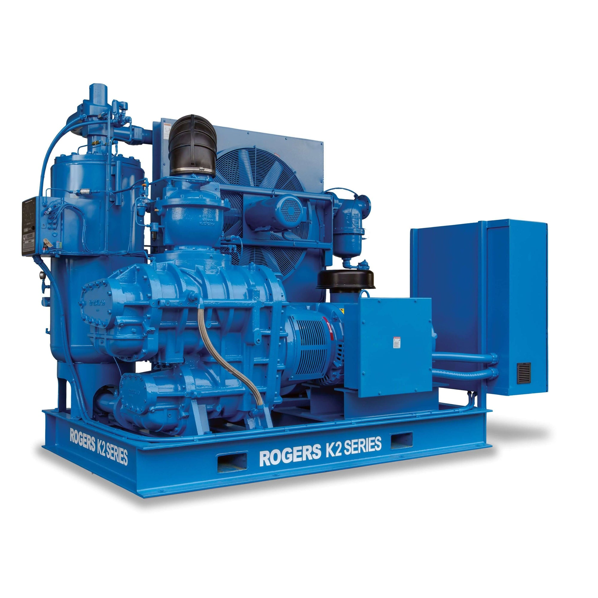

## 🏭 Projekt: Etap 2 - Sprężarkownia

Do napełniania naszego zbiornika ($V=5m^3$) wybrano sprężarkę tłokową. Musimy zweryfikować jej parametry energetyczne i dobrać system chłodzenia.

::: {.columns}
::: {.column width="60%"}
### Założenia Projektowe:
1.  **Powietrze ssane:** $p_1 = 1 \text{ bar}, t_1 = 20^\circ C$.
2.  **Powietrze tłoczone:** $p_2 = 9.5 \text{ bar}$.
3.  **Wydajność:** $\dot{V}_n = 100 \text{ m}^3/h$ (normalnych).
4.  **Proces sprężania:** Politropa z wykładnikiem $n = 1.35$.
:::
::: {.column width="40%"}

:::
:::

---

## ⚙️ Zadanie 2.1: Praca Techniczna Sprężania

Oblicz jednostkową pracę techniczną $l_t$ potrzebną do sprężenia 1 kg powietrza.

::: {.callout-note title="Wzór na pracę techniczną przemiany politropowej"}
$$ l_t = \frac{n}{n-1} R T_1 \left[ 1-\left(\frac{p_2}{p_1}\right)^{\frac{n-1}{n}} \right] $$
:::

::: {.columns}
::: {.column width="30%"}
### Obliczenia:

*   $R = 287 \text{ J}/(\text{kg K})$
*   $T_1 = 293.15 \text{ K}$
*   $p_2/p_1 = 9.5$
*   $n = 1.35$
:::
::: {.column width="70%"}
::: {.fragment}
$$ l_t = \frac{1.35}{0.35} \cdot 287 \cdot 293.15 \cdot \left[ 1-(9.5)^{\frac{0.35}{1.35}} \right] $$
$$ l_t = 3.857 \cdot 84134 \cdot [ 1-1.795 ] $$
$$ l_t \approx 324\,400 \cdot (-0.795) \approx \mathbf{-258\,000 \text{ J/kg} = -258 \text{ kJ/kg}} $$
:::
:::
:::

::: {.fragment .callout-warning title="UWAGA!"}
Ujemna **praca techniczna** oznacza, że sprężarka pobiera pracę z zewnątrz! Czyli napędzana jest silnikiem! 
:::

---

## ⚡ Zadanie 2.2: Moc Silnika Napędowego

Jaka jest teoretyczna moc sprężarki ($N_t$)?

::: {.fragment}
1.  **Strumień masy:** $\dot{m} = ?$

    *   **Wzór:** $\dot{m} = \frac{p_n \cdot \dot{V}_n}{R \cdot T_n}$ (warunki normalne: $p_n = 101325$ Pa, $T_n = 273.15$ K).
    *   $\dot{m} = \frac{101325 \cdot (100/3600)}{287 \cdot 273.15} = \frac{2814.5}{78394} \approx 0.0358 \text{ kg/s}$.
:::

::: {.fragment}
2.  **Moc teoretyczna:**
    $$ N_t = \dot{m} \cdot l_t $$
    $$ N_t = 0.0358 \text{ kg/s} \cdot 258 \text{ kJ/kg} \approx \mathbf{9.24 \text{ kW}} $$
:::

::: {.fragment .callout-tip}
Rzeczywista moc będzie wyższa przez sprawność mechaniczną ($\eta_m \approx 0.9$).
$N_{silnika} = N_t / 0.9 \approx 10.3 \text{ kW}$.
:::

---

## 🔥 Zadanie 2.3: Temperatura Tłoczenia

Do jakiej temperatury nagrzeje się powietrze na wylocie?
To kluczowe dla doboru oleju i chłodnicy!

$$ T_2 = T_1 \cdot \left(\frac{p_2}{p_1}\right)^{\frac{n-1}{n}} $$

::: {.fragment}
$$ T_2 = 293.15 \cdot (9.5)^{0.259} $$
$$ T_2 = 293.15 \cdot 1.795 \approx \mathbf{526 \text{ K} = 253^\circ C} $$

::: {.callout-error}
**Uwaga!** $253^\circ C$ to bardzo wysoka temperatura! Grozi zapłonem par oleju. Konieczne jest **chłodzenie międzystopniowe** lub intensywne chłodzenie cylindra.
:::
:::

---

## ❄️ Zadanie 2.4: Bilans Ciepła (I Zasada)

Ile ciepła musimy odprowadzić w chłodnicy, aby schłodzić powietrze z powrotem do $30^\circ C$ przed podaniem na halę?

::: {.fragment}
**I Zasada dla układu otwartego (chłodnica - ciśnienie stałe $p=const$):**
$$ \dot{Q} = \dot{m} \cdot (h_{wylot} - h_{wlot}) = \dot{m} \cdot c_p \cdot (t_{wyl} - t_{wl}) $$
:::

::: {.columns}
::: {.column width="50%"}
::: {.fragment}
**Dane:**
 
*   $\dot{m} = 0.0358 \text{ kg/s}$
*   $t_{wl} = 253^\circ C$ (z sprężarki)
*   $t_{wyl} = 30^\circ C$ (wymagane)
*   $c_p \approx 1005 \text{ J}/(\text{kg K})$
:::
:::

::: {.column width="50%"}
::: {.fragment}
**Obliczenia:**
$$ \dot{Q} = 0.0358 \cdot 1005 \cdot (30 - 253) $$
$$ \dot{Q} \approx -8020 \text{ W} = \mathbf{-8.0 \text{ kW}} $$

(Minus oznacza ciepło odprowadzone **Z** układu).
:::
:::
:::

---

## 🔄 Zadanie 2.5: Sprężanie Dwustopniowe

$253^\circ C$ to za dużo! Rozważmy **sprężanie dwustopniowe** z chłodzeniem międzystopniowym do $30^\circ C$.

**Optymalna proporcja stopni** (minimalna praca): $p_{pośr} = \sqrt{p_1 \cdot p_2}$.

$$ p_{pośr} = \sqrt{1 \cdot 9.5} \approx 3.08 \text{ bar} $$

::: {.fragment}
**Temperatura po I stopniu** ($1 \rightarrow 3.08$ bar, $n=1.35$):
$$ T_{I} = 293.15 \cdot (3.08)^{0.259} \approx 293.15 \cdot 1.333 \approx \mathbf{391 K = 118^\circ C} $$

**Temperatura po II stopniu** ($3.08 \rightarrow 9.5$ bar, start od $30^\circ C = 303K$):
$$ T_{II} = 303 \cdot (9.5/3.08)^{0.259} = 303 \cdot (3.08)^{0.259} \approx 303 \cdot 1.333 \approx \mathbf{404 K = 131^\circ C} $$
:::

::: {.fragment .callout-success}
$131^\circ C$ zamiast $253^\circ C$! Temperatura spadła prawie **dwukrotnie**. Jest to bezpieczne dla oleju i uszczelek.
:::

---

## 📊 Zadanie 2.6: Porównanie Procesów Sprężania

Oblicz pracę techniczną dla trzech różnych procesów sprężania ($p_1=1, p_2=9.5$ bar):

::: {.columns}
::: {.column width="33%"}
**Izotermiczny** ($n=1$):
$$ l_t = R T_1 \ln\frac{p_2}{p_1} $$
$$ l_t = 287 \cdot 293 \cdot \ln(9.5) $$
$$ l_t \approx \mathbf{189 \text{ kJ/kg}} $$
(Minimum teoretyczne)
:::
::: {.column width="33%"}
**Politropowy** ($n=1.35$):
$$ l_t \approx \mathbf{258 \text{ kJ/kg}} $$
(Obliczone wcześniej)
:::
::: {.column width="33%"}
**Adiabatyczny** ($n=\kappa=1.4$):
$$ l_t = \frac{1.4}{0.4} \cdot 287 \cdot 293 \cdot $$
$$ \cdot [(9.5)^{0.286}-1] $$
$$ l_t \approx \mathbf{273 \text{ kJ/kg}} $$
(Maksimum praktyczne)
:::
:::

::: {.fragment .callout-tip}
**Wniosek:** Sprężanie izotermiczne wymaga o **31% mniej** pracy niż adiabatyczne. Dlatego chłodzimy sprężarki!
:::

## 🧠 Dlaczego n=1 "psuje" wzór?{background-gradient="linear-gradient(to bottom, #bac3f1ff, #82d9e3ff)"}

**Problem:** Jeśli wstawisz $n=1$ do wzoru politropowego, otrzymasz dzielenie przez zero ($\frac{n}{n-1}$).
Dlaczego? Bo zmienia się charakter funkcji matematycznej pod wykresem (całki):

$$ l_t = \int v dp $$

::: {.columns}
::: {.column width="50%"}
**Dla $n \neq 1$ (Politropa):**
Funkcja potęgowa $v = C \cdot p^{-1/n}$.
Całka z $x^a$ to $\frac{x^{a+1}}{a+1}$.
Stąd bierze się ułamek $\frac{n}{n-1}$.
:::
::: {.column width="50%"}
**Dla $n = 1$ (Izoterma):**
Funkcja hiperboliczna $v = C/p$.
Całka z $1/x$ to **logarytm naturalny** ($\ln x$)!
$$ l_t = R T_1 \ln\frac{p_2}{p_1} $$
:::
:::

::: {.callout-note title="Reguła de l'Hospitala"}
Fizyka się nie "psuje". Granica wzoru ogólnego przy $n \to 1$ dąży właśnie do wzoru z logarytmem.
:::

---

## 💧 Zadanie 2.7: Dobór Chłodnicy Wodnej

Musimy odprowadzić $\dot{Q} = 8$ kW z chłodnicy sprężarki. Dysponujemy wodą z sieci wodociągowej ($t_{w,in} = 15^\circ C$). Maksymalna dopuszczalna temperatura wody na wylocie to $40^\circ C$ (limit zrzutu do kanalizacji).

**Oblicz wymagany strumień wody chłodzącej.**

::: {.fragment}
$$ \dot{Q} = \dot{m}_w \cdot c_w \cdot (t_{w,out} - t_{w,in}) $$
:::

::: {.fragment}
$$ \dot{m}_w = \frac{8000}{4190 \cdot (40 - 15)} = \frac{8000}{104\,750} $$
$$ \dot{m}_w \approx \mathbf{0.076 \text{ kg/s} = 4.6 \text{ l/min}} $$
:::

::: {.fragment .callout-note}
**Koszt wody:** Przy cenie $8 \text{ zł/m}^3$ i pracy sprężarki 2000 h/rok: $0.076 \cdot 3.6 \cdot 2000 \cdot 8 \approx \mathbf{4380 \text{ zł/rok}}$. Warto rozważyć obieg zamknięty z wieżą chłodniczą!
:::

---

## 🔬 Zadanie 2.8: Wyznaczanie Wykładnika Politropy {.smaller}

Serwisant zmierzył temperatury na sprężarce:

*   Ssanie: $t_1 = 22^\circ C$, $p_1 = 1$ bar.
*   Tłoczenie: $t_2 = 215^\circ C$, $p_2 = 8$ bar.

**Jaki jest rzeczywisty wykładnik politropy $n$ tej sprężarki?**

$$ T_2/T_1 = (p_2/p_1)^{(n-1)/n} $$

::: {.columns}
::: {.column width="50%"}
::: {.fragment .callout-note title="Krok 1: Logarytmowanie" style="font-size: 1.3em;"}
$$ \frac{488.15}{295.15} = 8^{(n-1)/n} $$
$$ 1.654 = 8^{(n-1)/n} $$
$$ \ln(1.654) = \frac{n-1}{n} \cdot \ln(8) $$
:::
:::

::: {.column width="50%"}
::: {.fragment .callout-tip title="Krok 2: Wyznaczenie n" style="font-size: 1.3em;"}
$$ 0.503 = \frac{n-1}{n} \cdot 2.079 $$
$$ \frac{n-1}{n} = 0.242 $$
$$ n = \frac{1}{1 - 0.242} \approx \mathbf{1.32} $$
:::
:::
:::

::: {.fragment .callout-tip style="font-size: 1.3em;"}
$n = 1.32 < \kappa = 1.4$ — sprężarka jest dobrze chłodzona (bliżej procesu izotermicznego niż adiabatycznego).
:::

---

## 🏠 Zadanie Domowe (Raport 2)

**Temat:** Odzysk ciepła.

Skoro wyrzucamy 8 kW ciepła do otoczenia, inżynier produkcji proponuje wykorzystać je do podgrzewania wody użytkowej w umywalniach.

1.  Mamy strumień wody $\dot{m}_w$ o temp. wejściowej $10^\circ C$.
2.  Chcemy ją podgrzać do $45^\circ C$.
3.  Zakładamy, że odzyskamy 80% ciepła z chłodnicy sprężarki ($0.8 \cdot 8 \text{ kW}$).

**Zadanie:** Oblicz, jaki strumień wody [l/min] możemy podgrzać?

*   Ciepło właściwe wody: $c_w = 4190 \text{ J}/(\text{kg K})$.
