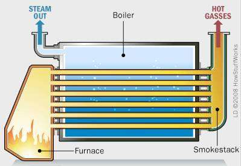

## <i class="bi bi-buildings"></i> Projekt: Etap 3 – Kotłownia

Fabryka „Termo-Tech” wykorzystuje parę wodną do procesów technologicznych (np. pasteryzacja, suszenie). Obecny kocioł gazowy wytwarza parę o parametrach:

::: {.columns}
::: {.column width="40%"}

*   Ciśnienie: $p = 10\ \text{bar}$ (abs)
*   Temperatura: $t = 250\ \text{°C}$
*   Wydajność: $\dot{m} = 2\ \text{t/h}$
*   Woda zasilająca: $t_{\text{zas}} = 60\ \text{°C}$
:::

::: {.column width="60%"}
### Twoje zadanie (jak w karcie projektowej):

*   **3.1** – stan termodynamiczny pary
*   **3.2** – moc cieplna kotła
*   **3.3** – kosztorys: zużycie gazu ziemnego
*   **3.4** – dławienie pary ($h = \text{const}$)
*   **3.5** – para mokra, stopień suchości $x$
*   **3.6** – interpolacja w tablicach pary przegrzanej
*   **3.7** – entropia w kotle
*   **3.8** – bilans kondensatu

:::

:::

---

## <i class="bi bi-bar-chart"></i> Zadanie 3.1: Stan termodynamiczny pary

Sprawdźmy, czy para na wylocie z kotła jest **nasycona, mokra czy przegrzana**.

::: {.callout-tip title="Jak korzystać z tablic?"}
1.  W tablicy pary nasyconej wg ciśnienia (**Załącznik A**) znajdź wiersz $p = 10\ \text{bar}$ $(= 1.0\ \text{MPa})$.
2.  Odczytaj temperaturę nasycenia $t_{\text{sat}}$ (w tablicy: kolumna $t_s$).
3.  Porównaj rzeczywistą temperaturę $t_{\text{rzecz}}$ z $t_{\text{sat}}$.

Brak Twojego ciśnienia w tablicy? Interpoluj $t_s$ liniowo między sąsiednimi wierszami.
:::

### Analiza:

*   Załącznik A, wiersz 10 bar: $t_{\text{sat}} = 179.9\ \text{°C}$.
*   Mamy: $t_{\text{rzecz}} = 250\ \text{°C}$.

::: {.fragment .callout-tip title="Wniosek"}
$t_{\text{rzecz}} > t_{\text{sat}}$ (przegrzanie $250 - 179.9 \approx 70\ \text{K}$), więc jest to **para przegrzana**.
Entalpię odczytamy z tablic pary przegrzanej (Załącznik B).
:::

---

## <i class="bi bi-fire"></i> Zadanie 3.2: Moc cieplna kotła

Kocioł podgrzewa wodę zasilającą o temperaturze $t_{\text{zas}} = 60\ \text{°C}$ do postaci pary przegrzanej ($10\ \text{bar}$, $250\ \text{°C}$).

::: {.columns}
::: {.column width="60%"}
### Dane:

1.  **Woda zasilająca ($60\ \text{°C}$, ciecz):**
    *   $h_1 \approx c_w \cdot t_{\text{zas}} = 4.19 \cdot 60 = \mathbf{251.4\ \text{kJ/kg}}$
    *   Załącznik A2 (60 °C): $h' = 251.2\ \text{kJ/kg}$ – różnica pomijalna
2.  **Para wylotowa ($10\ \text{bar}$, $250\ \text{°C}$):**
    *   Tablica B2, kolumna 1,0 MPa, wiersz 250 °C: $h_2 = \mathbf{2943\ \text{kJ/kg}}$

:::

::: {.column width="40%"}
### Moc cieplna kotła $\dot{Q}$:

$$ \dot{Q} = \dot{m} \cdot (h_2 - h_1) $$
$$ \dot{m} = 2\ \text{t/h} = \frac{2 \cdot 1000}{3600} \approx 0.5556\ \text{kg/s} $$

::: {.fragment}
$$ \dot{Q} = 0.5556 \cdot (2943 - 251.4) $$
$$ \dot{Q} \approx 1495\ \text{kW} \approx \mathbf{1.5\ \text{MW}} $$
:::
:::
:::

---

## <i class="bi bi-fuel-pump"></i> Zadanie 3.3: Kosztorys – zużycie gazu {.smaller}

Ile gazu ziemnego zużywa kocioł, jeśli jego sprawność wynosi $\eta_k = 0.90$?

*   Wartość opałowa gazu (metan): $W_d \approx 50\ \text{MJ/kg} = 50\,000\ \text{kJ/kg}$.
*   Gęstość gazu: $\rho_{\text{gaz}} \approx 0.7\ \text{kg/m}^3$.

::: {.columns}
::: {.column width="55%"}
### Bilans paliwa:

::: {.fragment}
$$ \dot{Q}_{\text{paliwa}} = \dot{m}_{\text{gaz}} \cdot W_d = \frac{\dot{Q}}{\eta_k} = \frac{1495\ \text{kW}}{0.90} \approx 1661\ \text{kW} $$
($\dot{Q}$ – moc cieplna kotła z Zad. 3.2)
:::

::: {.fragment}
$$ \dot{m}_{\text{gaz}} = \frac{\dot{Q}_{\text{paliwa}}}{W_d} = \frac{1661\ \text{kJ/s}}{50\,000\ \text{kJ/kg}} \approx 0.0332\ \text{kg/s} $$
:::
:::

::: {.column width="45%"}
::: {.fragment}
### W jednostkach handlowych (m³/h):

$$ \dot{V}_{\text{gaz}} = \frac{\dot{m}_{\text{gaz}} \cdot 3600}{\rho_{\text{gaz}}} = \frac{0.0332 \cdot 3600}{0.7} \approx \mathbf{171\ \text{m}^3\text{/h}} $$
:::
:::
:::

::: {.fragment .callout-tip title="Jednym wzorem (jak w karcie projektowej)"}
$$ \dot{V}_{\text{gaz}} = \frac{\dot{Q}}{\eta_k \cdot W_d \cdot \rho_{\text{gaz}}} \cdot 3600 = \frac{1495}{0.90 \cdot 50\,000 \cdot 0.7} \cdot 3600 \approx 171\ \text{m}^3\text{/h} \qquad (\dot{Q}\ \text{w kW},\ W_d\ \text{w kJ/kg}) $$
:::

---

## <i class="bi bi-droplet"></i> Zadanie 3.4: Dławienie Pary (h = const)

Przed wejściem do wymiennika ciepła ciśnienie pary jest redukowane zaworem redukcyjnym (dławienie) z $p_2 = 10\ \text{bar}$ do $p_3 = 2\ \text{bar}$.
Proces dławienia jest **izentalpowy**: $h_3 = h_2$.

**Pytanie:** Jaka będzie temperatura pary po dławieniu?

1.  Stan początkowy: $h_2 = 2943\ \text{kJ/kg}$ ($10\ \text{bar}$, $250\ \text{°C}$ – z Zad. 3.2).
2.  Stan końcowy: $p_3 = 2\ \text{bar}$, $h_3 = h_2 = 2943\ \text{kJ/kg}$.

::: {.fragment}
**Załącznik A, wiersz 2 bar:**

*   $h'' = 2707\ \text{kJ/kg}$ (para sucha nasycona, $x = 1$).
*   $h_3 > h''$ ($2943 > 2707$) → nadal para **przegrzana**!
:::

---

## <i class="bi bi-droplet"></i> Zadanie 3.4 (cd.): Odczyt temperatury z tablic {.smaller}

::: {.columns}
::: {.column width="40%"}
::: {.callout-tip title="Tablica B1, kolumna 0,2 MPa (= 2 bar)"}
| $t$ [°C] | $h$ [kJ/kg] |
|:--------:|:-----------:|
| 200 | 2870 |
| 250 | 2971 |
:::
:::

::: {.column width="60%"}
Szukamy temperatury, przy której $h_3 = 2943\ \text{kJ/kg}$ – leży ona między 200 a 250 °C. **Interpolacja „odwrotna”** (znamy $h$, szukamy $t$):

$$ t_3 = t_a + \frac{h_3 - h_a}{h_b - h_a} \cdot (t_b - t_a) $$
:::
:::

::: {.fragment}
$$ t_3 = 200 + \frac{2943 - 2870}{2971 - 2870} \cdot (250 - 200) = 200 + 0.723 \cdot 50 \approx \mathbf{236.1\ \text{°C}} $$
:::

::: {.fragment .callout-tip title="Wniosek"}
Dławienie obniżyło ciśnienie drastycznie (10 → 2 bar), ale temperatura spadła nieznacznie (250 → 236 °C). Para stała się „bardziej” przegrzana: przegrzanie wzrosło z $250 - 179.9 \approx 70\ \text{K}$ do $236.1 - 120.2 \approx 116\ \text{K}$.
:::

Uwaga: jeśli $h_3$ leży między $h''$ (wiersz pogrubiony, $x = 1$) a pierwszym wierszem tablicy przegrzania, interpoluj od stanu nasycenia: $t_a = t_s$ (Załącznik A), $h_a = h''$.

---

## <i class="bi bi-thermometer-half"></i> Zadanie 3.5: Para Mokra – Stopień Suchości {.smaller}

W odbiorniku pary (wymiennik ciepła za zaworem redukcyjnym) para skrapla się częściowo. Serwisant zmierzył ciśnienie $p = 2\ \text{bar}$ i temperaturę $t = 120.2\ \text{°C}$.

**Czy para jest mokra, sucha nasycona, czy przegrzana?**

::: {.fragment}
Załącznik A, wiersz 2 bar: $t_s = 120.2\ \text{°C}$, $h' = 504.7\ \text{kJ/kg}$, $h'' = 2707\ \text{kJ/kg}$.

$t = t_s$ → para **nasycona: mokra albo sucha**. Ciśnienie i temperatura nie wystarczą do określenia stanu – potrzebny jest trzeci parametr, np. entalpia.
:::

::: {.fragment}
Jeśli z bilansu (lub kalorymetru dławiącego) wiemy, że $h_{\text{pomiar}} = 2400\ \text{kJ/kg} < h''$, para jest **mokra**:
$$ x = \frac{h_{\text{pomiar}} - h'}{h'' - h'} = \frac{2400 - 504.7}{2707 - 504.7} = \frac{1895.3}{2202.3} \approx \mathbf{0.86} $$
:::

::: {.fragment .callout-warning title="Uwaga"}
$x = 0.86$ oznacza, że **14% masy stanowią krople wody**! W turbinie byłoby to niebezpieczne dla łopatek (erozja), w wymienniku ciepła jest to normalne.
:::

---

## <i class="bi bi-clipboard-data"></i> Zadanie 3.6: Interpolacja w Tablicach

Producent kotła proponuje podniesienie temperatury pary do $t = 275\ \text{°C}$ przy tym samym ciśnieniu $p = 10\ \text{bar}$. Takiej temperatury nie ma w tablicach – odczytaj $h$ i $s$ dla sąsiednich temperatur (250 i 300 °C) i zastosuj **interpolację liniową**.

::: {.callout-tip title="Tablica B2, kolumna 1,0 MPa (= 10 bar)"}
| $t$ [°C] | $h$ [kJ/kg] | $s$ [kJ/(kg·K)] |
|:--------:|:-----------:|:---------------:|
| 250 | 2943 | 6.926 |
| 300 | 3052 | 7.125 |
:::

::: {.fragment}
**Interpolacja** dla $t = 275\ \text{°C}$ (w połowie przedziału):

$$ h_{275} = 2943 + \frac{275 - 250}{300 - 250} \cdot (3052 - 2943) = 2943 + 0.5 \cdot 109 \approx \mathbf{2997.5\ \text{kJ/kg}} $$

$$ s_{275} = 6.926 + 0.5 \cdot (7.125 - 6.926) = 6.926 + 0.0995 \approx \mathbf{7.026\ \text{kJ/(kg·K)}} $$
:::

---

## <i class="bi bi-arrow-repeat"></i> Zadanie 3.7: Entropia w Kotle {.smaller}

Oblicz zmianę entropii wody/pary w procesie parowania w kotle (z Zadania 3.2): woda $60\ \text{°C}$ → para $10\ \text{bar}$, $250\ \text{°C}$.

::: {.columns}
::: {.column width="50%"}

::: {.fragment}
**Z tablic:**

*   Woda zasilająca ($60\ \text{°C}$) – Załącznik A2, wiersz 60 °C: $s_1 = s' = 0.831\ \text{kJ/(kg·K)}$.
*   Para wylotowa ($10\ \text{bar}$, $250\ \text{°C}$) – Tablica B2, kolumna 1,0 MPa: $s_2 = 6.926\ \text{kJ/(kg·K)}$.
:::

::: {.fragment}
**Zmiana entropii (na 1 kg):**
$$ \Delta s = s_2 - s_1 = 6.926 - 0.831 = \mathbf{6.095\ \text{kJ/(kg·K)}} $$
:::

::: {.fragment}
**Strumień entropii:**
$$ \dot{S} = \dot{m} \cdot \Delta s = 0.5556 \cdot 6.095 \approx \mathbf{3.39\ \text{kW/K}} $$
:::
:::
::: {.column width="50%"}

::: {.fragment .callout-note title="Skąd ten wzrost entropii?"}
Entropia wody rośnie, bo doprowadzamy do niej ciepło ($dS = \delta Q / T$) – sam ten wzrost nie dowodzi nieodwracalności.

O nieodwracalności świadczy bilans ze spalinami: ciepło płynie od spalin o temperaturze $T_{\text{spalin}} \approx 1500\ \text{K}$ do wody/pary (60–250 °C) przy dużej różnicy temperatur. Spaliny tracą entropię $\dot{Q}/T_{\text{spalin}}$, woda zyskuje znacznie więcej:
$$ \dot{S}_{\text{gen}} = \dot{m}\,\Delta s - \frac{\dot{Q}}{T_{\text{spalin}}} \approx 3.39 - \frac{1495}{1500} \approx 2.4\ \text{kW/K} > 0 $$
Do tego dochodzi nieodwracalność samego spalania.
:::
:::
:::

---

## <i class="bi bi-droplet"></i> Zadanie 3.8: Bilans Kondensatu {.smaller}

Wymiennik ciepła (odbiornik) skrapla parę po dławieniu ($2\ \text{bar}$, $236\ \text{°C}$) do **wrzątku** – cieczy nasyconej przy tym samym ciśnieniu, $t_s = 120.2\ \text{°C}$. Kondensat wraca do kotła.

### Ile ciepła oddaje 1 kg pary w wymienniku?

::: {.fragment}
**Z tablic:**

*   $h_{\text{para}} = h_3 = h_2 = 2943\ \text{kJ/kg}$ (para po dławieniu, 2 bar, 236 °C; dławienie: $h = \text{const}$)
*   $h' = 504.7\ \text{kJ/kg}$ (Załącznik A, wiersz 2 bar – ciecz nasycona)

:::

::: {.fragment}
$$ q_{\text{wym}} = h_{\text{para}} - h' = 2943 - 504.7 = \mathbf{2438.3\ \text{kJ/kg}} $$
:::

::: {.fragment}
**Moc cieplna wymiennika** (przy $\dot{m} = 0.5556\ \text{kg/s}$):
$$ \dot{Q}_{\text{wym}} = \dot{m} \cdot q_{\text{wym}} = 0.5556 \cdot 2438.3 \approx \mathbf{1355\ \text{kW} \approx 1.35\ \text{MW}} $$
:::

::: {.fragment .callout-tip title="Wniosek"}
Prawie cała moc kotła (≈ 91% z 1495 kW) trafia do wymiennika. Pozostałe ≈ 140 kW $= \dot{m}\,(h' - h_1)$ to ciepło, które kondensat (120 °C) traci, zanim wróci do kotła jako woda zasilająca 60 °C – można je odzyskać, np. podgrzewając nim wodę zasilającą.
:::

---

## <i class="bi bi-house-door"></i> Zadanie Domowe (Raport 3)

**Temat:** Kocioł kondensacyjny?

Inżynier proponuje wymianę kotła na kondensacyjny. Aby to miało sens, musimy odzyskać ciepło skraplania pary wodnej ze spalin.

1.  Przy spalaniu $1\ \text{m}^3$ gazu (warunki normalne) powstaje ok. $1.6\ \text{kg}$ wody w spalinach.
2.  Ciepło skraplania wody (przy ok. 40 °C) $r \approx 2400\ \text{kJ/kg}$.
3.  Nasz kocioł zużywa $171\ \text{m}^3\text{/h}$ gazu.

**Oblicz:**
Jaki dodatkowy strumień ciepła [kW] możemy odzyskać, jeśli skroplimy całą parę wodną ze spalin?
O ile punktów procentowych wzrośnie sprawność kotłowni?

*Wskazówka: sprawność liczona względem wartości opałowej $W_d$ może przekroczyć 100% – dlaczego?*
