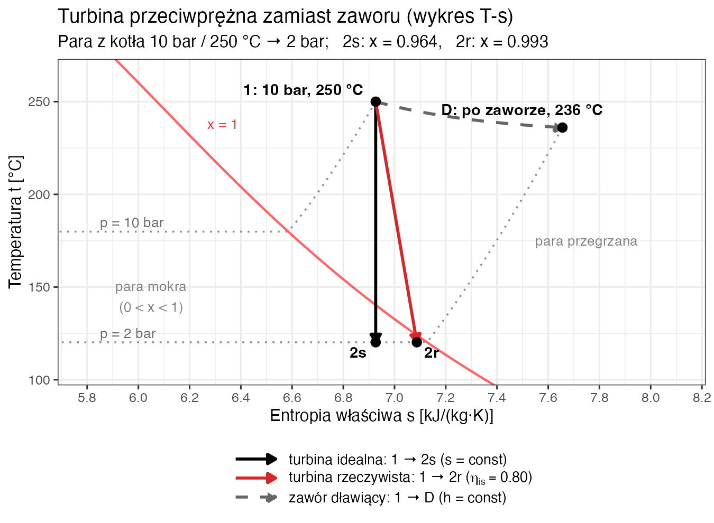

## <i class="bi bi-buildings"></i> Projekt: Etap 4 – Mikroturbina

W Ćw. 3 (Zad. 3.4) redukowaliśmy ciśnienie pary z **10 bar** do **2 bar** na zaworze dławiącym. Energia się nie traci ($h = \text{const}$), ale tracimy **egzergię** – zdolność pary do wykonania pracy!
W miejscu zaworu proponujemy zainstalować **turbinę przeciwprężną**: para najpierw wytworzy prąd, a potem (o niższym ciśnieniu) trafi do wymiennika. To **kogeneracja** (CHP – *Combined Heat and Power*).

::: {.columns}
::: {.column width="55%"}
::: {.mmd-fit style="height: 380px;"}
```{mermaid}
%%{init: {'theme': 'default', 'htmlLabels': false, 'flowchart': {'htmlLabels': false, 'wrappingWidth': 400, 'subGraphTitleMargin': {'top': 6, 'bottom': 16}}, 'themeVariables': {'fontSize': '20px', 'fontFamily': 'Arial, Helvetica, sans-serif'}}}%%
flowchart LR
    K["Kocioł<br>10 bar, 250 °C"] -->|"1: para przegrzana"| T["Turbina<br>przeciwprężna"]
    T === G(("Generator"))
    T -->|"2: para, 2 bar"| W["Wymiennik ciepła<br>(odbiorcy pary)"]
    K -.->|"dawniej"| Z["Zawór redukcyjny<br>10 → 2 bar"]
    Z -.-> W

    style K fill:#ffebee,stroke:#e74c3c,stroke-width:2px
    style T fill:#fff3e0,stroke:#f39c12,stroke-width:2px
    style G fill:#e8f5e9,stroke:#4caf50,stroke-width:2px
    style W fill:#e0f7fa,stroke:#00bcd4,stroke-width:2px
    style Z fill:#f5f5f5,stroke:#9e9e9e,stroke-width:2px,stroke-dasharray: 5 5
```
:::
:::

::: {.column width="45%"}
**Dane (przykład z Ćw. 3):**

*   Wlot = para z kotła: $p_1 = 10\ \text{bar}$, $t_1 = 250\ \text{°C}$
*   Wylot = ciśnienie po dławieniu: $p_2 = 2\ \text{bar}$
*   Strumień = cała wydajność kotła: $\dot{m} = 2\ \text{t/h} = \frac{2 \cdot 1000}{3600} \approx 0.5556\ \text{kg/s}$
*   Sprawność izentropowa: $\eta_{\text{is}} = 0.80$
:::
:::

---

## <i class="bi bi-clipboard-data"></i> Twoje zadanie (jak w karcie projektowej)

*   **4.1** – stan pary za turbiną idealną ($s = \text{const}$): porównanie $s_1$ z $s'$ i $s''$
*   **4.2** – stopień suchości pary na wylocie $x_2$
*   **4.3** – idealna moc turbiny $N_t$
*   **4.4** – rzeczywista moc turbiny $N_r$ (sprawność izentropowa $\eta_{\text{is}}$)
*   **4.5** – wariant „Modernizacja Plus”: para z kotła o $4\ \text{bar}$ i $50\ \text{K}$ „wyżej”
*   **4.6** – sprawność Carnota $\eta_C$ i sprawność $\eta_t = N_t / \dot{Q}_{\text{kotła}}$

::: {.callout-tip title="Na Twojej karcie"}
*   $p_1$, $t_1$ – ciśnienie i temperatura pary z kotła (Etap 3); $p_2$ – ciśnienie po dławieniu (Zad. 3.4); $\dot{m}$ – wydajność kotła (cała para idzie przez turbinę); $\eta_{\text{is}}$ – z tabeli parametrów.
*   Para przegrzana: **Załącznik B** (ciśnienia w MPa: $10\ \text{bar} = 1.0\ \text{MPa}$). Stan nasycenia na wylocie: **Załącznik A** (wiersz $p_2$; kolumna $r = h'' - h'$).
:::

---

## <i class="bi bi-graph-up"></i> Wizualizacja procesu (wykres T-s)

::: {.columns}
::: {.column width="55%"}
{width="100%"}
:::

::: {.column width="45%"}
*   **1 → 2s** – turbina idealna: pionowa linia w dół (izentropa, $s = \text{const}$).
*   **1 → 2r** – turbina rzeczywista: tarcie i zawirowania zwiększają entropię, więc punkt 2r leży **na prawo** od 2s.
*   **1 → D** – dawny zawór dławiący ($h = \text{const}$): ten sam spadek ciśnienia, ale **zero pracy**.

Para przegrzana (punkt 1) opuszcza turbinę jako lekko mokra (2s, 2r). Przy niskiej sprawności $\eta_{\text{is}}$ może wyjść nawet przegrzana ($h_{2r} > h''$).
:::
:::

---

## <i class="bi bi-wind"></i> Zadanie 4.1: Rozprężanie izentropowe ($s = \text{const}$) {.smaller}

Proces w idealnej turbinie jest adiabatyczny i odwracalny ($s_1 = s_2$).

### Krok 1: Parametry na wlocie (10 bar, 250 °C)
Tablica B2, kolumna 1,0 MPa, wiersz 250 °C:

*   $h_1 = 2943\ \text{kJ/kg}$ (ta sama wartość co $h_2$ w Zad. 3.2 – to ta sama para z kotła)
*   $s_1 = 6.926\ \text{kJ/(kg·K)}$

### Krok 2: Parametry na wylocie (2 bar, $s_2 = s_1$)
Załącznik A, wiersz 2 bar – porównujemy $s_2 = 6.926\ \text{kJ/(kg·K)}$ z:

*   $s' = 1.530\ \text{kJ/(kg·K)}$ (ciecz nasycona)
*   $s'' = 7.127\ \text{kJ/(kg·K)}$ (para sucha nasycona)

::: {.callout-note title="Wniosek"}
Ponieważ $s' < s_2 < s''$ ($1.530 < 6.926 < 7.127$), para na wylocie jest **parą mokrą** (mieszaniną cieczy i pary, $0 < x_2 < 1$).
:::

---

## <i class="bi bi-droplet"></i> Zadanie 4.2: Stopień suchości ($x_2$)

Jaka część pary skropliła się w turbinie?

$$ s_2 = s' + x_2 (s'' - s') $$
$$ x_2 = \frac{s_2 - s'}{s'' - s'} $$

::: {.columns}
::: {.fragment .column width="50%"}

**Obliczenia:**
$$ x_2 = \frac{6.926 - 1.530}{7.127 - 1.530} $$
$$ x_2 = \frac{5.396}{5.597} \approx \mathbf{0.964} $$

:::
::: {.fragment .column width="50%"}
**Interpretacja:**
96.4% masy to para (sucha nasycona), a **3.6% to kropelki wody**.
To bezpieczny poziom wilgotności dla turbiny (zwykle wymaga się $x \geq 0.85\text{–}0.90$).
:::
:::

---

## <i class="bi bi-lightning-charge"></i> Zadanie 4.3: Idealna moc turbiny

::: {.columns}
::: {.column width="50%"}
Entalpia na wylocie ($h_{2s}$) dla procesu izentropowego:
$$ h_{2s} = h' + x_2 (h'' - h') $$

::: {.fragment}
Załącznik A, wiersz 2 bar: $h' = 504.7\ \text{kJ/kg}$, $h'' = 2707\ \text{kJ/kg}$, $h'' - h' = r \approx 2202\ \text{kJ/kg}$.

$$ h_{2s} = 504.7 + 0.964 \cdot 2202 $$
$$ h_{2s} \approx 504.7 + 2122.7 = \mathbf{2627.4\ \text{kJ/kg}} $$
:::
:::

::: {.column width="50%"}
::: {.fragment}
**Moc idealna ($N_t$):**
$$ N_t = \dot{m} \cdot (h_1 - h_{2s}) $$
$$ N_t = 0.5556\ \text{kg/s} \cdot (2943 - 2627.4)\ \text{kJ/kg} $$
$$ N_t = 0.5556 \cdot 315.6 \approx \mathbf{175.3\ \text{kW}} $$
:::
:::
:::

---

## <i class="bi bi-bullseye"></i> Zadanie 4.4: Rzeczywista moc (sprawność izentropowa) {.smaller}
::: {.callout-note title="Rzeczywista turbina nie jest idealna. Producent deklaruje sprawność izentropową $\eta_{\text{is}} = 0.80$."}

:::

::: {.fragment style="color: red; font-size: 0.8em;"}
**Jaka jest rzeczywista entalpia na wylocie ($h_{2r}$)?**
:::

::: {.fragment}
$$ \eta_{\text{is}} = \frac{h_1 - h_{2r}}{h_1 - h_{2s}} $$
:::

:::: {.columns}
::: {.column width="60%"}
::: {.fragment}
$$ h_{2r} = h_1 - \eta_{\text{is}} \cdot (h_1 - h_{2s}) $$
:::

::: {.fragment}
$$ h_{2r} = 2943 - 0.80 \cdot (2943 - 2627.4) = \newline 2943 - 252.5 $$
:::

::: {.fragment}
$$ h_{2r} \approx \mathbf{2690.5\ \text{kJ/kg}} $$
:::
:::

::: {.column width="40%"}
::: {.fragment}
**Rzeczywista moc:**
$$ N_r = \dot{m} \cdot (h_1 - h_{2r}) = \newline 0.5556 \cdot 252.5 \approx \mathbf{140.3\ \text{kW}} $$
:::

::: {.fragment}
(Zamiast $175.3\ \text{kW}$ w idealnym przypadku – strata $35.0\ \text{kW}$).
:::
:::
::::

::: {.fragment .callout-note title="Stan pary na wylocie"}
Czy $h_{2r} = 2690.5\ \text{kJ/kg}$ to nadal para mokra?
$h''(2\ \text{bar}) = 2707 > 2690.5$ → tak, ale $x_{2r} = \frac{2690.5 - 504.7}{2202} \approx 0.993$ – praktycznie sucha.
Gdyby $h_{2r} > h''$, para na wylocie byłaby **przegrzana** (stopień suchości $x$ nie istnieje).
:::

---

## <i class="bi bi-wrench"></i> Zadanie 4.5: Analiza wariantowa – wyższe parametry pary {.smaller}

Co jeśli kocioł dostarczy parę o **4 bar** i **50 K** „wyżej”: $14\ \text{bar}$, $300\ \text{°C}$ zamiast $10\ \text{bar}$, $250\ \text{°C}$? Wylot nadal $2\ \text{bar}$.
*(Na karcie: Twoje $p_1 + 4\ \text{bar}$ i $t_1 + 50\ \text{K}$; dla ciśnień 16–20 bar – Tablica B3.)*

::: {.callout-tip title="Tablica B2, kolumna 1,4 MPa, wiersz 300 °C"}
$h_1 = 3041\ \text{kJ/kg}$, $s_1 = 6.955\ \text{kJ/(kg·K)}$
:::

::: {.fragment}
**Krok 1:** Sprawdzamy stan na wylocie ($s_2 = 6.955\ \text{kJ/(kg·K)}$, $p_2 = 2\ \text{bar}$):
$s''(2\ \text{bar}) = 7.127$ → $s_2 < s''$ → para mokra.
:::

::: {.fragment}
$$ x_{2s} = \frac{6.955 - 1.530}{7.127 - 1.530} = \frac{5.425}{5.597} \approx 0.969 $$
:::

::: {.fragment}
$$ h_{2s} = 504.7 + 0.969 \cdot 2202 = 504.7 + 2133.7 \approx 2638.4\ \text{kJ/kg} $$
:::

::: {.fragment}
**Moc idealna:**
$$ N_{t,\text{var}} = 0.5556 \cdot (3041 - 2638.4) = 0.5556 \cdot 402.6 \approx \mathbf{223.7\ \text{kW}} $$
$$ \Delta = \frac{N_{t,\text{var}} - N_t}{N_t} \cdot 100 = \frac{223.7 - 175.3}{175.3} \cdot 100 \approx \mathbf{27.6\%} $$
:::

::: {.fragment .callout-note title="Podniesienie parametrów pary z (10 bar, 250 °C) na (14 bar, 300 °C) zwiększyło moc idealną o **27.6%** (175.3 → 223.7 kW)!" }
:::

---

## <i class="bi bi-rulers"></i> Zadanie 4.6: Sprawność obiegu Carnota

::: {.callout-tip title="Jaka byłaby **maksymalna teoretyczna** sprawność silnika cieplnego pracującego między temperaturą pary wlotowej a temperaturą otoczenia?"}
:::

$T_H = t_1 + 273.15$; $T_L$ – temperatura otoczenia (hali): przyjmujemy $20\ \text{°C}$, czyli $T_L = 293.15\ \text{K}$.
*(Na karcie: Twoja temperatura w hali $t$ z Etapu 1.)*

::: {.columns}
::: {.column width="50%"}
**Wariant podstawowy** ($t_1 = 250\ \text{°C}$):
$$ \eta_C = 1 - \frac{T_L}{T_H} $$
$$ \eta_C = 1 - \frac{293.15}{523.15} \approx \mathbf{43.96\%} $$
:::
::: {.column width="50%"}
**Wariant z Zad. 4.5** ($t_1 = 300\ \text{°C}$):
$$ \eta_C = 1 - \frac{293.15}{573.15} \approx \mathbf{48.85\%} $$
:::
:::

---

## <i class="bi bi-rulers"></i> Zadanie 4.6 (cd.): Sprawność $\eta_t$ a Carnot {.smaller}

Porównujemy idealną moc turbiny (Zad. 4.3) z mocą cieplną kotła (Zad. 3.2):
$$ \eta_t = \frac{N_t}{\dot{Q}_{\text{kotła}}} \cdot 100 = \frac{175.3}{1495} \cdot 100 \approx \mathbf{11.7\%} $$

::: {.fragment .callout-warning title="Dlaczego tak daleko od Carnota?"}
Daleko od Carnota ($43.96\%$)! Turbina jest **przeciwprężna** – nie rozpręża pary do temperatury otoczenia, lecz oddaje ją do wymiennika przy $t_s(2\ \text{bar}) = 120.2\ \text{°C}$.
Dla takiej maszyny realną granicą jest Carnot z $T_L = 393.35\ \text{K}$: $\eta_C = 1 - \frac{393.35}{523.15} \approx 24.8\%$.
:::

::: {.fragment .callout-tip title="Kogeneracja: ciepło nie jest stracone"}
To nie jest strata! Z pozostałych ≈ 88% mocy kotła większość trafia do wymiennika (Zad. 3.8) jako ciepło użytkowe. W kogeneracji ocenia się więc **wskaźnik wykorzystania energii** $(N + \dot{Q}_{\text{wym}}) / \dot{Q}_{\text{kotła}}$, a nie samą sprawność wytwarzania prądu.
:::

---

## <i class="bi bi-cash-coin"></i> Zadanie domowe (Raport 4) {.smaller}

**Temat:** Opłacalność kogeneracji.

Zainstalowanie turbiny kosztuje **150 000 PLN**.
Generator ma sprawność $\eta_{\text{gen}} = 90\%$.
Cena prądu dla przemysłu: **0.80 PLN/kWh**.
Turbina pracuje **4000 h/rok**.

1.  Oblicz moc elektryczną: $N_{\text{el}} = N_r \cdot \eta_{\text{gen}}$ ($N_r$ – rzeczywista moc turbiny z Zad. 4.4).
2.  Oblicz roczną produkcję energii elektrycznej [MWh].
3.  Oblicz roczny zysk ze sprzedaży (lub niekupionego) prądu [PLN].
4.  Oblicz prosty okres zwrotu nakładów (SPBT, *Simple Pay-Back Time*).

::: {.callout-tip title="Pytanie do raportu"}
Czy opłaca się montować turbinę? Porównaj z dławieniem pary na zaworze (0 PLN z produkcji prądu).
:::

::: {.callout-warning title="Uwaga – bilans energii"}
Turbina zamienia część entalpii pary na pracę, więc do wymiennika trafia mniej ciepła: $0.5556 \cdot (2690.5 - 504.7) \approx 1214\ \text{kW}$ zamiast $\approx 1355\ \text{kW}$ (Zad. 3.8) – o $\approx N_r = 140\ \text{kW}$ mniej.
Aby utrzymać ciepło dla procesu, kocioł musi spalić więcej gazu (metodą z Zad. 3.3: $\approx 16\ \text{m}^3\text{/h}$). Uwzględnij ten koszt w ocenie opłacalności.
:::
