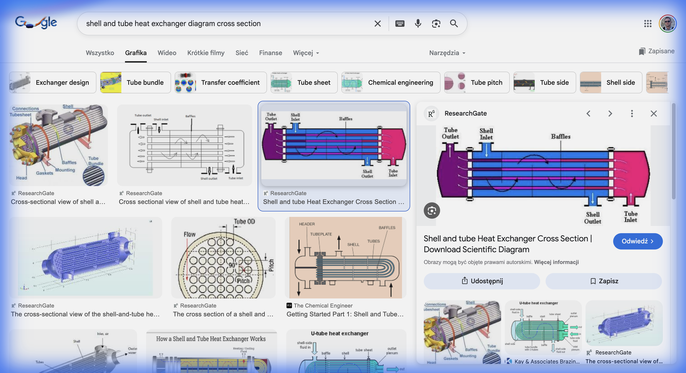
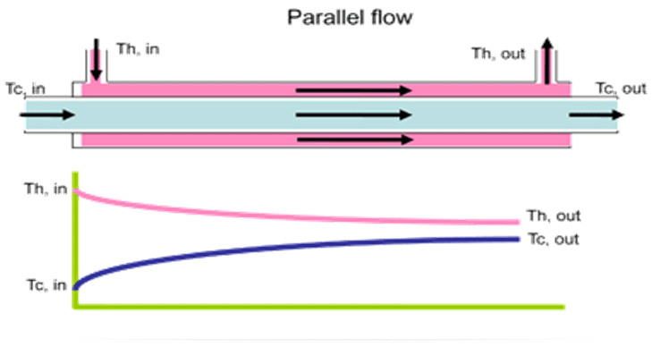
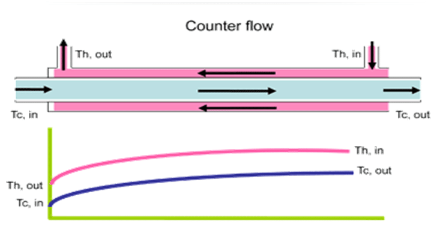

## <i class="bi bi-buildings"></i> Projekt: Etap 5 – Odzysk Ciepła ze Spalin{.smaller}

W zakładzie „Termo-Tech” spaliny z kotła mają temperaturę 300 °C. Inżynier proponuje użyć ich do podgrzewania wody technologicznej.
Musimy przeanalizować ten proces pod kątem I i II zasady termodynamiki.

::: {.columns}
::: {.column width="60%"}
### Twoje Zadanie:
1.  Bilans energii wymiennika (I zasada) – Zad. 5.1.
2.  Generacja entropii i strata egzergii (II zasada) – Zad. 5.2–5.4.
3.  Przeciwprąd, kaskada, straty do otoczenia – Zad. 5.5–5.7.

### Dane:
::: {style="font-size: 1.1em;"}
*   Spaliny (gorące): $\dot{m}_s = 1$ kg/s, $t_{in} = 300$ °C, $t_{out} = 150$ °C, $c_s \approx 1.0$ kJ/(kg·K)
*   Woda (zimna): podgrzewana od 20 do 80 °C, $c_w \approx 4.19$ kJ/(kg·K)
*   Otoczenie (hala): $t = 20$ °C → $T_0 = 293.15$ K
:::
:::
::: {.column width="40%"}

:::
:::

---

## <i class="bi bi-fire"></i> Zadanie 5.1: Bilans Energii (I Zasada)

Ile wody możemy podgrzać?

::: {.fragment}
$$ \dot{Q} = \dot{m}_s \cdot c_s \cdot (T_{in} - T_{out}) $$
:::

::: {.fragment}
$$ \dot{m}_w = \frac{\dot{Q}}{c_w \cdot \Delta t_w} $$
:::

::: {.fragment}
**Obliczenia:** $c_s$ (spaliny) $\approx 1.0$ kJ/(kg·K), $c_w$ (woda) $\approx 4.19$ kJ/(kg·K)
:::

::: {.fragment}
$$ \dot{Q} = 1 \cdot 1.0 \cdot (300 - 150) = \mathbf{150\ \text{kW}} $$
:::

::: {.fragment}
$$ \dot{m}_w = \frac{150}{4.19 \cdot (80 - 20)} = \frac{150}{251.4} \approx \mathbf{0.597\ \text{kg/s}} $$
:::

::: {.fragment}
Do bilansu entropii (bez zaokrągleń!): $\dot{m}_w c_w = \dot{Q}/\Delta t_w = 150\,000/60 = 2500$ W/K
:::

---

## <i class="bi bi-dice-5"></i> Zadanie 5.2: Generacja Entropii (II Zasada){.smaller auto-animate="true"}

::: {.callout-important}
Wymiana ciepła przy skończonej różnicy temperatur jest **nieodwracalna**, czyli generuje entropię ($\Delta \dot{S}_{\text{gen}} > 0$).
:::

::: {.fragment}
$$ \Delta \dot{S}_{\text{gen}} = \Delta \dot{S}_{\text{spalin}} + \Delta \dot{S}_{\text{wody}} $$
:::

::: {.fragment}
$$ \Delta \dot{S}_i = \dot{m}_i \, c_i \, \ln\frac{T_{out}}{T_{in}} $$
:::

::: {.columns}
::: {.column width="50%"}
::: {.fragment}
**Spaliny (chłodzenie):**
$T_{in} = 573.15$ K, $T_{out} = 423.15$ K, $c_s = 1000$ J/(kg·K)
:::

::: {.fragment}
$$ \Delta \dot{S}_{\text{spalin}} = 1 \cdot 1000 \cdot \ln\left(\frac{423.15}{573.15}\right) $$
:::

::: {.fragment}
$$ \Delta \dot{S}_{\text{spalin}} = 1000 \cdot (-0.3034) = \mathbf{-303.4\ \text{W/K}} $$
(Entropia spalin maleje, bo oddają ciepło.)
:::
:::

::: {.column width="50%"}
::: {.fragment}
**Woda (grzanie):**
$T_{in} = 293.15$ K, $T_{out} = 353.15$ K, $\dot{m}_w c_w = 2500$ W/K
:::

::: {.fragment}
$$ \Delta \dot{S}_{\text{wody}} = 2500 \cdot \ln\left(\frac{353.15}{293.15}\right) $$
:::

::: {.fragment}
$$ \Delta \dot{S}_{\text{wody}} = 2500 \cdot 0.1862 = \mathbf{+465.5\ \text{W/K}} $$
(Entropia wody rośnie, bo pobiera ciepło.)
:::
:::
:::

## <i class="bi bi-dice-5"></i> Zadanie 5.2: Generacja Entropii (II Zasada){auto-animate="true"}

### Bilans Całkowity:

::: {.callout-important style="font-size: 1.5em;"}
$$ \Delta \dot{S}_{\text{gen}} = -303.4 + 465.5 = \mathbf{+162.1\ \text{W/K}} > 0 $$
Entropia całkowita wzrosła! Energia została „zdegradowana” (z wysokiej temperatury 300 °C do niskiej 80 °C).
:::

---

## <i class="bi bi-gem"></i> Zadanie 5.3: Strata Egzergii (Twierdzenie Gouy–Stodoli)

Czy to było mądre wykorzystanie ciepła?
Mogliśmy użyć spalin 300 °C do napędu silnika cieplnego, a użyliśmy ich tylko do podgrzania wody do 80 °C.

**Strata egzergii (twierdzenie Gouy–Stodoli):**
$$ \dot{B}_{\text{str}} = T_0 \cdot \Delta \dot{S}_{\text{gen}} $$
$T_0$ – temperatura otoczenia; w karcie: **temperatura hali** $t$, czyli $T_0 = t + 273.15$. Tu $t = 20$ °C → $T_0 = 293.15$ K.

$$ \dot{B}_{\text{str}} = 293.15 \cdot 162.1 = 47\,520\ \text{W} \approx \mathbf{47.52\ \text{kW}} $$

::: {.callout-caution}
W procesie prostego podgrzewania wody straciliśmy bezpowrotnie ok. **47.5 kW** potencjalnej mocy mechanicznej!
To cena za nieodwracalność procesu.
:::

---

## <i class="bi bi-arrow-repeat"></i> Zadanie 5.4: Egzergia Ciepła Spalin{.smaller}

Ile pracy moglibyśmy **teoretycznie** uzyskać z ciepła spalin (zamiast tylko grzać wodę)?

Spaliny oddają ciepło w zakresie $573.15 \rightarrow 423.15$ K, a nie w stałej temperaturze. Silnik Carnota liczymy więc dla **średniej temperatury termodynamicznej** spalin (tak samo liczy się ją dla każdego strumienia):

$$ T_{m,s} = \frac{T_{in} - T_{out}}{\ln(T_{in}/T_{out})} = \frac{573.15 - 423.15}{\ln(573.15/423.15)} = \frac{150}{0.3034} \approx \mathbf{494.4\ \text{K}} $$

::: {.fragment}
**Silnik Carnota** między $T_{m,s} = 494.4$ K a otoczeniem $T_0 = 293.15$ K:
$$ \eta_C = 1 - \frac{T_0}{T_{m,s}} = 1 - \frac{293.15}{494.4} \approx \mathbf{40.7\%} $$
:::

::: {.fragment}
**Maksymalna praca (egzergia ciepła spalin):**
$$ \dot{B}_{\text{max}} = \eta_C \cdot \dot{Q} = 0.407 \cdot 150 \approx \mathbf{61.05\ \text{kW}} $$
To samo daje $\dot{Q} - T_0 \, |\Delta \dot{S}_{\text{spalin}}| = 150 - 293.15 \cdot 0.30342 = 61.05$ kW.
:::

---

## <i class="bi bi-arrow-repeat"></i> Zadanie 5.4 (cd.): Sprawność Egzergetyczna Wymiennika

Egzergia oddana przez spaliny: $\dot{B}_{\text{max}} = 61.05$ kW. Wymiennik nie produkuje pracy – ta egzergia albo trafia do wody, albo jest niszczona:

::: {.fragment}
*   zniszczona w wymienniku (Zad. 5.3): $\dot{B}_{\text{str}} = 47.52$ kW,
*   przekazana do wody (egzergia ciepłej wody): $61.05 - 47.52 \approx 13.5$ kW.
:::

::: {.fragment}
**Sprawność egzergetyczna wymiennika:**
$$ \psi = 1 - \frac{\dot{B}_{\text{str}}}{\dot{B}_{\text{max}}} = 1 - \frac{47.52}{61.05} \approx \mathbf{22.2\%} $$
:::

::: {.fragment .callout-warning title="Uwaga" style="position: absolute; top: 50%; left: 50%; transform: translate(-50%, -50%); width: 70%; z-index: 10; background: white; box-shadow: 0 8px 32px rgba(0,0,0,0.3); font-size: 1.3em;"}
Tylko ok. **22%** egzergii oddanej przez spaliny trafia do wody. Reszta jest niszczona przez nieodwracalność wymiany ciepła.
:::

---

## <i class="bi bi-building-gear"></i> Zadanie 5.5: Wymiennik Przeciwprądowy vs Współprądowy{.smaller}

Inżynier proponuje zmianę z wymiennika **współprądowego** na **przeciwprądowy**, który pozwala podgrzać wodę wyżej – do 130 °C – przy tym samym schłodzeniu spalin (ta sama moc $\dot{Q} = 150$ kW). Jak to wpływa na generację entropii?

::: {.columns}
::: {.column width="50%"}
{width="70%" fig-align="center"}
**Współprądowy:**

*   Spaliny: 300 → 150 °C
*   Woda: 20 → 80 °C
*   $\Delta T$ na końcach: $300 - 20 = 280$ K i $150 - 80 = 70$ K
*   $\Delta \dot{S}_{\text{gen}} = 162.1$ W/K (Zad. 5.2)
:::
::: {.column width="50%"}
{width="70%" fig-align="center"}
**Przeciwprądowy:**

*   Spaliny: 300 → 150 °C
*   Woda: 20 → 130 °C (woda pod ciśnieniem; w przeciwprądzie $t_{w,out}$ może nawet przekroczyć $t_{s,out}$)
*   $\Delta T$ na końcach: $300 - 130 = 170$ K i $150 - 20 = 130$ K – różnica temperatur bardziej wyrównana
*   Strumień wody: $\dot{m}_w = \frac{150}{4.19 \cdot 110} \approx 0.325$ kg/s
:::
:::

---

## <i class="bi bi-building-gear"></i> Zadanie 5.5 (cd.): Entropia Wymiennika Przeciwprądowego{.smaller}

**Obliczenie entropii dla wymiennika przeciwprądowego:**

::: {.fragment}
$$ \Delta \dot{S}_i = \dot{m}_i \, c_i \, \ln\frac{T_{out}}{T_{in}}, \qquad \dot{m}_w c_w = \frac{\dot{Q}}{\Delta t_w} = \frac{150\,000}{110} = 1363.6\ \text{W/K} $$
:::

::: {.fragment}
$\Delta \dot{S}_{\text{wody}} = 1363.6 \cdot \ln(403.15/293.15) = 1363.6 \cdot 0.31862 = +434.5$ W/K
:::

::: {.fragment}
$\Delta \dot{S}_{\text{gen}} = -303.4 + 434.5 = \mathbf{+131.1\ \text{W/K}}$
:::

::: {.fragment .callout-important title="Wniosek"}
Redukcja ze 162.1 do 131.1 W/K → **o 19% mniejsza generacja entropii**, a strata egzergii spada do $T_0 \cdot \Delta \dot{S}_{\text{gen}} = 293.15 \cdot 131.1 = 38.43$ kW. Sprawność egzergetyczna rośnie: $\psi = 1 - 38.43/61.05 \approx 37.1\%$ (zamiast 22.2%).

Uwaga: $\Delta \dot{S}_{\text{gen}}$ zależy tylko od temperatur na wlotach i wylotach – przy tej samej wodzie 20 → 80 °C oba układy dają 162.1 W/K. Przeciwprąd wygrywa, bo pozwala (przy rozsądnej powierzchni) podgrzać wodę wyżej, a im wyższa średnia temperatura wody, tym mniejsza generacja entropii.
:::

---

## <i class="bi bi-bar-chart"></i> Zadanie 5.6: Kaskada Wymienników

Zamiast jednego wymiennika, użyjmy **dwóch kolejnych** (kaskada):

::: {.fragment .incremental}
1.  **Wymiennik A:** Spaliny 300 → 220 °C → podgrzewanie wody kotłowej od 20 do 90 °C.
2.  **Wymiennik B:** Spaliny 220 → 150 °C → podgrzewanie wody użytkowej od 15 do 50 °C.
:::

::: {.fragment .incremental}
### Bilans Wymiennika A:
$\dot{Q}_A = 1 \cdot 1.0 \cdot (300-220) = 80\ \text{kW}$ |
$\dot{m}_{w,A} = \frac{80}{4.19 \cdot (90-20)} = 0.273$ kg/s
:::

::: {.fragment .incremental}
### Bilans Wymiennika B:
$\dot{Q}_B = 1 \cdot 1.0 \cdot (220-150) = 70\ \text{kW}$ |
$\dot{m}_{w,B} = \frac{70}{4.19 \cdot (50-15)} = 0.477$ kg/s
:::

---

## <i class="bi bi-bar-chart"></i> Zadanie 5.6 (cd.): Entropia Kaskady{.smaller}

**Czy kaskada zmniejsza generację entropii?**

Generacja entropii w każdym stopniu ($\dot{m}_w c_w = \dot{Q}/\Delta t_w$: A – 1142.9 W/K, B – 2000 W/K):

| Stopień | $\Delta \dot{S}_{\text{spalin}}$ [W/K] | $\Delta \dot{S}_{\text{wody}}$ [W/K] | $\Delta \dot{S}_{\text{gen}}$ [W/K] |
|:--|:--:|:--:|:--:|
| A | $1000 \ln\frac{493.15}{573.15} = -150.3$ | $1142.9 \ln\frac{363.15}{293.15} = +244.7$ | $+94.4$ |
| B | $1000 \ln\frac{423.15}{493.15} = -153.1$ | $2000 \ln\frac{323.15}{288.15} = +229.3$ | $+76.2$ |
| **Kaskada** | $-303.4$ | $+474.0$ | $\mathbf{+170.6}$ |

::: {.fragment}
Jeden wymiennik (Zad. 5.2): 162.1 W/K → kaskada generuje **więcej** entropii! Dlaczego? Średnia temperatura termodynamiczna ogrzewanej wody $T_{m,w} = \frac{T_{out} - T_{in}}{\ln(T_{out}/T_{in})}$ wynosi: jeden wymiennik 322.2 K, A – 326.9 K, **B – tylko 305.3 K**. Ponieważ $\Delta \dot{S}_{\text{wody}} = \dot{Q}/T_{m,w}$, ciepło oddane wodzie o niskiej temperaturze (B: 15 → 50 °C) generuje dużo entropii.
:::

::: {.fragment .callout-tip}
**Kaskada dopasowuje poziom temperatury do odbiorcy** (woda kotłowa 90 °C, woda użytkowa 50 °C), ale sama z siebie nie zmniejsza generacji entropii. Generacja maleje dopiero, gdy rośnie średnia temperatura ogrzewanej wody – np. gdy ta sama woda płynie szeregowo przez B, a potem A (20 → 71.3 → 130 °C): $\Delta \dot{S}_{\text{gen}} = 131.1$ W/K, jak w przeciwprądzie.
:::

---

## <i class="bi bi-globe-europe-africa"></i> Zadanie 5.7: Entropia a Otoczenie{.smaller}

Na koniec: obliczmy, ile entropii „eksportuje” nasz zakład do otoczenia przez komin (spaliny 150 °C do powietrza o temperaturze otoczenia; w karcie: temperatura hali $t$, tu 20 °C).

::: {.fragment}
Spaliny wychodzą z wymiennika: $\dot{m}_s = 1$ kg/s, $t_{out} = 150$ °C.
Stygną do $t_{atm} = 20$ °C w atmosferze.
:::

::: {.fragment}
$$ \dot{Q}_{komin} = 1 \cdot 1.0 \cdot (150 - 20) = \mathbf{130\ \text{kW}} $$
:::

::: {.fragment}
Ta energia jest tracona przez komin (strata wylotowa).
:::

::: {.fragment}
$$ \Delta \dot{S}_{atm} = \frac{\dot{Q}_{komin}}{T_{atm}} = \frac{130\,000}{293.15} \approx \mathbf{443.5\ \text{W/K}} $$
:::

::: {.fragment .callout-important}
Entropia atmosfery rośnie o **443.5 W/K** (co sekundę o 443.5 J/K). Część tej entropii wnoszą same spaliny – ich entropia maleje o $1000 \cdot \ln(293.15/423.15) = -367.0$ W/K – więc przy stygnięciu spalin w atmosferze **generuje się** ok. 76 W/K. Obniżenie $t_{out}$ do ~50 °C (kocioł kondensacyjny) zmniejsza $\dot{Q}_{komin}$ ze 130 do 30 kW, a $\Delta \dot{S}_{atm}$ do 102.3 W/K (o ok. 77%).
:::

---

## <i class="bi bi-house-door"></i> Zadanie Domowe (Raport 5)

**Temat:** Optymalizacja Wymiennika.

Zaproponuj zmianę parametrów, aby zmniejszyć stratę egzergii (zbliżyć proces do odwracalnego).

1.  Zwiększ temperaturę wody wylotowej do 95 °C (zamiast 80 °C).
2.  Oblicz nowy strumień wody.
3.  Oblicz nową generację entropii $\Delta \dot{S}_{\text{gen}}$ i stratę egzergii $\dot{B}_{\text{str}}$.
4.  Wniosek: Czy zbliżenie temperatur czynników ($T_{\text{spalin}} \approx T_{\text{wody}}$) zmniejsza generację entropii?

::: {.callout-tip}
Im mniejsza różnica temperatur między czynnikami w wymienniku ($\Delta T$), tym mniejsza generacja entropii i wyższa sprawność egzergetyczna (II zasada).
:::
