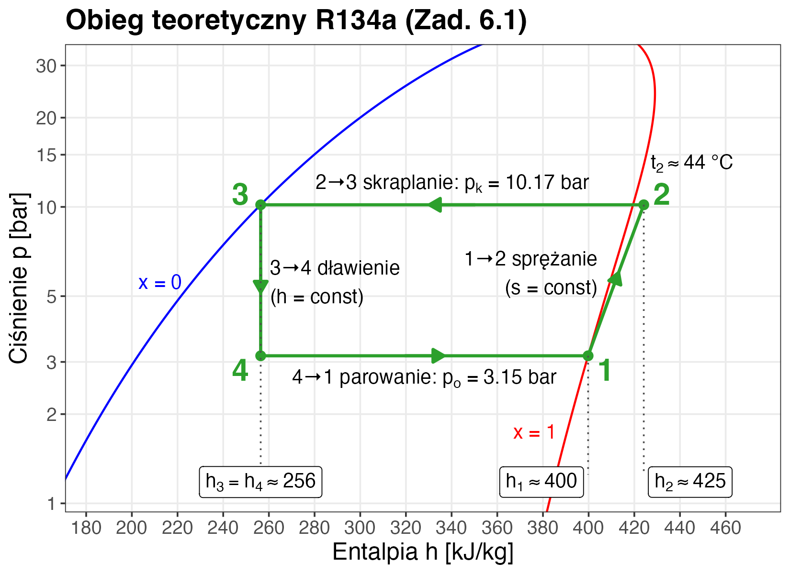
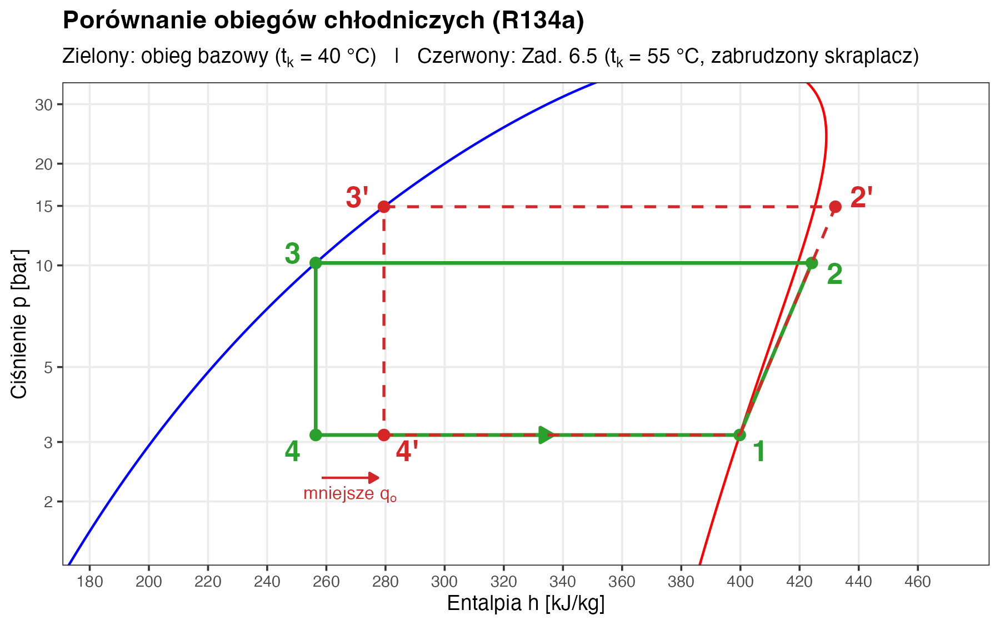

## <i class="bi bi-buildings"></i> Projekt: Etap 6 – Chłodzenie Hali {.smaller}

W hali produkcyjnej o powierzchni $2000 \text{ m}^2$ maszyny oddają $300 \text{ kW}$ ciepła (zyski ciepła).
Musimy zaprojektować agregat wody lodowej (chiller), który odbierze to ciepło.

::: {.columns}
::: {.column width="60%"}
### Założenia:

1.  **Wydajność chłodnicza:** $\dot{Q}_o = 300 \text{ kW}$.
2.  **Czynnik chłodniczy:** R134a.
3.  **Temperatura parowania:** $t_o = 2\,^\circ\text{C}$.
4.  **Temperatura skraplania:** $t_k = 40\,^\circ\text{C}$.

**Pytania inwestora:**

1.  Jaką moc pobierze sprężarka? ($N$)
2.  Ile ciepła musimy wyrzucić na dach (skraplacz)? ($\dot{Q}_{sk}$)
3.  Czy urządzenie będzie efektywne? ($\text{EER}$)

::: {style="font-size: 0.6em"}
W karcie projektowej (Etap 6) ta sama metoda dotyczy komory chłodniczej – zmieniają się tylko dane.
:::
:::
::: {.column width="40%"}

:::
:::

---

## <i class="bi bi-snow"></i> Zadanie 6.1: Obieg Lindego na Wykresie p-h {.smaller}

::: {.panel-tabset}

### Krok 1: odczyt

:::: {.columns}
::: {.column width="52%"}
Obieg teoretyczny (bez strat ciśnienia i bez dochłodzenia/przegrzania).

1.  **Punkt 1 (ssanie):** para nasycona sucha ($x = 1$) przy $t_o = 2\,^\circ\text{C}$, $p_o \approx 3.15$ bar.
    *   tablica: $h_1 = h''(2\,^\circ\text{C}) \approx 400 \text{ kJ/kg}$, $s_1 \approx 1.73 \text{ kJ/(kg·K)}$.
2.  **Punkt 2 (tłoczenie):** sprężanie izentropowe ($s = \text{const}$) do ciśnienia skraplania $p_k = p_s(40\,^\circ\text{C}) \approx 10.17$ bar.
    *   wykres: $s_2 = s_1$ na izobarze $p_k$ → $h_2 \approx 425 \text{ kJ/kg}$, $t_2 \approx 44\,^\circ\text{C}$ (więcej niż $t_k$!).
3.  **Punkt 3 (wylot skraplacza):** ciecz nasycona ($x = 0$) przy $t_k = 40\,^\circ\text{C}$.
    *   tablica: $h_3 = h'(40\,^\circ\text{C}) \approx 256 \text{ kJ/kg}$.
4.  **Punkt 4 (dławienie):** przemiana izentalpowa ($h = \text{const}$).
    *   $h_4 = h_3 \approx 256 \text{ kJ/kg}$.
:::
::: {.column width="48%"}
{width="100%"}
:::
::::

### Tablica (interpolacja)

Załącznik C (R134a) ma wiersze co 5 K – dla $t_o = 2\,^\circ\text{C}$ interpolujemy między $0$ a $5\,^\circ\text{C}$:

$$ h_1 = h''(2\,^\circ\text{C}) = 398.6 + \tfrac{2}{5}\,(401.5 - 398.6) = 399.8 \approx 400 \text{ kJ/kg} $$
$$ s_1 = s''(2\,^\circ\text{C}) = 1.727 + \tfrac{2}{5}\,(1.725 - 1.727) \approx 1.726 \text{ kJ/(kg·K)} $$
$$ p_o = 2.93 + \tfrac{2}{5}\,(3.50 - 2.93) \approx 3.16 \text{ bar} \quad (\text{dokładnie } 3.15 \text{ bar}) $$

Punkt 3 – wiersz $40\,^\circ\text{C}$, bez interpolacji: $h_3 = h' = 256.4 \text{ kJ/kg}$, $p_k = 10.17 \text{ bar}$.

::: {.callout-tip title="Z wykresu p-h (Załącznik F) odczytujemy tylko punkt 2"}
Izentropa $s = 1.726 \text{ kJ/(kg·K)}$ przecina izobarę $p_k = 10.17 \text{ bar}$ → $h_2 \approx 425 \text{ kJ/kg}$.
Uwaga: oś ciśnienia wykresu jest w MPa – $p_o \approx 0.315 \text{ MPa}$, $p_k \approx 1.017 \text{ MPa}$.
:::

### Dane wejściowe

*   **Wydajność chłodnicza:** $\dot{Q}_o = 300 \text{ kW}$
*   **Czynnik:** R134a
*   **Temp. parowania:** $t_o = 2\,^\circ\text{C}$
*   **Temp. skraplania:** $t_k = 40\,^\circ\text{C}$

:::

---

## <i class="bi bi-lightning-charge"></i> Zadanie 6.2: Bilans Energetyczny (Krok 2)

::: {.panel-tabset}

### Zadanie 6.2

**Bilans energetyczny (jednostkowy):**

::: {style="text-align: center"}
$q_o = h_1 - h_4 = 400 - 256 = \mathbf{144 \text{ kJ/kg}}$
(chłodzenie użyteczne)

$l_k = h_2 - h_1 = 425 - 400 = \mathbf{25 \text{ kJ/kg}}$
(praca sprężania)

$q_{sk} = h_2 - h_3 = 425 - 256 = \mathbf{169 \text{ kJ/kg}}$
(ciepło skraplania – odpadowe)
:::

::: {.callout-note title="Weryfikacja I zasady"}
$$ q_o + l_k = 144 + 25 = 169 = q_{sk} $$
$$ \text{Energia}_\text{in} = \text{Energia}_\text{out} \quad \text{(OK!)} $$
:::

### Dane i wyniki Kroku 1

:::: {.columns}

::: {.column width="50%"}
**Parametry wejściowe:**

1.  **Wydajność chłodnicza:** $\dot{Q}_o = 300 \text{ kW}$.
2.  **Czynnik chłodniczy:** R134a.
3.  **Temperatura parowania:** $t_o = 2\,^\circ\text{C}$.
4.  **Temperatura skraplania:** $t_k = 40\,^\circ\text{C}$.
:::

::: {.column width="50%"}
**Entalpie (tablica + wykres):**

*   $h_1 = 400$ kJ/kg
*   $h_2 = 425$ kJ/kg
*   $h_3 = 256$ kJ/kg
*   $h_4 = 256$ kJ/kg
:::

::::

:::

---

## <i class="bi bi-cash-coin"></i> Zadanie 6.3: Moc i Efektywność (Krok 3) {.smaller}

::::: {.panel-tabset}

### Zadanie 6.3

**Strumień czynnika** – musimy odebrać $\dot{Q}_o = 300$ kW ciepła z hali:
$$ \dot{m} = \frac{\dot{Q}_o}{q_o} = \frac{300 \text{ kJ/s}}{144 \text{ kJ/kg}} \approx \mathbf{2.08 \text{ kg/s}} $$

:::: {.columns}
::: {.column width="33%"}
::: {.fragment}
**Moc sprężarki:**
$$ N = \dot{m} \cdot l_k = 2.08 \cdot 25 $$
$$ N \approx \mathbf{52 \text{ kW}} $$
:::
:::

::: {.column width="34%"}
::: {.fragment}
**Ciepło skraplania:**
$$ \dot{Q}_{sk} = \dot{Q}_o + N = 300 + 52 $$
$$ \dot{Q}_{sk} \approx \mathbf{352 \text{ kW}} $$
$(= \dot{m} \cdot q_{sk} = 2.08 \cdot 169)$
:::
:::

::: {.column width="33%"}
::: {.fragment}
**Efektywność (EER):**
$$ \text{EER} = \frac{\dot{Q}_o}{N} = \frac{q_o}{l_k} = \frac{144}{25} $$
$$ \text{EER} \approx \mathbf{5.76} $$
:::
:::
::::

::: {.fragment .callout-note title="Wniosek: na 1 kW mocy sprężania prawie 6 kW chłodu"}
Obieg teoretyczny ($N$ – moc sprężania izentropowego). W rzeczywistym agregacie EER jest wyraźnie niższy: przy $\eta_{is} \approx 0.7$ i sprawności silnika $\eta_{el} \approx 0.9$: $\text{EER} \approx 5.76 \cdot 0.7 \cdot 0.9 \approx 3.6$.
:::

### Dane i wyniki Kroku 2

:::: {.columns}

::: {.column width="50%"}
**Parametry wejściowe:**

1.  **Wydajność chłodnicza:** $\dot{Q}_o = 300 \text{ kW}$.
2.  **Czynnik chłodniczy:** R134a.
3.  **Temperatura parowania:** $t_o = 2\,^\circ\text{C}$.
4.  **Temperatura skraplania:** $t_k = 40\,^\circ\text{C}$.
:::

::: {.column width="50%"}
**Entalpie:**

*   $h_1 = 400$, $h_2 = 425$, $h_3 = 256$, $h_4 = 256$ kJ/kg

**Wielkości jednostkowe:**

*   $q_o = 144$ kJ/kg
*   $l_k = 25$ kJ/kg
*   $q_{sk} = 169$ kJ/kg
:::

::::

:::::

---

## <i class="bi bi-arrow-repeat"></i> Zadanie 6.4: Pompa Ciepła z Tego Samego Obiegu {.smaller}

::::: {.panel-tabset}

### Zadanie 6.4

Skoro skraplacz wyrzuca $\dot{Q}_{sk} = 352 \text{ kW}$ ciepła na dach... Czy moglibyśmy **zimą** odwrócić logikę i wykorzystać to ciepło do ogrzewania biur?

**Ten sam obieg, ale patrząc jako pompa ciepła:**
$$ \text{COP}_{PC} = \frac{\dot{Q}_{sk}}{N} = \frac{q_{sk}}{l_k} = \frac{169}{25} \approx \mathbf{6.76} \quad (= \text{EER} + 1) $$

::: {.fragment .callout-tip title="Wniosek"}
Na każdy 1 kW mocy sprężania dostajemy **6.76 kW ciepła** do ogrzewania (obieg teoretyczny)!
Porównaj z grzejnikiem elektrycznym ($\text{COP} = 1$) lub kotłem gazowym ($\eta \approx 0.95$).
:::

::: {.fragment .callout-note title="Ale uwaga"}
Zimą nie ma już ciepłej hali jako dolnego źródła – trzeba je znaleźć (grunt, ścieki, powietrze zewnętrzne). Niższe $t_o$ i wyższe $t_k$ potrzebne do ogrzewania obniżą COP!
:::

### Dane i wyniki Kroku 3

:::: {.columns}

::: {.column width="50%"}
**Parametry wejściowe:**

1.  **Wydajność chłodnicza:** $\dot{Q}_o = 300 \text{ kW}$.
2.  **Czynnik chłodniczy:** R134a.
3.  **Temperatura parowania:** $t_o = 2\,^\circ\text{C}$.
4.  **Temperatura skraplania:** $t_k = 40\,^\circ\text{C}$.

:::

::: {.column width="50%"}
**Wyniki chłodnicze:**

*   $q_o = 144$ kJ/kg, $l_k = 25$ kJ/kg, $q_{sk} = 169$ kJ/kg
*   $\dot{m} = 2.08$ kg/s
*   $N = 52$ kW
*   $\text{EER} = 5.76$
*   **Ciepło skraplania:** $\dot{Q}_{sk} = \dot{Q}_o + N = 352$ kW
:::
::::
:::::

---

## <i class="bi bi-thermometer-half"></i> Zadanie 6.5: Wpływ Temperatury Skraplania na EER {.smaller}

Skraplacz na dachu ulega zabrudzeniu (albo latem jest upał) i temperatura skraplania rośnie o 15 K – z $t_k = 40$ do $55\,^\circ\text{C}$. Jak zmieni się EER?

:::: {.columns}
::: {.column width="50%"}
::: {.callout-tip title="Odczyt: tablica + wykres p-h (R134a)"}
Dla $t_k = 55\,^\circ\text{C}$ ($p_k \approx 14.9$ bar):

*   $h_1 = 400$ kJ/kg (bez zmian – parowanie w $2\,^\circ\text{C}$)
*   $h_{2'} \approx 432$ kJ/kg (wykres: ta sama izentropa, wyższe ciśnienie → więcej pracy)
*   $h_{3'} = h'(55\,^\circ\text{C}) = 279.5 \approx 280$ kJ/kg (tablica: wyższe ciśnienie → wyższa entalpia cieczy)
:::
:::
::: {.column width="50%"}
::: {.fragment}
$$ q_o = 400 - 280 = 120 \text{ kJ/kg} \quad (\text{było } 144) $$
$$ l_k = 432 - 400 = 32 \text{ kJ/kg} \quad (\text{było } 25) $$
$$ \text{EER}_{new} = \frac{120}{32} = \mathbf{3.75} \quad (\text{było } 5.76) $$
:::
::: {.fragment}
$$ \Delta\text{EER} = \frac{5.76 - 3.75}{5.76} \cdot 100\% \approx \mathbf{35\%} $$

**Pogorszenie o 35%!** Przy tej samej $\dot{Q}_o$ moc sprężarki rośnie z 52 do $N = 300/3.75 = 80$ kW.
:::
:::
::::

::: {.fragment .callout-warning title="Dlatego skraplacze na dachach mają wentylatory i zraszanie wodą"}
Każdy 1 K obniżenia $t_k$ to ok. 2–3% wyższy EER (tu: 35% / 15 K ≈ 2.3% na 1 K).
:::

---

## <i class="bi bi-bar-chart"></i> Wizualizacja: Wpływ Temperatury Skraplania ($t_k$)

Analiza zadań 6.1 (obieg bazowy, $t_k = 40\,^\circ\text{C}$) i 6.5 (zabrudzony skraplacz, $t_k = 55\,^\circ\text{C}$).

{.r-stretch fig-align="center"}

::: {.fragment .fade-up style="font-size: 0.7em; text-align: center;"}
**Wniosek:** podniesienie temperatury skraplania (czerwony obieg 1–2′–3′–4′) powoduje:

1. Wzrost pracy sprężania: $h_{2'} - h_1 > h_2 - h_1$.
2. Przesunięcie punktu dławienia w prawo ($h_{3'} > h_3$) → mniejsza wydajność chłodnicza $q_o$.
:::

---

## <i class="bi bi-snow"></i> Zadanie 6.6: Porównanie Czynników (R134a vs R290)

::::: {.panel-tabset}

### Zadanie 6.6

Rozważamy zamianę R134a (GWP = 1430) na **R290 (propan, GWP = 3)**. Czy warto?

::: {.callout-tip title="Odczyt dla R290 (Załącznik D i G)"}
Dla $t_o = 2\,^\circ\text{C}$, $t_k = 40\,^\circ\text{C}$:

*   $h_1 \approx 577$ kJ/kg, $h_2 \approx 624$ kJ/kg
*   $h_3 \approx 307$ kJ/kg, $h_4 = h_3$
:::

::: {.fragment}
$$ q_o = 577 - 307 = \mathbf{270 \text{ kJ/kg}} \quad (\text{R134a: } 144) $$
$$ l_k = 624 - 577 = \mathbf{47 \text{ kJ/kg}} \quad (\text{R134a: } 25) $$
$$ \text{EER} = \frac{270}{47} = \mathbf{5.74} \quad (\text{R134a: } 5.76) $$
:::

### Dane R134a (porównanie)

:::: {.columns}

::: {.column width="50%"}
**Parametry wejściowe:**

1.  **Wydajność chłodnicza:** $\dot{Q}_o = 300 \text{ kW}$.
2.  **Czynnik chłodniczy:** R134a.
3.  **Temperatura parowania:** $t_o = 2\,^\circ\text{C}$.
4.  **Temperatura skraplania:** $t_k = 40\,^\circ\text{C}$.

:::

::: {.column width="50%"}

**R134a (referencja):**

*   $q_o = 144$ kJ/kg
*   $l_k = 25$ kJ/kg
*   $\text{EER} = 5.76$

**R290 (propan):**

*   $h_1 = 577$ kJ/kg
*   $h_2 = 624$ kJ/kg
*   $h_3 = 307$ kJ/kg

:::
::::
:::::

---

## <i class="bi bi-snow"></i> Zadanie 6.6 (cd.): Wnioski

**Strumień czynnika:**
$\dot{m}_{R290} = \dot{Q}_o / q_o = 300/270 = \mathbf{1.11 \text{ kg/s}}$ (R134a: $2.08$ kg/s – **prawie o połowę mniej!**)

**Efektywność:** EER praktycznie taki sam (5.74 wobec 5.76) – R290 jest **nieznacznie mniej** efektywny (dokładne obliczenia: różnica ok. 2%). O wyborze decydują ekologia i bezpieczeństwo, nie sprawność.

::: {.callout-warning title="Bezpieczeństwo i środowisko" style="font-size: 1.3em"}
R290 ma lepszą wydajność objętościową i pomijalny GWP (3 wobec 1430); podobnie jak R134a nie niszczy warstwy ozonowej. **Ale jest palny!** Klasa bezpieczeństwa wg EN 378 / ISO 817: R134a – A1 (niepalny), R290 – A3 (wysoka palność). Wymaga specjalnych zabezpieczeń (ATEX).
:::

::: {style="font-size: 0.6em"}
GWP wg AR4 (rozporządzenie UE 517/2014), jak w karcie projektowej. Nowe rozporządzenie (UE) 2024/573 podaje wartości wg AR6: R134a – 1530, R290 – 0.02.
:::

---

## <i class="bi bi-droplet"></i> Zadanie 6.7: Dobór Rurociągu Ssawnego {.smaller}

Ile wynosi prędkość czynnika R134a w rurociągu ssawnym o średnicy $d = 80 \text{ mm}$? Przy jakiej średnicy prędkość wyniesie ok. 12 m/s?

::: {.fragment}
**Z wykresu p-h (izochory):** na ssaniu ($2\,^\circ\text{C}$, para nasycona) objętość właściwa $v_1 \approx 0.065 \text{ m}^3/\text{kg}$ (w karcie projektowej $v_1$ jest podane).

$$ \dot{V} = \dot{m} \cdot v_1 = 2.08 \cdot 0.065 = 0.135 \text{ m}^3/\text{s} $$

$$ A = \frac{\pi d^2}{4} = \frac{\pi \cdot 0.08^2}{4} = 0.00503 \text{ m}^2 \qquad w = \frac{\dot{V}}{A} = \frac{0.135}{0.00503} \approx \mathbf{26.8 \text{ m/s}} $$
:::

::: {.fragment .callout-tip title="Dopuszczalna prędkość w rurociągu ssawnym: 8–15 m/s"}
Nasza rura jest **za mała!** Zbyt duża prędkość → spadki ciśnienia → spadek EER. (Poniżej 8 m/s rura jest za duża – ryzyko złego powrotu oleju do sprężarki.)
:::

::: {.fragment}
Średnica wymagana dla $w \approx 12$ m/s:
$$ d = \sqrt{\frac{4 \dot{V}}{\pi w}} = \sqrt{\frac{4 \cdot 0.135}{\pi \cdot 12}} = 0.120 \text{ m} \approx \mathbf{120 \text{ mm}} $$
:::

---

## <i class="bi bi-house-door"></i> Zadanie Domowe (Raport 6)

**Temat:** Rzeczywisty obieg chłodniczy.

W praktyce występują straty i dodatkowe procesy poprawiające efektywność.

1.  Aby chronić sprężarkę przed cieczą, stosuje się **przegrzanie par** na ssaniu o $\Delta T_{sh} = 5 \text{ K}$ (czyli $t_1 = 2 + 5 = 7\,^\circ\text{C}$).
2.  Aby zwiększyć wydajność, stosuje się **dochłodzenie cieczy** przed dławieniem o $\Delta T_{sc} = 5 \text{ K}$ (czyli $t_3 = 40 - 5 = 35\,^\circ\text{C}$).

**Zadanie:**
Narysuj nowy obieg na wykresie p-h i oblicz nowy wskaźnik EER.
Czy dochłodzenie poprawia, czy pogarsza efektywność (EER)?

::: {.callout-tip title="Wskazówka"}
Pamiętaj: przegrzanie w parowniku zwiększa nieco i $q_o$, i $l_k$ (dla R134a efekt netto ≈ 0 – chodzi o ochronę sprężarki); dochłodzenie zwiększa $q_o$ bez zmiany $l_k$. Jaki będzie bilans netto?
:::
