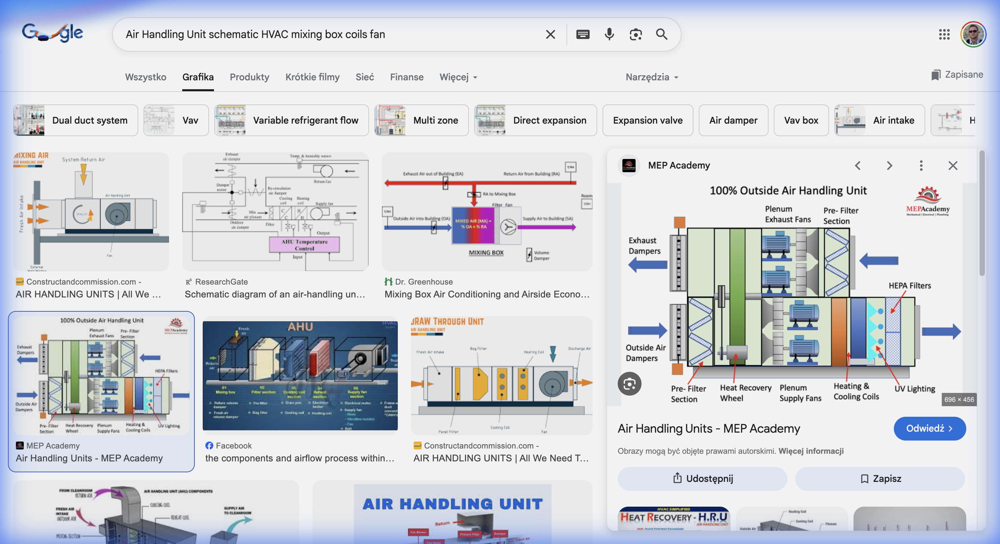

## <i class="bi bi-buildings"></i> Projekt: Etap Finalny – HVAC (ang. heating, ventilation, air conditioning)

W hali montażu elektroniki musimy utrzymać ściśle określone warunki, aby uniknąć wyładowań elektrostatycznych (ESD) i korozji.

::: {.columns}
::: {.column width="60%"}
### Wymagania Hali (Punkt W):
1.  **Temperatura:** $t_W = 22^\circ\text{C} \pm 1\,\text{K}$.
2.  **Wilgotność:** $\varphi_W = 50\% \pm 5\%$.
3.  **Zyski ciepła jawnego:** $Q_j = 50 \text{ kW}$.
4.  **Zyski wilgoci:** $\dot{W} = 10 \text{ kg/h}$.

### Zadanie:
Zaprojektować proces przygotowania powietrza w centrali wentylacyjnej (zima/lato).
:::
::: {.column width="40%"}

:::
:::

---

## <i class="bi bi-clipboard-data"></i> Założenia i Oznaczenia (jak w Karcie Projektowej)

*   **Centrala:** $\dot{V} = 25\,000 \text{ m}^3/\text{h}$, $\rho \approx 1.2 \text{ kg/m}^3$ → $\dot{m} \approx 8.33 \text{ kg/s}$; $c_p = 1.005 \text{ kJ/(kg}\cdot\text{K)}$.
*   **Nawiew latem:** $t_N = t_W - 4\,\text{K}$.
*   **Punkty na wykresie h-X:** **Z** – powietrze zewnętrzne, **P** – za nagrzewnicą (zima), **N** – nawiew, **W** – hala, **R** – za chłodnicą (punkt rosy), **M** – mieszanina (recyrkulacja).
*   **Jednostki:** zawilżenie $X$ w g/kg, entalpia $h$ w kJ/kg – obie odniesione do **1 kg powietrza suchego**.
*   **Ciśnienie:** wykres h-X sporządzono dla 0.1 MPa, a wartości w przykładach (i w karcie) liczono dla $p = 101.325$ kPa – odczytane z wykresu $X$ wyjdzie ok. 1% większe (np. $X_W \approx 8.4$ zamiast $8.3 \text{ g/kg}$); oba wyniki są poprawne.
*   Na wykresie entalpia jest oznaczona $i_{1+X}$ – to to samo co $h$.

---

## <i class="bi bi-snow"></i> Zadanie 7.1: Proces Zimowy (Ogrzewanie + Nawilżanie){.smaller}

Zimą powietrze zewnętrzne ma parametry: $t_Z = -10^\circ\text{C}$, $\varphi_Z = 90\%$.
Musimy je doprowadzić do stanu nawiewu $N$ (upraszczamy: $t_N = t_W$, $X_N = X_W$).

::: {.fragment}
### Krok 1: Wykres h-X
1.  Zaznacz punkt Z ($t_Z = -10^\circ\text{C}$, $\varphi_Z = 90\%$): $X_Z \approx 1.4 \text{ g/kg}$, $h_Z \approx -6.5 \text{ kJ/kg}$.
2.  Punkt W ($t_W = 22^\circ\text{C}$, $\varphi_W = 50\%$): $X_W \approx 8.3 \text{ g/kg}$ (z wykresu dla 0.1 MPa: $\approx 8.4 \text{ g/kg}$).
:::
::: {.fragment}
### Krok 2: Proces w Centrali
Aby osiągnąć $X_W$ z $X_Z$, musimy dodać wilgoć (nawilżanie parowe – izoterma).
Aby osiągnąć $t_W$, musimy ogrzać powietrze.

::: {.columns}
::: {.column width="50%"}
**Sekwencja:**

1.  **Nagrzewnica Wstępna:** Ogrzewanie $Z \rightarrow P$ ($X = \text{const}$).
2.  **Nawilżacz Parowy:** Nawilżanie $P \rightarrow N$ ($t \approx \text{const}$).
3.  Stan nawiewu $N$ musi mieć $X_N = X_W$ (przyjmujemy bilans wilgoci $\approx 0$).
:::
::: {.column width="50%"}
**Obliczenia:**

*   $X_P = X_Z \approx 1.4 \text{ g/kg}$, $t_P = t_W = 22^\circ\text{C}$ → $h_P \approx 26 \text{ kJ/kg}$.
*   $X_N = X_W \approx 8.3 \text{ g/kg}$.
*   $t_N \approx t_W = 22^\circ\text{C}$ (uproszczenie: pomijamy straty ciepła hali).
:::
:::
:::

---

## <i class="bi bi-graph-up"></i> Wizualizacja na Wykresie h-X (zima){.smaller}

::: {style="font-size: 0.8em"}
Jak narysować proces zimowy?
:::

:::: {.columns}

::: {.column width="70%"}
::: {style="position: relative; display: block; width: 100%; margin: 0 auto;"}
{width="100%"}

<!-- Overlay coords: left = 0.95*x_img (img max-width 95%), top = 1.6 + 0.958*y_img (p margin) -->
<!-- Step 1: Point Z (-10 °C, X = 1.46 g/kg on the 0.1 MPa chart) -->
::: {.fragment fragment-index=1 style="position: absolute; top: 81%; left: 6.03%; width: 0; height: 0;"}

  Punkt Z

:::

<!-- Step 2: Point W (22 °C, X = 8.37 g/kg on the 0.1 MPa chart) -->
::: {.fragment fragment-index=2 style="position: absolute; top: 49.9%; left: 12.78%; width: 0; height: 0;"}

  Punkt W

:::

<!-- Step 3: Heating Z -> P (X = const), P on the 22 °C isotherm -->
::: {.fragment fragment-index=3}

P (tP)

:::

<!-- Step 4: Humidifying P -> N = W (t = const) -->
::: {.fragment fragment-index=4}
<svg style="position: absolute; top: 0; left: 0; width: 100%; height: 100%; pointer-events: none; z-index: 1;">
  <line x1="6.03%" y1="50.2%" x2="12.78%" y2="49.9%" style="stroke:blue;stroke-width:2" />
</svg>
<svg style="position: absolute; top: 0; left: 0; width: 100%; height: 100%; pointer-events: none; z-index: 1;">
  <line x1="9.4%" y1="49.6%" x2="12.9%" y2="37%" style="stroke:blue;stroke-width:2" />
</svg>

  izotermiczne nawilżanie
  

:::

:::
:::

::: {.column width="30%"}
::: {.fragment fragment-index=1}
### 1. Punkt Z
$-10^\circ\text{C}$, $90\%$.
Odczytaj $X_Z$.
:::

::: {.fragment fragment-index=2}
### 2. Punkt W
$22^\circ\text{C}$, $50\%$.
Odczytaj $X_W$.
:::

::: {.fragment fragment-index=3}
### 3. Nagrzewanie
Pionowo w górę od Z ($X = \text{const}$) do temperatury $t_P = t_W$ (punkt P).
:::

::: {.fragment fragment-index=4}
### 4. Nawilżanie
Po izotermie ($t \approx \text{const}$) w prawo, aż osiągniesz $X_W$.
:::

::: {.fragment fragment-index=5}
### 5. Entalpia
Od punktu idź równolegle do ukośnych linii $i_{1+X} = \text{const}$ do lewej skali [kJ/kg] ($i_{1+X} \equiv h$): $h_Z \approx -6.5$, $h_P \approx 26 \text{ kJ/kg}$.
:::
:::

::::

---

## <i class="bi bi-sun"></i> Zadanie 7.2: Proces Letni (Chłodzenie + Osuszanie){.smaller}

Latem jest gorąco i wilgotno: $t_Z = 32^\circ\text{C}$, $\varphi_Z = 45\%$.
$X_Z \approx 13.5 \text{ g/kg}$, $h_Z \approx 67 \text{ kJ/kg}$.
Punkt W: $X_W \approx 8.3 \text{ g/kg}$.

### Analiza:
$X_Z > X_W$ ($13.5 > 8.3$) $\Rightarrow$ **Musimy OSUSZAĆ!**

### Proces w Chłodnicy:
Chłodzenie przebiega przy $X = \text{const}$ do punktu rosy, a potem po linii nasycenia ($\varphi = 100\%$).
Wykraplanie wody zachodzi na powierzchni chłodnicy.

1.  Oziębiamy powietrze aż do $X = X_W \approx 8.3 \text{ g/kg}$ (na linii nasycenia) – punkt R.
    *   To wymaga temperatury punktu rosy (tzw. punktu rosy aparatu): $t_R \approx 11.1^\circ\text{C}$, $h_R \approx 32 \text{ kJ/kg}$.
2.  Ale $11.1^\circ\text{C}$ to za zimno dla ludzi!
3.  Musimy podgrzać powietrze (Nagrzewnica Wtórna, $X = \text{const}$) do $t_N = t_W - 4\,\text{K} = 18^\circ\text{C}$: $h_N \approx 39 \text{ kJ/kg}$.

**Wniosek:** Latem musimy najpierw mocno chłodzić (by osuszyć), a potem lekko podgrzać! To duży koszt energetyczny.

---

## <i class="bi bi-graph-up"></i> Wizualizacja na Wykresie h-X (lato){.smaller}

:::: {.columns}

::: {.column width="70%"}
::: {style="position: relative; display: block; width: 100%; margin: 0 auto;"}
{width="100%"}

<!-- Step 1: Point Z (32 °C, X = 13.67 g/kg on the 0.1 MPa chart) -->
::: {.fragment fragment-index=1 style="position: absolute; top: 39.9%; left: 17.95%; width: 0; height: 0;"}

<!-- Label to the RIGHT of Z to avoid cooling line -->

  Punkt Z

:::

<!-- Step 2: Cooling & Dehumidification (Z -> saturation at X_Z -> R along phi = 100%) -->
::: {.fragment fragment-index=2}
<!-- Point R (dew point of W): 11.1 °C, X = 8.37 g/kg -->

R

<!-- Cooling: X = const down to saturation (18.6 °C), then along the saturation curve to R -->
<svg viewBox="0 0 100 100" preserveAspectRatio="none" style="position: absolute; top: 0; left: 0; width: 100%; height: 100%; pointer-events: none; z-index: 1;">
  <polyline points="17.95,39.88 17.95,53.08 16.65,54.68 15.18,56.69 13.88,58.67 12.78,60.54" style="fill:none;stroke:blue;stroke-width:2" vector-effect="non-scaling-stroke" />
</svg>
<!-- Label to the RIGHT of Cooling Process -->

  Chłodzenie + Osuszanie

:::

<!-- Step 3: Heating (R -> N), N: 18 °C, X = 8.37 g/kg -->
::: {.fragment fragment-index=3}

N

<!-- Heating Line -->

<!-- Label to the LEFT of Heating Process -->

  Nagrzewanie

:::

<!-- Final State: W (Reference), 22 °C, X = 8.37 g/kg -->

:::
:::

::: {.column width="30%"}
::: {.fragment fragment-index=1}
### 1. Punkt Z
$32^\circ\text{C}$, $45\%$.
Wilgotno i gorąco.
:::

::: {.fragment fragment-index=2}
### 2. Chłodzenie i Osuszanie
Oziębiamy powietrze do punktu rosy, a dalej wzdłuż krzywej $\varphi = 100\%$, aż $X = X_W \approx 8.3 \text{ g/kg}$ (punkt R).
$t_R \approx 11.1^\circ\text{C}$.
:::

::: {.fragment fragment-index=3}
### 3. Nagrzewanie Wtórne
$11.1^\circ\text{C}$ to za zimno!
Podgrzewamy powietrze ($X = \text{const}$) do temperatury nawiewu $t_N = t_W - 4\,\text{K} = 18^\circ\text{C}$ (punkt N).
:::
:::

::::

---

## <i class="bi bi-building-gear"></i> Zadanie 7.3: Bilans Centrali{.smaller}

Oblicz moc chłodniczą i grzewczą dla strumienia $\dot{V} = 25\,000 \text{ m}^3/\text{h}$, $\rho \approx 1.2 \text{ kg/m}^3$.

$$ \dot{m} = \rho \cdot \frac{\dot{V}}{3600} = 1.2 \cdot \frac{25\,000}{3600} \approx \mathbf{8.33 \text{ kg/s}} $$

::: {.fragment}
### Chłodnica (Lato):
$h_Z (32^\circ\text{C}, 45\%) \approx 67 \text{ kJ/kg}$.
$h_R (11.1^\circ\text{C}, 100\%) \approx 32 \text{ kJ/kg}$.
$$ \dot{Q}_{ch} = \dot{m} (h_Z - h_R) = 8.33 \cdot (67 - 32) = 8.33 \cdot 35 \approx \mathbf{292 \text{ kW}} $$
:::

::: {.fragment}
### Nagrzewnica Wtórna (Lato):
$h_R (11.1^\circ\text{C}) \approx 32 \text{ kJ/kg}$.
$h_N (18^\circ\text{C}, X = 8.3 \text{ g/kg}) \approx 39 \text{ kJ/kg}$.
$$ \dot{Q}_{grz} = \dot{m} (h_N - h_R) = 8.33 \cdot (39 - 32) = 8.33 \cdot 7 \approx \mathbf{58 \text{ kW}} $$
:::

::: {.fragment .callout-important title="Wniosek"  style="font-size: 1.8em;"}
Marnujemy ok. 58 kW ciepła, żeby podgrzać powietrze, które wcześniej schłodziliśmy!
**Rozwiązanie:** Rekuperacja chłodu lub by-pass powietrza.
:::

---

## <i class="bi bi-search"></i> Zadanie 7.4: Punkt Rosy – Kontrola Kondensacji{.smaller}

::: {.panel-tabset}

### Wyznacz punkt rosy z wykresu h-X:

W hali temperatura wewnętrznej powierzchni ściany zewnętrznej spada zimą do $12^\circ\text{C}$. Czy przy parametrach wewnętrznych ($22^\circ\text{C}$, $50\%$) dojdzie do **kondensacji na ścianie**?

1.  Punkt W: $t_W = 22^\circ\text{C}$, $\varphi_W = 50\% \rightarrow X_W \approx 8.3 \text{ g/kg}$.
2.  Punkt rosy: idź w dół po $X = \text{const}$ aż do przecięcia z krzywą $\varphi = 100\%$.

::: {.fragment}
$$ t_R (X_W = 8.3 \text{ g/kg}) \approx \mathbf{11.1^\circ\text{C}} $$

Ściana ma $12^\circ\text{C} > t_R = 11.1^\circ\text{C}$ → kondensacji **nie ma**, ale zapas to tylko $0.9\,\text{K}$ – **na granicy!** Przy niewielkim spadku temperatury ściany pojawi się rosa.

Gdy $|t_{\text{ściany}} - t_R| < 0.5\,\text{K}$, wynik uznajemy za „na granicy” (dokładność odczytu z wykresu).
:::

::: {.fragment .callout-caution title="Decyzja"}
Należy docieplić ścianę (zmniejszyć współczynnik przenikania ciepła $U$ – wzrośnie temperatura jej wewnętrznej powierzchni) lub obniżyć wilgotność w hali do $\varphi \le 45\%$ ($t_R \approx 9.5^\circ\text{C}$).
:::

### Wykres

::: {style="position: relative; display: block; width: 70%; margin: 0 auto;"}
{width="100%"}
:::
:::

---

## <i class="bi bi-rulers"></i> Zadanie 7.5: Wymagany Strumień Powietrza{.smaller}

Oblicz minimalny strumień powietrza nawiewanego, aby pokryć zyski ciepła jawnego ($Q_j = 50$ kW) i wilgoci ($\dot{W} = 10$ kg/h).

**Bilans ciepła jawnego:**
$$ Q_j = \dot{m} \cdot c_p \cdot (t_W - t_N) $$

Przyjmijmy $t_N = t_W - 4\,\text{K} = 18^\circ\text{C}$ (jak w Zad. 7.2), $t_W = 22^\circ\text{C}$, $c_p = 1.005 \text{ kJ/(kg}\cdot\text{K)}$.

::: {.fragment}
$$ \dot{m} = \frac{Q_j}{c_p \, (t_W - t_N)} = \frac{50}{1.005 \cdot (22 - 18)} = \frac{50}{4.02} \approx \mathbf{12.44 \text{ kg/s}} $$
$$ \dot{V} = \frac{12.44}{1.2} \approx 10.4 \text{ m}^3/\text{s} \approx \mathbf{37\,300 \text{ m}^3/\text{h}} $$
:::

::: {.fragment}
**Weryfikacja bilansu wilgoci:**
$$ \Delta X = \frac{\dot{W}}{\dot{m}} = \frac{10/3600}{12.44} = 0.000223 \text{ kg/kg} = 0.22 \text{ g/kg} $$
$X_N = X_W - \Delta X = 8.3 - 0.22 \approx 8.1$ g/kg → Praktycznie brak zmiany. Zyski wilgoci są niewielkie.
:::

---

## <i class="bi bi-arrow-repeat"></i> Zadanie 7.6: Recyrkulacja Powietrza

Zamiast pobierać 100% powietrza zewnętrznego, stosujemy **recyrkulację**: $r = 70\%$ powietrza wraca z hali (stan W), $100\% - r = 30\%$ to świeże powietrze (stan Z).

**Lato:** Punkt Z (zewn.): $32^\circ\text{C}$, $45\%$, $X_Z \approx 13.5$ g/kg. Punkt W (hala): $22^\circ\text{C}$, $50\%$, $X_W \approx 8.3$ g/kg.

### Punkt Mieszaniny M:
$$ t_M = \tfrac{r}{100}\, t_W + \left(1 - \tfrac{r}{100}\right) t_Z = 0.7 \cdot 22 + 0.3 \cdot 32 = 15.4 + 9.6 = \mathbf{25.0^\circ\text{C}} $$
$$ X_M = \tfrac{r}{100}\, X_W + \left(1 - \tfrac{r}{100}\right) X_Z = 0.7 \cdot 8.3 + 0.3 \cdot 13.5 = 5.81 + 4.05 = \mathbf{9.86 \text{ g/kg}} $$

---

## <i class="bi bi-arrow-repeat"></i> Zadanie 7.6 (cd.): Analiza Oszczędności

**Porównanie obciążenia osuszania:**

*   Bez recyrkulacji ($X_Z = 13.5$): Musimy usunąć $13.5 - 8.3 = 5.2$ g/kg.
*   Z recyrkulacją ($X_M = 9.86$): Musimy usunąć $9.86 - 8.3 = 1.56$ g/kg.

::: {.callout-tip title="Wniosek"}
Redukcja obciążenia osuszania o **70%** ($1 - 1.56/5.2 = 0.70$)! → Mniejsza chłodnica, mniejszy koszt energii.
Uwaga: redukcja zawsze równa się udziałowi recyrkulacji $r$, bo $X_M - X_W = \left(1 - \tfrac{r}{100}\right)(X_Z - X_W)$.
:::

::: {.callout-note title="Uwaga"}
Recyrkulacja to **najskuteczniejszy** sposób zmniejszenia kosztów energetycznych centrali. Ograniczenie: wymogi higieniczne (min. 30 m³/h powietrza świeżego na osobę).
:::

---

## <i class="bi bi-droplet"></i> Zadanie 7.7: Ilość Kondensatu (Lato){.smaller}

W procesie letnim (chłodzenie + osuszanie) z powietrza wykrapla się woda. Ile litrów na godzinę?

::: {.fragment}
**Strumień masy powietrza:** $\dot{m} = 8.33$ kg/s (z Zad. 7.3).

**Zmiana zawilżenia** (za chłodnicą $X_R = X_W$):
$$ \Delta X = X_Z - X_R = 13.5 - 8.3 = 5.2 \text{ g/kg} = 0.0052 \text{ kg/kg} $$

**Strumień kondensatu:**
$$ \dot{m}_w = \dot{m} \cdot \Delta X = 8.33 \cdot 0.0052 = 0.0433 \text{ kg/s} $$
$$ \dot{V}_w = 0.0433 \cdot 3600 \approx \mathbf{156 \text{ l/h}} \quad (\rho_w \approx 1 \text{ kg/l}) $$
:::

::: {.fragment .callout-note title="Uwaga"}
To ok. **2.6 litra na minutę** wykroplonej wody! Musi być odprowadzona do kanalizacji przez syfon (aby nie wciągać powietrza). Tę wodę (o niskiej mineralizacji) można po uzdatnieniu wykorzystać np. do nawilżania.
:::

---

## <i class="bi bi-building-gear"></i> Zadanie 7.8: Nagrzewnica Zimowa – Moc{.smaller}

::: {.panel-tabset}

### Obliczenia

Oblicz moc nagrzewnicy zimowej dla strumienia $\dot{V} = 25\,000 \text{ m}^3/\text{h}$ powietrza podgrzewanego od $-10^\circ\text{C}$ do $22^\circ\text{C}$ (proces $Z \rightarrow P$ z Zad. 7.1).

::: {.columns}
::: {.column width="50%"}
$$ \dot{m} = 1.2 \cdot \frac{25\,000}{3600} \approx 8.33 \text{ kg/s} $$

**Z wykresu h-X:**

*   $h_Z (-10^\circ\text{C}, 90\%) \approx -6.5 \text{ kJ/kg}$
*   $h_P (22^\circ\text{C}, X = 1.4 \text{ g/kg}) \approx 26 \text{ kJ/kg}$
:::
::: {.column width="50%"}
$$ \dot{Q}_{nagr} = \dot{m} (h_P - h_Z) $$
$$ \dot{Q}_{nagr} = 8.33 \cdot (26 - (-6.5)) $$
$$ \dot{Q}_{nagr} = 8.33 \cdot 32.5 \approx \mathbf{271 \text{ kW}} $$
:::
:::

::: {.fragment .callout-warning title="Uwaga"}
$271 \text{ kW}$ to jak ogrzewanie **ok. 14 domów jednorodzinnych** (przyjmując ok. 20 kW na dom)! Dlatego rekuperacja (odzysk ciepła) jest kluczowa – może zaoszczędzić ok. 75% tej mocy (Zad. 7.9).
:::

### Wykres

::: {style="position: relative; display: block; width: 70%; margin: 0 auto;"}
{width="100%"}
:::
:::

---

## <i class="bi bi-arrow-left-right"></i> Zadanie 7.9: Odzysk Ciepła (Rekuperacja){.smaller}

Wymiennik krzyżowy (rekuperator) o sprawności temperaturowej $\eta = 75\%$ podgrzewa powietrze świeże ($t_Z = -10^\circ\text{C}$) ciepłem powietrza wywiewanego z hali ($t_W = 22^\circ\text{C}$). Strumień: $\dot{V} = 25\,000 \text{ m}^3/\text{h}$ → $\dot{m} = 8.33$ kg/s.

::: {.columns}
::: {.column width="50%"}
::: {.fragment}
**1. Temperatura za rekuperatorem** (przed nagrzewnicą):
$$ \eta = \frac{t_{odz} - t_Z}{t_W - t_Z} \;\Rightarrow\; t_{odz} = t_Z + \eta \, (t_W - t_Z) $$
$$ t_{odz} = -10 + 0.75 \cdot (22 - (-10)) = -10 + 24 = \mathbf{14^\circ\text{C}} $$
:::
:::
::: {.column width="50%"}
::: {.fragment}
**2. Zaoszczędzona moc grzewcza** (warunki obliczeniowe):
$$ \Delta\dot{Q} = \dot{m} \, c_p \, (t_{odz} - t_Z) = 8.33 \cdot 1.005 \cdot (14 - (-10)) \approx \mathbf{201 \text{ kW}} $$
Nagrzewnica musi dostarczyć już tylko ok. $271 - 201 = 70$ kW (oszczędność ok. 74%).
:::
:::
:::

---

## <i class="bi bi-arrow-left-right"></i> Zadanie 7.9 (cd.): Czy Rekuperator się Opłaci?{.smaller}

Przyjmij średnią sezonową temperaturę zewnętrzną $t_{Z,\text{śr}} = +2^\circ\text{C}$, 3000 h pracy w sezonie i cenę ciepła 0.35 zł/kWh. Rekuperator kosztuje ok. 150 000 zł.

::: {.fragment}
**Średnia moc odzyskiwana w sezonie** (ta sama sprawność, mniejsza różnica temperatur):
$$ \Delta\dot{Q}_{\text{śr}} = \dot{m} \, c_p \, \eta \, (t_W - t_{Z,\text{śr}}) = 8.33 \cdot 1.005 \cdot 0.75 \cdot (22 - 2) \approx 125.6 \text{ kW} $$
:::

::: {.fragment}
**Roczna oszczędność:**
$$ E = 125.6 \text{ kW} \cdot 3000 \text{ h} \approx 376\,800 \text{ kWh} \quad\Rightarrow\quad K = 376\,800 \cdot 0.35 \approx \mathbf{132\,000 \text{ zł/rok}} $$

**Prosty okres zwrotu:**
$$ T_{zw} = \frac{150\,000}{132\,000} \approx \mathbf{1.1 \text{ roku}} $$
:::

::: {.fragment .callout-important title="Uwaga"}
Nie licz oszczędności dla mocy obliczeniowej ($201 \text{ kW} \cdot 3000 \text{ h}$) – temperatura $-10^\circ\text{C}$ występuje tylko przez kilka dni w roku; zawyżyłbyś oszczędność o ok. 60%.
:::

---

## <i class="bi bi-house-door"></i> Zadanie Domowe (Raport 7)

**Temat:** Etap 7 Karty Projektowej – Centrala Klimatyzacyjna.

1.  Rozwiąż zadania 7.1–7.9 dla **swoich** danych z karty ($t_Z$ zima/lato, $t_W$, $\dot{V}$, $Q_j$, $r$).
2.  Na jednym wykresie h-X zaznacz wszystkie punkty (Z, P, N, W, R, M) oraz procesy zimowy i letni.
3.  Oceń wyniki: czy strumień centrali wystarcza do pokrycia zysków ciepła (Zad. 7.5)? Czy rekuperator się opłaca (Zad. 7.9)?
