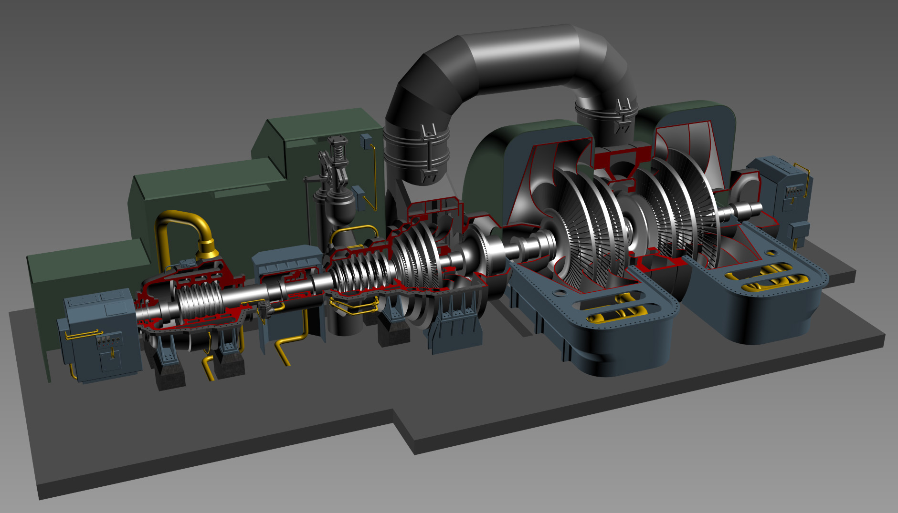
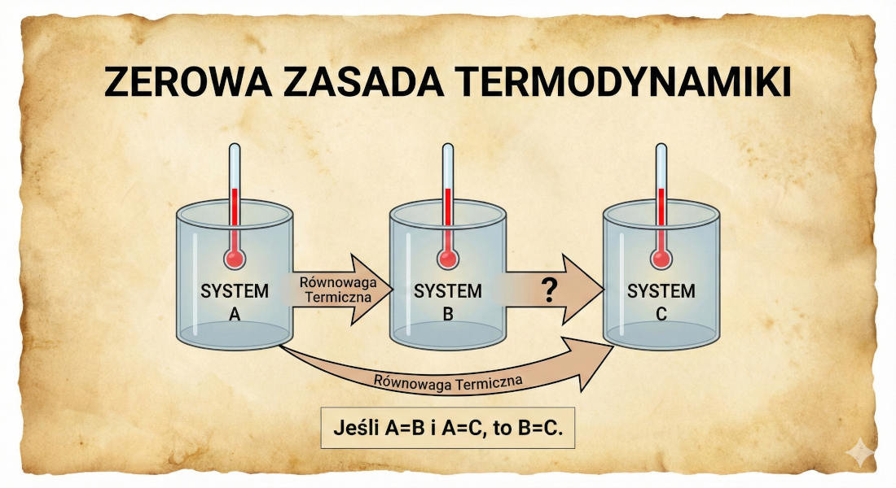
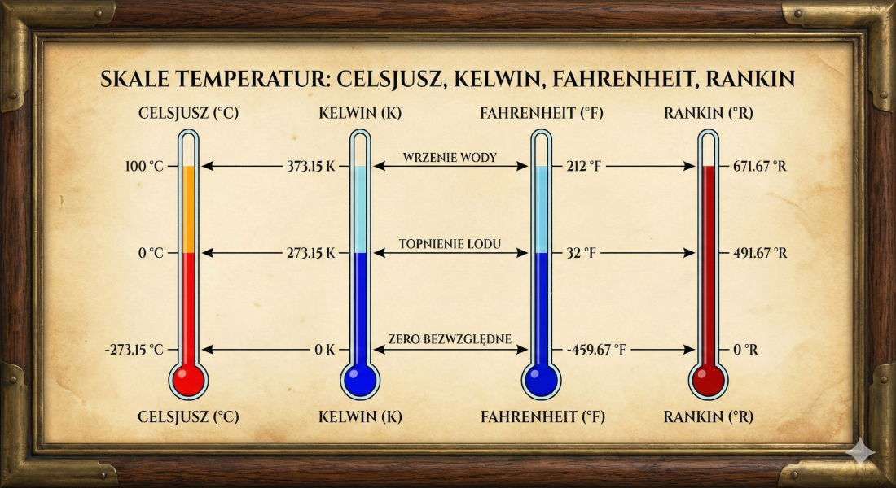
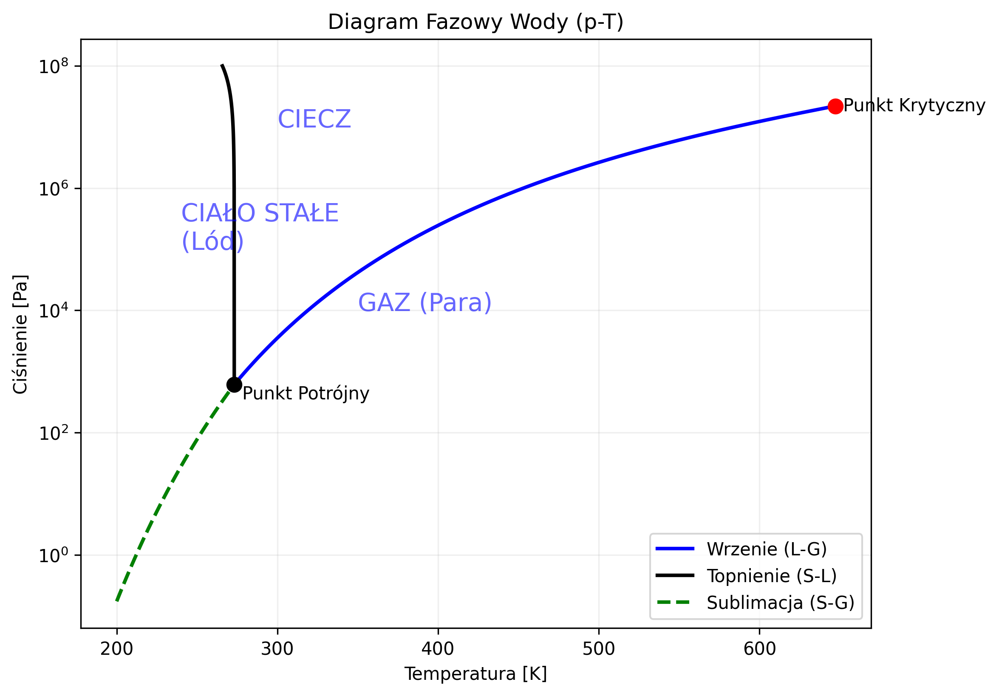
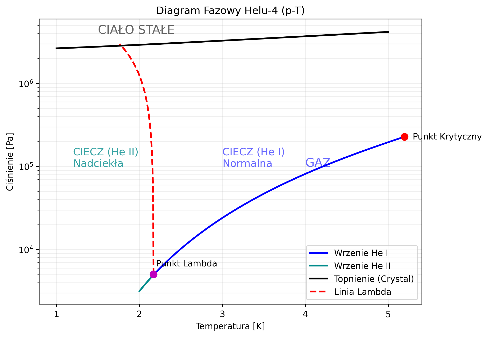

```{r}
#| label: setup
#| include: false

library(ggplot2)

# Ustaw motyw domyślny na jasny (standardowy minimal)
theme_set(theme_minimal(base_size = 18))
```
<!-- # Wprowadzenie do Termodynamiki {data-menu-title="Tytuł"} -->

<!-- ## Moduł 1: Podstawy (2h) -->

<!-- **Prowadzący:** \[Imię i Nazwisko\] -->

<!-- **Cel Modułu:** Zdefiniowanie fundamentalnych pojęć, klasyfikacja układów oraz zrozumienie kluczowych parametrów stanu i zasad równowagi \[1-10\]. -->

### Materiały z wykładów i ćwiczeń dostępne na platformie: [elearning](https://elearning2.up.poznan.pl){target="_blank"}

{width="20%" fig-align="right"}

:::: {style="position: relative; display: inline-block;"}


<div class="fragment" style="position: absolute; top: 0%; left: 89%; width: 150px; height: 100px; border: 10px solid #e60000; box-shadow: 0 0 10px rgba(0,0,0,0.5); z-index: 10;">
</div>
::::

## <i class="bi bi-fire"></i> Czym jest Termodynamika?

### Definicja i Zakres

Termodynamika to **dział fizyki** zajmujący się badaniem **termicznych właściwości układów makroskopowych**.


Bada ona przemiany pomiędzy różnymi formami energii, *przede wszystkim* między:

::: {style="text-align: left; margin-left: 150px;"}
-   **Ciepłem** ($Q$)
-   **Pracą** ($L$)
:::

### Termodynamika Techniczna w Inżynierii {.fragment .fade-up}

:::: incremental 

::: {.r-stack} 

<div style="text-align: left; margin-left: 150px;">
-   **Obliczanie właściwości par:** Np. para wodna w turbinach.
-   **Analiza obiegów:** Silniki spalinowe, elektrownie.
-   **Urządzenia:** Sprężarki, pompy ciepła, chłodnictwo.
</div>

::: {.fragment .fade-up .callout-note title="Innymi słowy..." style="font-size: 1.3em; color: red; background-color: #e3f2fd;"}
To nauka o tym, jak zamienić chaos (ciepło) w użyteczne działanie (pracę).
:::

:::

::::

## Poziomy Opisu Układu {style="font-size: 0.95em;"}

### Makrostan vs. Mikrostan

Możemy patrzeć na układ z dwóch perspektyw:

::::: columns
::: {.column width="50%" .incremental}
### 📊 Makrostan

-   Opis za pomocą wielkości **mierzalnych** i uśrednionych.
-   Zmienne: $p, T, V, U$ (***Parametry stanu***).
-   To podejście dominuje w inżynierii.
-   **To tzw. metoda** *fenomenologiczna*
:::

::: {.column width="50%" .incremental}
### 🔬 Mikrostan

-   Opis stanu każdej pojedynczej cząstki.
-   Pędy i położenia miliardów atomów.
-   Wymaga metod statystycznych.
-   **To tzw. metoda** *statystyczna*
:::
:::::

::: {.fragment .fade-up .callout-note title="Wniosek"}
Makrostan o największej liczbie odpowiadających mu mikrostanów $\Omega$ jest **najbardziej prawdopodobny** i odpowiada stanowi równowagi.
:::


## <i class="bi bi-boxes"></i> Klasyfikacja Układów

Podział ze względu na wymianę z otoczeniem:

:::::: columns
::: {.column width="33%"}
### <i class="bi bi-box-seam"></i> Izolowany

-   **Energia:** ❌
-   **Materia:** ❌

<!-- Wstaw grafikę przedstawiającą układ izolowany, np. termos -->

{width="60%" fig-align="left"}
:::

::: {.column width="33%"}
### <i class="bi bi-box-seam-fill"></i> Zamknięty

-   **Energia:** ✅
-   **Materia:** ❌

<!-- Wstaw grafikę przedstawiającą układ zamknięty, np. zamknięty cylinder z tłokiem -->

{width="90%" fig-align="left"}
:::

::: {.column width="33%"}
### <i class="bi bi-box-arrow-right"></i> Otwarty

-   **Energia:** ✅
-   **Materia:** ✅

<!-- Wstaw grafikę przedstawiającą układ otwarty, np. turbinę parową -->

{width="90%" fig-align="left"}
:::
::::::

Dla **układu izolowanego** zmiana energii wewnętrznej jest zerowa: $\Delta U = 0$


## <i class="bi bi-arrow-repeat"></i> Proces i Równowaga

### Definicje Procesów

::::: columns
::: {.column width="40%"}
**Proces (Przemiana Termodynamiczna):** 

* Zmiana stanu układu, w wyniku której zmienia się wartość co najmniej jednego z parametrów termodynamicznych.
:::

::: {.column width="60%"}
```{r}
#| label: fig-przemiany
#| fig-cap: "Porównanie przemian termodynamicznych (rozprężanie izotermiczne i adiabatyczne, ochładzanie izochoryczne)"
#| echo: false
#| warning: false
#| message: false
#| fig-align: center
#| fig-height: 6

library(ggplot2)
library(dplyr)

# 1. PARAMETRY FIZYCZNE
# =====================
p0 <- 10       # Ciśnienie początkowe [bar]
v0 <- 1        # Objętość początkowa [m3]
gamma <- 1.4   # Wykładnik adiabaty (dla powietrza)
v_end <- 4     # Objętość końcowa

# Generowanie ciągu objętości dla krzywych
v_seq <- seq(v0, v_end, length.out = 200)

# 2. OBLICZENIA (MODEL FIZYCZNY)
# ==============================

# A. Przemiana Izotermiczna (T = const) -> pV = const -> p = p0*v0 / v
p_iso <- (p0 * v0) / v_seq

# B. Przemiana Adiabatyczna (Q = 0) -> pV^gamma = const -> p = p0 * (v0/v)^gamma
p_adia <- p0 * (v0 / v_seq)^gamma

# Składanie danych do wykresu (Tidy Data)
df_curves <- data.frame(
  V = rep(v_seq, 2),
  P = c(p_iso, p_adia),
  Typ = rep(c("Izotermiczna (T=const)", "Adiabatyczna (Q=0)"), each = length(v_seq))
)

# C. Przemiana Izochoryczna (V = const)
# To jest linia pionowa, więc definiujemy ją oddzielnie jako odcinek
df_isocho <- data.frame(
  V = c(v0, v0),
  P = c(p0, 2), # Spadek ciśnienia przy stałej objętości (chłodzenie)
  Typ = "Izochoryczna (V=const)"
)

# 3. GENEROWANIE WYKRESU
# ======================
ggplot() +
  # Krzywe (Izotermiczna i Adiabatyczna)
  geom_line(data = df_curves, aes(x = V, y = P, color = Typ), size = 1.5) +
  
  # Linia pionowa (Izochoryczna) - używamy linetype dashed dla odróżnienia
  geom_path(data = df_isocho, aes(x = V, y = P, color = Typ), 
            size = 1.5, linetype = "dashed") +
  
  # Punkt początkowy (wspólny)
  geom_point(aes(x = v0, y = p0), size = 5, color = "black") +
  annotate("text", x = v0 + 0.2, y = p0 + 0.5, label = "Stan początkowy", 
           fontface = "bold", size = 5) +
  
  # Estetyka i Kolory
  scale_color_manual(values = c(
    "Adiabatyczna (Q=0)" = "#e41a1c",     # Czerwony
    "Izotermiczna (T=const)" = "#377eb8", # Niebieski
    "Izochoryczna (V=const)" = "#4daf4a"  # Zielony
  )) +
  
  # Opisy osi i tytuły
  labs(
    title = "Diagram p-V: Porównanie Przemian",
    x = "Objętość V",
    y = "Ciśnienie p",
    color = "Rodzaj Przemiany"
  ) +
  
  # Styl akademicki
  theme_minimal(base_size = 16) +
  theme(
    legend.position = "bottom",
    panel.grid.minor = element_blank(),
    plot.title = element_text(face = "bold"),
    axis.title = element_text(face = "italic")
  )
```
:::
:::::

## Proces i Równowaga

### Definicje Procesów

::::: columns
::: {.column width="40%"}
**Obieg Termodynamiczny:** 

* Ciąg procesów, który prowadzi układ z powrotem do stanu początkowego.
:::

::: {.column width="60%"}
```{r}
#| label: fig-otto-cycle
#| fig-cap: "Teoretyczny Obieg Otta (p-V) dla silnika spalinowego"
#| echo: false
#| warning: false
#| message: false
#| fig-align: center
#| fig-height: 6

library(ggplot2)
library(dplyr)

# 1. PHYSICAL PARAMETERS
# ======================
gamma <- 1.4       # Heat capacity ratio (air)
r_comp <- 8        # Compression ratio (V_max / V_min)
p1 <- 1            # Initial pressure [bar]
v1 <- 8            # Initial volume (V_max) [arb. units]
v2 <- v1 / r_comp  # Compressed volume (V_min)
heat_add <- 3.5    # Pressure multiplier for combustion (represents Q_in)

# 2. STATE CALCULATION (Corner Points 1-2-3-4)
# ============================================

# State 1: Intake end (Start of compression)
# Known: p1, v1

# State 2: Compression end (Adiabatic)
# p1 * v1^gamma = p2 * v2^gamma
p2 <- p1 * (v1 / v2)^gamma

# State 3: Combustion end (Isochoric Heat Addition)
# v3 = v2, p3 rises due to explosion
v3 <- v2
p3 <- p2 * heat_add

# State 4: Expansion end (Adiabatic Power Stroke)
# p3 * v3^gamma = p4 * v4^gamma, where v4 = v1
v4 <- v1
p4 <- p3 * (v3 / v4)^gamma

# 3. CURVE GENERATION
# ===================

# A. Adiabatic Compression (1 -> 2)
v_12 <- seq(v1, v2, length.out = 100)
p_12 <- p1 * (v1 / v_12)^gamma
df_12 <- data.frame(V = v_12, P = p_12, Phase = "1-2: Sprężanie (Adiabata)")

# B. Isochoric Combustion (2 -> 3)
# Vertical line
df_23 <- data.frame(V = c(v2, v3), P = c(p2, p3), Phase = "2-3: Zapłon (Q_dost)")

# C. Adiabatic Expansion (3 -> 4) - WORK STROKE
v_34 <- seq(v3, v4, length.out = 100)
p_34 <- p3 * (v3 / v_34)^gamma
df_34 <- data.frame(V = v_34, P = p_34, Phase = "3-4: Praca (Adiabata)")

# D. Isochoric Exhaust (4 -> 1)
# Vertical line
df_41 <- data.frame(V = c(v4, v1), P = c(p4, p1), Phase = "4-1: Wydech (Q_wyl)")

# Combine all for lines
df_cycle <- rbind(df_12, df_23, df_34, df_41)

# Create polygon data for shading the Work Area (W)
# We need to order points to form a closed loop: 1->2->3->4->1
df_poly <- rbind(df_12, df_23, df_34, df_41)

# 4. PLOTTING
# ===========
ggplot() +
  # A. Shaded Area (Work)
  geom_polygon(data = df_poly, aes(x = V, y = P), 
               fill = "grey90", color = NA) +
  
  # B. Cycle Lines
  geom_path(data = df_cycle, aes(x = V, y = P, color = Phase), 
            size = 1.5, lineend = "round") +
  
  # C. Corner Points Labels (1, 2, 3, 4)
  annotate("text", x = v1 + 0.2, y = p1, label = "1", size = 6, fontface = "bold") +
  annotate("text", x = v2 - 0.2, y = p2, label = "2", size = 6, fontface = "bold") +
  annotate("text", x = v3 - 0.2, y = p3, label = "3", size = 6, fontface = "bold") +
  annotate("text", x = v4 + 0.2, y = p4, label = "4", size = 6, fontface = "bold") +
  
  # D. Annotations for Heat/Work (Arrows)
  annotate("text", x = 2.4, y = 12.5, lineheight = 0.9,
           label = "Pole =\nPraca (L)", color = "grey50", fontface = "italic") +

  # E. Colors and Scales
  scale_color_manual(values = c(
    "1-2: Sprężanie (Adiabata)" = "#377eb8", # Blue
    "2-3: Zapłon (Q_dost)" = "#e41a1c",      # Red (Heat In)
    "3-4: Praca (Adiabata)" = "#ff7f00",     # Orange
    "4-1: Wydech (Q_wyl)" = "#4daf4a"        # Green (Heat Out)
  ),
  # Etykiety legendy z indeksami (plotmath) zamiast widocznego podkreślnika
  breaks = c("1-2: Sprężanie (Adiabata)", "2-3: Zapłon (Q_dost)",
             "3-4: Praca (Adiabata)", "4-1: Wydech (Q_wyl)"),
  labels = c("1-2: Sprężanie (Adiabata)",
             expression("2-3: Zapłon (" * Q[dost] * ")"),
             "3-4: Praca (Adiabata)",
             expression("4-1: Wydech (" * Q[wyl] * ")"))
  ) +
  
  # F. Theme details
  labs(
    title = "Obieg Otta (Silnik ZI)",
    subtitle = "Teoretyczny cykl idealny gazu doskonałego",
    x = "Objętość V",
    y = "Ciśnienie p",
    color = "Etap cyklu"
  ) +
  theme_minimal(base_size = 16) +
  theme(
    legend.position = "right",
    legend.title = element_text(face="bold"),
    panel.grid.minor = element_blank()
  )
```
:::
:::::

## Proces i Równowaga

::::: columns
::: {.column width="30%"}
**Stan Równowagi:** 

* Stan, w którym parametry są jednorodne i nie zmieniają się w czasie (równowaga termiczna, mechaniczna, chemiczna).

[*Wykres obok (na dole): wizualizacja istoty równowagi termodynamicznej — zanik gradientów.*]{style="font-size: 0.6em; color: #555;"}
:::

::: {.column width="70%"}


::: {.mmd-fit style="height: 410px;"}
```{mermaid}
%%| fig-align: center
%%{init: {'theme': 'default', 'htmlLabels': false, 'flowchart': {'htmlLabels': false, 'wrappingWidth': 400, 'subGraphTitleMargin': {'top': 6, 'bottom': 16}}, 'themeVariables': {'fontSize': '16px', 'fontFamily': 'Arial, Helvetica, sans-serif'}}}%%
flowchart LR
    subgraph Rownowaga [Pełna Równowaga<br>Termodynamiczna]
        direction TB
        
        T[Termiczna] ---|T1 = T2| A(Brak przepływu ciepła)
        M[Mechaniczna] ---|p1 = p2| B(Brak ruchu granic/tłoka)
        C[Chemiczna] ---|μ1 = μ2| D(Brak dyfuzji/reakcji)
    end
    
    style Rownowaga fill:#f9f9f9,stroke:#333,stroke-width:2px
    style T fill:#ffcccc,stroke:#333
    style M fill:#ccffcc,stroke:#333
    style C fill:#ccccff,stroke:#333
```
:::


```{r}
#| label: equilibrium
#| echo: false
#| warning: false
#| fig-width: 12
#| fig-height: 3.4

library(ggplot2)
library(dplyr)
library(patchwork) # Do łączenia wykresów (install.packages("patchwork"))

# Ustawienie ziarna dla powtarzalności
set.seed(123)
n_points <- 300

# 1. GENEROWANIE DANYCH: NIERÓWNOWAGA
# Cząstki "Ciepłe" po lewej, "Zimne" po prawej (Gradient Temperatury)
# Cząstki gęściej po lewej (Gradient Ciśnienia)
df_noneq <- data.frame(
  x = c(rnorm(n_points/2, mean=2, sd=1), rnorm(n_points/2, mean=8, sd=1)),
  y = runif(n_points, 0, 10),
  Energia = c(rep("Wysoka (Gorące)", n_points/2), rep("Niska (Zimne)", n_points/2))
)

# 2. GENEROWANIE DANYCH: RÓWNOWAGA
# Cząstki rozłożone jednorodnie (Brak gradientu ciśnienia)
# Energie wymieszane (Brak gradientu temperatury)
df_eq <- data.frame(
  x = runif(n_points, 0, 10),
  y = runif(n_points, 0, 10),
  Energia = sample(c("Wysoka (Gorące)", "Niska (Zimne)"), n_points, replace = TRUE)
)

# Styl wykresu (wspólny)
common_theme <- theme_void() + 
  theme(
    plot.title = element_text(face="bold", size=16, hjust=0.5, color="#2c3e50"),
    plot.subtitle = element_text(size=12, hjust=0.5, color="grey40"),
    legend.position = "bottom",
    panel.border = element_rect(color="black", fill=NA, size=2),
    plot.margin = margin(10, 20, 10, 20)
  )

# Wykres A: Nierównowaga
p1 <- ggplot(df_noneq, aes(x, y, color=Energia)) +
  geom_point(size=3, alpha=0.8) +
  scale_color_manual(values=c("#3498db", "#e74c3c")) +
  labs(title = "Stan Nierównowagi", 
       subtitle = "Widoczne gradienty (przepływy są możliwe)\nNiejednorodność parametrów") +
  common_theme

# Wykres B: Równowaga
p2 <- ggplot(df_eq, aes(x, y, color=Energia)) +
  geom_point(size=3, alpha=0.8) +
  scale_color_manual(values=c("#3498db", "#e74c3c")) +
  labs(title = "Stan Równowagi", 
       subtitle = "Parametry jednorodne w całej objętości\nBrak makroskopowych zmian") +
  common_theme

# Łączenie wykresów (wymaga biblioteki patchwork)
p1 + p2 + plot_layout(guides = "collect") & theme(legend.position = "bottom")
```

:::
:::::

## Proces Kwazistatyczny

### Ideał Termodynamiki

:::: {style="font-size: 0.85em;"}

*   **Proces Kwazistatyczny (Równowagowy):**
    * Proces nieskończenie powolny, który w każdej chwili znajduje się nieskończenie blisko stanu równowagi termodynamicznej. 
    * Proces kwazistatyczny bez tarcia i innych zjawisk dyssypacyjnych jest **odwracalny** – może być odwrócony przez nieskończenie małą zmianę parametrów układu i otoczenia (kwazistatyczny ≠ odwracalny: np. bardzo powolne sprężanie z tarciem tłoka jest nieodwracalne).

::: incremental
*   **Znaczenie Inżynierskie:** 
    * Procesy kwazistatyczne są często używane jako **idealny model porównawczy** dla rzeczywistych (nieodwracalnych) maszyn cieplnych i chłodniczych.

*   **Przykłady** 
    * Rozprężanie adiabatyczne przy braku tarcia; obiegi teoretyczne (Carnota, Otta, Diesla, Rankine'a) złożone z przemian kwazistatycznych.
:::

::::

## <i class="bi bi-speedometer2"></i> Parametry Stanu

### Podstawowe Wielkości Makroskopowe

**Parametry Stanu:** Wielkości, które opisują stan układu i są funkcjami stanu (ich zmiana zależy tylko od stanu początkowego i końcowego).

**Ciśnienie (**$p$), **Temperatura (**$T$), **Objętość (**$V$) lub **Objętość właściwa (**$v$).

::: incremental
-   **Wielkości Intensywne:** Niezależne od rozmiaru (np. $p, \ T, \ v$).
-   **Wielkości Ekstensywne:** Zależne od rozmiaru (np. $V$, $U$).
:::

::: {style="font-size: 0.9em;".fragment .fade-up .callout-tip title="Analogia dla różnic pomiędzy wielkościami _Intensywną_ i _Ekstensywną_"}
Wyobraź sobie szklankę gorącej herbaty. Jeśli przelejesz połowę herbaty do drugiej, identycznej szklanki, to objętość i masa napoju w każdej szklance zmniejszą się o połowę (są to parametry ekstensywne). Jednak temperatura herbaty w obu naczyniach pozostanie dokładnie taka sama jak na początku, ponieważ nie zależy ona od ilości płynu (jest to parametr intensywny).
:::

## <i class="bi bi-thermometer-half"></i> Zasada Zerowa Termodynamiki

### Definicja Temperatury

::::: columns
:::: {.column width="50%"}
**Sformułowanie:** Jeśli system A jest w **równowadze termicznej** z systemem B, a system A jest w równowadze termicznej z systemem C, to systemy B i C są w równowadze termicznej między sobą.

::: {.fragment .fade-up}
### Konsekwencja

-   Zasada zerowa jest logicznym fundamentem do zdefiniowania **temperatury**.
-   Jeśli B i C mają tę samą temperaturę, to są w równowadze.
:::
::::

:::: {.column width="50%"}
{width="100%" fig-align="left"}

::: {style="font-size: 0.7em; color: red;" .fragment .fade-up .callout-tip title="Prostym językiem"}
Dwa ciała znajdujące się w równowadze termicznej z trzecim ciałem są także w równowadze termicznej między sobą.
:::
::::
:::::

## <i class="bi bi-lightning-charge"></i> Energia układu jako ___funkcja stanu___

Energia wewnętrzna układu jest jego immanentną cechą, zależną wyłącznie od parametrów określających aktualny stan systemu.

* Spadek energii układu adiabatycznego jest równy pracy wykonanej przez ten układ:
    $U_1 - U_2 = L_{1-2}$
    
::: {.callout-warning appearance="simple" title="**Wniosek:**"}    
Energia jest funkcją stanu, co oznacza, że jej zmiana nie zależy od drogi przemiany, a jedynie od stanu początkowego i końcowego.
:::

## <i class="bi bi-gear-wide-connected"></i> Praca i Ciepło: Formy przekazu energii

W przeciwieństwie do energii, praca ($L$) i ciepło ($Q$) **nie są postaciami energii** ani funkcjami stanu.


* **Praca ($L$):** Oddziaływanie, którego jedynym skutkiem zewnętrznym mogłoby być podniesienie ciężaru.
* **Ciepło ($Q$):** Przekazywanie energii wynikające wyłącznie z różnicy temperatur między układami.

::: {.fragment .fade-up .callout-note title="Spostrzeżenie"}
"Praca i ciepło przestają istnieć z chwilą zakończenia zjawiska ich wykonywania lub przepływu. Pozostaje tylko skutek — zmieniona wartość energii ciał."
:::

## Jednostki miary

W układzie SI podstawową jednostką pracy, ciepła i energii jest **dżul (J)**.

* $1 \text{ J} = 1 \text{ N} \cdot \text{m} = 1 \text{ W} \cdot \text{s}$
* W technice często stosujemy wielokrotności: $1 \text{ kJ} = 10^3 \text{ J}$.
* Jednostki pozaukładowe dopuszczone:
    * Kilowatogodzina: $1 \text{ kWh} = 3{,}6 \cdot 10^6 \text{ J}$
* Jednostki dawne (niedopuszczone w UE, spotykane w starszej literaturze):
    * Koniogodzina: $1 \text{ KMh} \approx 2{,}648 \text{ MJ}$ (praca silnika o mocy 1 KM w ciągu 1 h).


## <i class="bi bi-thermometer"></i> Temperatura i Skale

### Konwersje Skal

::::: columns
::: {.column width="60%"}
::: {style="font-size: 0.9em;"}
W Termodynamice Technicznej i obliczeniach preferowana jest **skala bezwzględna (Kelvina)**.

$$ T[K] = t[°C] + 273{,}15 $$

Konwersja na skalę Fahrenheita ($t_F$): $$ t_F = \frac{9}{5} t + 32; \space t = \frac{5}{9} (t_F - 32) $$

Konwersja na skalę Rankine'a \[°R\] ($t_R$): $$ t_R = t_F + 459{,}67; \space t_F = t_R - 459{,}67 $$ $$ t_R = \frac{9}{5} T; \space T = \frac{5}{9} t_R $$
:::
:::

::: {.column width="40%"}
<!-- Wstaw grafikę porównującą skale Kelvina, Celsjusza i Fahrenheita. -->

{width="100%" fig-align="left"}
:::
:::::

## <i class="bi bi-speedometer"></i> Ciśnienie i Energia Cząstek


### Makroskopowe $p$ a Mikroskopowe $w$

Ciśnienie makroskopowe ($p$) jest bezpośrednio związane z **ruchami cząstek** w mikroskali.

<br>

::::: columns
::: {.column width="48%"}
::: { style="background-color: #e3f2fd; border-radius: 10px; padding: 15px; box-shadow: 2px 2px 5px rgba(0,0,0,0.1);"}
**Równanie kinetyczne gazów:**

Ciśnienie zależy od liczby cząstek $N$, masy pojedynczej cząsteczki $m$ i średniej kwadratu prędkości $\overline{w^2}$.

$$ p V = \frac{1}{3} N m \overline{w^2} $$
:::
:::

::: {.column width="4%"}
<!-- Spacer -->
:::

::: {.column width="48%"}
::: { style="background-color: #fff3e0; border-radius: 10px; padding: 15px; box-shadow: 2px 2px 5px rgba(0,0,0,0.1);"}
**Właściwości ciśnienia:**

*   W gazie jako całości rozkład prędkości jest **izotropowy** (taki sam w każdym kierunku).
*   Ciśnienie to składowa normalna siły $dF_n$ wywieranej przez cząstki na element powierzchni $dA$:
    $$ p = \frac{dF_n}{dA} $$
:::
:::
:::::

## Manometr U-rurkowy

Proste urządzenie do pomiaru małych różnic ciśnień.

```{r}
#| label: manometer
#| echo: false
#| fig-width: 6
#| fig-height: 5

library(ggplot2)
library(ggforce)

# Geometria U-rurki
r_tube <- 1.0     # Promień osi rurki
w_tube <- 0.6     # Szerokość rurki (średnica)
h_left <- 4       # Wysokość cieczy lewa
h_right <- 7      # Wysokość cieczy prawa
h_max <- 10       # Wysokość rurki

# Promienie ścianek (zewnętrzna i wewnętrzna)
r_outer <- r_tube + w_tube/2
r_inner <- r_tube - w_tube/2

# 1. CIECZ (Niebieska)
# --------------------
# Syfon (łuk na dole)
# Słupy cieczy prostokątne

# 2. ŚCIANKI (Szare/Czarne kontury)
# ---------------------------------

ggplot() +
  # --- CIECZ (LIQUID) ---
  # Łuk dolny (U-kształt: od 3 do 9 przez 6 -> start=pi/2, end=1.5*pi)
  geom_arc_bar(aes(x0=0, y0=0, r0=r_inner, r=r_outer, start=pi/2, end=1.5*pi), 
               fill="#3498db", color=NA) +
  
  # Lewa noga cieczy
  geom_rect(aes(xmin=-r_outer, xmax=-r_inner, ymin=0, ymax=h_left), fill="#3498db") +
  
  # Prawa noga cieczy
  geom_rect(aes(xmin=r_inner, xmax=r_outer, ymin=0, ymax=h_right), fill="#3498db") +
  
  # --- ŚCIANKI RURKI (WALLS) ---
  # Zewnętrzny łuk (dół)
  geom_arc(aes(x0=0, y0=0, r=r_outer, start=pi/2, end=1.5*pi), size=1.5, color="grey30") +
  # Wewnętrzny łuk (dół)
  geom_arc(aes(x0=0, y0=0, r=r_inner, start=pi/2, end=1.5*pi), size=1.5, color="grey30") +
  
  # Lewe ściany pionowe
  geom_segment(aes(x=-r_outer, xend=-r_outer, y=0, yend=h_max), size=1.5, color="grey30") +
  geom_segment(aes(x=-r_inner, xend=-r_inner, y=0, yend=h_max), size=1.5, color="grey30") +
  
  # Prawe ściany pionowe
  geom_segment(aes(x=r_outer, xend=r_outer, y=0, yend=h_max), size=1.5, color="grey30") +
  geom_segment(aes(x=r_inner, xend=r_inner, y=0, yend=h_max), size=1.5, color="grey30") +
  
  # --- OZNACZENIA ---
  # Poziom cieczy lewy
  geom_segment(aes(x=-r_outer-0.5, xend=-r_inner+0.5, y=h_left, yend=h_left), linetype="dashed") +
  annotate("text", x=-1.9, y=h_left, label="p[1] (gaz)", parse=TRUE, fontface="bold", size=5, hjust=1) +
  
  # Poziom cieczy prawy
  geom_segment(aes(x=r_inner-0.5, xend=r_outer+0.5, y=h_right, yend=h_right), linetype="dashed") +
  annotate("text", x=1.9, y=h_right, label="p[2] (atm)", parse=TRUE, fontface="bold", size=5, hjust=0) +
  
  # Delta h wymiarowanie
  geom_segment(aes(x=0, xend=0, y=h_left, yend=h_right), arrow=arrow(length=unit(0.2,"cm"), ends="both")) +
  annotate("label", x=0, y=(h_left+h_right)/2, label="Delta*h", parse=TRUE, fill="white") +
  
  # Linie pomocnicze do h
  geom_segment(aes(x=-r_inner, xend=0, y=h_left, yend=h_left), linetype="dotted", alpha=0.5) +
  geom_segment(aes(x=r_inner, xend=0, y=h_right, yend=h_right), linetype="dotted", alpha=0.5) +
  
  theme_void() +
  coord_fixed() + 
  xlim(-3.5, 3.5) + ylim(-2, 11)
```

$$ \Delta p = \rho_{\text{cieczy}} \cdot g \cdot \Delta h $$

## Współczynniki Termiczne

### Jak układy reagują na $p$ i $T$?

::::: columns
::: {.column width="33%"}
::: {style="background-color: #c7f76dff; border-radius: 10px; padding: 15px; box-shadow: 2px 2px 5px rgba(0,0,0,0.1);"}
**1. Współczynnik Objętościowej Rozszerzalności Cieplnej <br>(**$\alpha$): Mierzy względną zmianę objętości przy stałym ciśnieniu. $$ \alpha = \frac{1}{V} \left(\frac{\partial V}{\partial T}\right)_p $$
:::
:::

::: {.column width="33%"}
::: {style="background-color: #f6ce94ff; border-radius: 10px; padding: 15px; box-shadow: 2px 2px 5px rgba(0,0,0,0.1);"}
**2. Współczynnik rozprężliwości (**$\beta$): Mierzy względną zmianę ciśnienia przy stałej objętości. $$ \beta = \frac{1}{p} \left(\frac{\partial p}{\partial T}\right)_v $$
:::
:::
::: {.column width="33%"}
::: {style="background-color: #e3f2fd; border-radius: 10px; padding: 15px; box-shadow: 2px 2px 5px rgba(0,0,0,0.1);"}
**3. Współczynnik Ściśliwości Izotermicznej <br>(**$\gamma$): Mierzy względną zmianę objętości przy stałej temperaturze. $$ \gamma = -\frac{1}{V} \left(\frac{\partial V}{\partial p}\right)_T $$
:::
:::
:::::

::: {.callout-note title="Korelacja" style="font-size: 70%;"}
Istnienie równania stanu implikuje, że wszystkie te trzy wielkości ($\alpha, \beta, \gamma$) są ze sobą powiązane.
:::

## Równanie Stanu

### Funkcjonalny Związek

Równanie stanu to związek funkcyjny między parametrami stanu ($p, V, T$) dla układu będącego w równowadze termodynamicznej.

$$ f(p, V, T) = 0 $$

::: {.callout-note title="Cel"}
Umożliwia obliczenie brakującego parametru, gdy znane są pozostałe. Jest to punkt wyjścia dla analizy gazów.
:::

## Modele Gazu: Idealny vs. Rzeczywisty {style="font-size: 0.9em; color: #7f2d2dff"}

::::: columns
:::: {.column width="50%"}
### [Model Idealny: Gaz Doskonały]{style="color: #422ef4ff"}

### [Równanie Clapeyrona]{style="color: #5865c6ff"}

::: {style="background-color: #b3b9f4ff; border-radius: 10px; padding: 15px; box-shadow: 2px 2px 5px rgba(0,0,0,0.1);"}

Równanie stanu dla 1 mola gazu doskonałego ($V_m$ – objętość molowa, $R_u$ – uniwersalna stała gazowa): $$ \frac{pV_m}{R_u T} = 1 $$

**Kiedy działa?** - Dla małych ciśnień i wysokich temperatur.

**Ograniczenia:** - Gazy rzeczywiste (He, N$_2$, CH$_4$, Ar) odbiegają od tego idealnego zachowania, szczególnie przy **dużych ciśnieniach** i **niskich temperaturach**.
:::
::::

:::: {.column style="width: 50%; font-size: 0.95em;"}
### [Model Rzeczywisty: Gaz Rzeczywisty]{style="color: #25560dff"}

### [Równanie Van der Waalsa]{style="color: #468826ff"}

::: {style="background-color: #47a542ff; border-radius: 10px; padding: 15px; box-shadow: 2px 2px 5px rgba(0,0,0,0.1);"}
Równanie van der Waalsa koryguje model idealny, uwzględniając:

$$ \left(p + \frac{a}{V_m^2}\right) (V_m - b) = R_u T $$

**Poprawki Fizyczne:** 

::: {style="font-size: 0.7em;"}
1. **Objętość cząsteczek**
$b$: Odejmujemy od objętości molowej $V_m$ **kowolumen** – objętość niedostępną dla ruchu cząsteczek (ok. 4-krotność ich objętości własnej).

2. **Oddziaływania**
$a/V_m^2$: Dodajemy wewnętrzne ciśnienie wynikające z sił przyciągania między cząsteczkami. Poprawka ta uwzględnia fakt, że cząstki gazu rzeczywistego wzajemnie się przyciągają, co redukuje parcie na ścianki naczynia.
:::
:::
::::
:::::

## Implikacje Stanu Rzeczywistego {style="font-size: 0.95em;"}

### Stany Cieczy i Pary

Równanie van der Waalsa może dawać **trzy różne objętości** ($V_1, V_2, V_3$) dla stałych wartości $p$ i $T$.

:::: {.columns}
::: {.column width="50%"}

```{r}
#| echo: false
#| warning: false
#| message: false
#| fig-align: center
#| fig-height: 7

library(ggplot2)

Tr <- 0.85
Vr <- seq(0.5, 5, length.out = 500)

# Izoterma T < Tk
pr <- (8 * Tr) / (3 * Vr - 1) - (3 / Vr^2)
df_vdw <- data.frame(Vr = Vr, pr = pr, Typ = "T < Tk (Tr = 0,85)")

# Izoterma krytyczna T = Tk
Tr_crit <- 1.0
pr_crit <- (8 * Tr_crit) / (3 * Vr - 1) - (3 / Vr^2)
df_vdw_crit <- data.frame(Vr = Vr, pr = pr_crit, Typ = "T = Tk (Krytyczna)")

df_all <- rbind(df_vdw, df_vdw_crit)

p_const <- 0.504
df_line <- data.frame(Vr = c(0.5, 5), pr = c(p_const, p_const))

f_root <- function(v) { (8 * Tr) / (3 * v - 1) - (3 / v^2) - p_const }
v1 <- uniroot(f_root, c(0.51, 0.8))$root
v3 <- uniroot(f_root, c(0.8, 1.8))$root
v2 <- uniroot(f_root, c(1.8, 4.5))$root

# Punkty izotermy T < Tk
v_points <- c(v1, v3, v2)
labels <- c('V1 (Ciecz)', 'V3 (Niestabilny)', 'V2 (Para/Gaz)')
colors <- c('#4caf50', '#ff9800', '#9c27b0')

df_points <- data.frame(Vr = v_points, pr = rep(p_const, 3), 
                        label = labels, color = colors)

# Punkt krytyczny
df_crit_point <- data.frame(Vr = 1.0, pr = 1.0, label = "K (Punkt Krytyczny)", color = "#d32f2f")

df_points <- rbind(df_points, df_crit_point)

# Położenie etykiet (V1, V3, V2, K) - przesunięte tak, aby nie nachodziły na krzywe
df_points$lx <- df_points$Vr + c(0.04, 0.06, 0, 0.06)
df_points$ly <- df_points$pr + c(0.05, -0.05, 0.08, 0.06)
df_points$hj <- c(0, 0, 0.5, 0)

ggplot() +
  # Krzywe
  geom_line(data = df_all, aes(x = Vr, y = pr, color = Typ), linewidth = 1.5) +
  # Izobara (Maxwell)
  geom_line(data = df_line, aes(x = Vr, y = pr), color = '#e74c3c', linewidth = 1, linetype = "dashed") +
  # Punkty węzłowe
  geom_point(data = df_points, aes(x = Vr, y = pr), color = df_points$color, size = 5) +
  geom_text(data = df_points, aes(x = lx, y = ly, label = label, hjust = hj), fontface = "bold", color = df_points$color) +
  
  # Estetyka ramy
  scale_color_manual(values = c("T < Tk (Tr = 0,85)" = "#2196f3", "T = Tk (Krytyczna)" = "#9e9e9e")) +
  coord_cartesian(xlim = c(0.4, 4), ylim = c(0.2, 1.3)) +
  labs(
    title = "Ewolucja objętości w równaniu van der Waalsa",
    x = "Objętość właściwa zredukowana (Vr)",
    y = "Ciśnienie zredukowane (pr)",
    color = "Izoterma"
  ) +
  theme_minimal(base_size = 14) +
  theme(
    plot.title = element_text(face = "bold", hjust = 0.5),
    legend.position = "bottom"
  )
```

:::

::: {.column width="50%"}
::: {.incremental style="font-size: 0.9em;"}
-   $V_1$: Objętość 1 mola **cieczy**.
-   $V_2$: Objętość 1 mola **pary nasyconej**.
-   $V_3$: Rozwiązanie bez znaczenia fizycznego.
:::

::: {.fragment .callout-note title="Punkt Krytyczny" style="font-size: 0.9em;"}
(**$T_k$**): Wraz ze wzrostem temperatury $T$, objętości cieczy ($V_1$) i pary ($V_2$) zbliżają się do siebie. W temperaturze krytycznej $T_k$, odcinek $V_1$–$V_2$ skraca się do zera: $V_1 = V_2 = V_k$. Ten unikalny punkt ($K$) wyznacza koniec "kopuły nasycenia".
:::

::: {.notes}
**Uzasadnienie fizyczne "wyciętej" części (Reguła Maxwella):**

*   Równanie van der Waalsa zakłada jednorodność materii również pod kopułą nasycenia.
*   W rzeczywistości w tym obszarze (dla izobar poniżej ciśnienia pary nasyconej) faza staje się heterogeniczna - czynnik rozwarstwia się na ciecz i parę wrząc/skraplając się izobaryczno-izotermicznie (linia przerywana z czerwoną barwą na wykresie).  Rzeczywista objętość mieszaniny leży na prostej pomiędzy V1 a V2, a układ "ścina" esowate wygięcie w ten sposób, by wyrównać pola pod i nad linią stałego ciśnienia (tzw. konstrukcja Maxwella).
*   Zakres rosnący izotermy między minimum a maksimum (V3) opisuje stany niestabilne mechanicznie, które w przyrodzie makroskopowej się nie zdarzają (układ natychmiast wrze/skrapla się na stałym ciśnieniu p_{sat}).
:::

:::
::::
## Stany Metastabilne

### Metastabilne (Nietrwałe) Stany Równowagi

Równanie stanu van der Waalsa opisuje stany nietrwałe, które w rzeczywistości można osiągnąć w specyficznych warunkach:

::::: columns
::: {.column width="50%" .callout-warning appearance="simple"}
**1. Para Przesycona:** Izotermiczne sprężanie pary niezawierającej ośrodków kondensacji (pyłków, jonów).
:::

::: {.column width="50%" .callout-warning appearance="simple"}
**2. Ciecz Przegrzana:** Izotermiczne rozprężanie cieczy pozbawionej zanieczyszczeń.
:::
:::::

::: {.fragment .callout-note title="Stany Metastabilne:"}
Są nietrwałe. Małe zaburzenie może spowodować gwałtowne skroplenie (para przesycona) lub wrzenie (ciecz przegrzana).
:::
 
## Przemiany Fazowe: wykresy $p$-$T$

:::: {style="font-size: 0.85em;"}

Wykresy fazowe pokazują obszary w przestrzeni ($p, T$), w których substancja istnieje w danej fazie (stałej, ciekłej, gazowej lub ich równowadze).

**Przykłady wykresów fazowych:**

- Woda (anomalia: ujemne nachylenie krzywej topnienia – wzrost ciśnienia obniża temperaturę topnienia lodu).
- Hel-4 (posiadający linię $\lambda$, która jest przejściem fazowym drugiego rodzaju do stanu nadciekłego).

::::

::::: columns
::: {.column width="50%"}
{width="72%"}
:::
::: {.column width="50%"}
{width="72%"}
:::
:::::

---

## Pytania Kontrolne

1.  Czy zamknięta puszka z napojem w lodówce to układ otwarty czy zamknięty?
2.  Czy temperatura w $^\circ C$ jest parametrem intensywnym czy ekstensywnym?
3.  Jeśli manometr na oponie pokazuje 2,2 bara, a ciśnienie otoczenia to 1 bar, jakie jest ciśnienie absolutne w oponie?

    [Odp: $2{,}2 + 1{,}0 = 3{,}2$ bara.]{.fragment style="color: #7f2d2dff"}

Dziękuję za uwagę!
