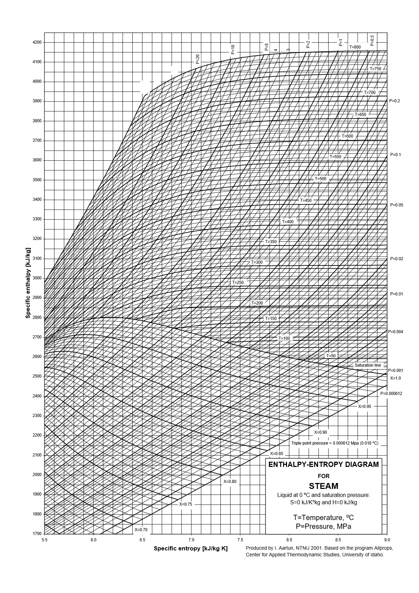
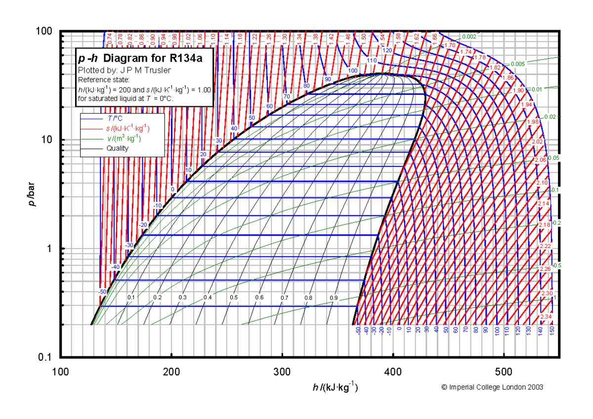

```{r}
#| echo: false
#| warning: false
#| message: false
library(ggplot2)
theme_set(theme_minimal(base_size = 18))
```


## <i class="bi bi-list-ol"></i> Agenda Wykładu {data-menu-title="Agenda"}

1.  **Termodynamika Przemian Fazowych** (Clapeyron-Clausius)
2.  **Para Nasycona** (Sucha vs Mokra)
3.  **Stopień Suchości ($x$)**
4.  **Tablice Pary Wodnej** (Jak korzystać?)
5.  **Wykresy Termodynamiczne** (T-s, h-s, p-h)
6.  **Para Przegrzana**

---

## <i class="bi bi-bookmark"></i> 1. Termodynamika Przemian Fazowych 

### Rodzaje Przemian

::: {.fragment .incremental}
*   **I Rodzaju:** Skokowa zmiana entalpii (ciepło utajone) i objętości. Temperatura jest stała ($T=const$).
    *   Wrzenie (Ciecz $\to$ Gaz)
    *   Topnienie (Ciało stałe $\to$ Ciecz)
*   **II Rodzaju:** Ciągła zmiana entalpii, ale skokowa zmiana ciepła właściwego $C_p$.
    *   Przejście w nadciekłość (Hel).
:::

::: {.fragment .fade-up}
### Ciepło Utajone (Latent Heat)


::: {style="border: 2px solid #e60000; padding: 20px; border-radius: 10px; background-color: #fff0f0; font-size: 0.8em;"}
**Energia potrzebna do zerwania wiązań międzycząsteczkowych, bez zmiany temperatury.**
:::
:::

#### Dla wody:{.fragment .fade-up style="font-size: 0.8em;"}

::: incremental
*   Ciepło parowania ($r$): $2257 \text{ kJ/kg}$ (ogromne!)
*   Ciepło topnienia: $333 \text{ kJ/kg}$
:::

---

## <i class="bi bi-bookmark"></i> Równanie Clapeyrona-Clausiusa 

Opisuje krzywą równowagi fazowej (np. krzywą wrzenia) na wykresie p-T:

$$ \frac{dp}{dT} = \frac{Q_{r}}{T (v'' - v')} $$

*   $Q_r$: Ciepło przemiany (ciepło parowania lub topnienia) [J/kg]
*   $v''$: Objętość właściwa pary (gazu)
*   $v'$: Objętość właściwa cieczy

::: {.callout-note .fragment}
Ponieważ zazwyczaj $v'' > v'$ (gaz większy od cieczy) i $r > 0$ (trzeba grzać), to $dp/dT > 0$.
Wzrost ciśnienia podnosi temperaturę wrzenia (dlatego w szybkowarze woda wrze np. w $120^\circ C$, co przyspiesza gotowanie).
:::

---

## <i class="bi bi-bookmark"></i> Wyjątek Wody: Topnienie 

Woda (lód) ma unikalną cechę: $v_{Lód} > v_{Woda}$ (lód pływa!).
Zatem $v'' - v' < 0$ (dla topnienia).

$$ \frac{dp}{dT} < 0 $$

Wzrost ciśnienia **obniża** temperaturę topnienia lodu.

::: {.fragment .fade-up}
*   Dlatego pod płozą łyżwy (wysokie ciśnienie) lód topi się w temp. np. $-2^\circ C$, tworząc warstewkę wody (poślizg).
:::

---

## <i class="bi bi-graph-up"></i> Wykres stanów faz wody we współrzędnych $p-T$. {.center}

```{r}
#| echo: false
#| warning: false
#| fig-width: 6
#| fig-height: 6
#| fig-align: center
library(ggplot2)
library(ggrepel)
# 1. Stałe termodynamiczne (SI)
T_tp <- 273.16        # K
P_tp <- 611.657       # Pa
T_c  <- 647.10        # K
P_c  <- 22.064e6      # Pa
P_atm <- 101325       # Pa
# 2. Funkcje krzywych (fizycznie spójne)

# Parowanie: ln(P/P_tp) = A * (1 - T_tp/T)
A_vap <- log(P_c / P_tp) / (1 - T_tp / T_c)
p_vap <- function(temp) P_tp * exp(A_vap * (1 - T_tp / temp))
# Sublimacja
A_sub <- 22.5 
p_sub <- function(temp) P_tp * exp(A_sub * (1 - T_tp / temp))

# Topnienie (anomalia: dT/dp < 0)
t_melt <- function(pres) T_tp - (7.4e-8 * (pres - P_tp))
# 3. Generowanie danych
df_vap  <- data.frame(T = seq(T_tp, T_c, length.out = 200))
df_vap$P <- p_vap(df_vap$T)
df_sub  <- data.frame(T = seq(220, T_tp, length.out = 100))
df_sub$P <- p_sub(df_sub$T)
p_m_seq <- exp(seq(log(P_tp), log(1e9), length.out = 100))
df_melt <- data.frame(T = t_melt(p_m_seq), P = p_m_seq)
# Punkty charakterystyczne
points <- data.frame(
  T = c(T_tp, T_c, 373.15),
  P = c(P_tp, P_c, P_atm),
  label = c("Punkt potrójny", "Punkt krytyczny", "Wrzenie (1 atm)")
)
 
# 4. Wykres
ggplot() +
  # Obszar nadkrytyczny (tło)
  annotate("rect", xmin = T_c, xmax = 750, ymin = P_c, ymax = 1e9, fill = "grey90", alpha = 0.5) +
  # Linie fazowe
  geom_line(data = df_sub, aes(x = T, y = P), color = "blue", size = 1) +
  geom_line(data = df_vap, aes(x = T, y = P), color = "red", size = 1.2) +
  geom_line(data = df_melt, aes(x = T, y = P), color = "darkgreen", size = 1) +
  # Punkty
  geom_point(data = points, aes(x = T, y = P), size = 3) +
  # Etykiety punktów (W dół i w lewo)
  geom_text_repel(data = points, aes(x = T, y = P, label = label),
                  nudge_x = 80, # Przesunięcie w prawo [K]
                  nudge_y = -0.5, # Przesunięcie w dół (w skali log10)
                  segment.color = "grey50",
                  arrow = arrow(length = unit(0.02, "npc")),
                  fontface = "bold", size = 3.5) +
  # Napisy obszarów (odsunięte od linii)
  annotate("text", x = 240, y = 1e6, label = "LÓD", size = 5, fontface = "bold", color = "blue") +
  annotate("text", x = 420, y = 1e8, label = "WODA CIEKŁA", size = 5, fontface = "bold", color = "darkgreen") +
  annotate("text", x = 550, y = 1e4, label = "PARA", size = 5, fontface = "bold", color = "red") +
  # FLUID NADKRYTYCZNY (tylko w dół względem poprzedniej pozycji)
  annotate("text", x = 700, y = 8e7, label = "STAN\nNADKRY\nTYCZNY", 
           fontface = "italic", color = "grey30", size = 4) +
  # Konfiguracja osi
  scale_y_log10(limits = c(10, 1e9), 
                breaks = c(P_tp, 101325, P_c),
                labels = c("611.7 Pa", "101.3 kPa", "22.06 MPa")) +
  scale_x_continuous(limits = c(220, 750), breaks = seq(200, 800, 50)) +
  labs(
       x = "Temperatura T [K]", y = "Ciśnienie p [Pa]") +
  theme_minimal() +
  theme(plot.title = element_text(face = "bold", size = 14))
```

---

## <i class="bi bi-table"></i> 4. Tablice Pary Wodnej 

Inżynier nie "liczy" pary z równania gazu doskonałego. Inżynier **odczytuje** z tablic.

Rodzaje tablic:

::: {.fragment}
1.  **Tablice Nasycenia (wg Temperatury lub Ciśnienia):**
    *   Używamy, gdy wiemy, że mamy wrzenie $(p, T_{nasycenia})$.
    *   Odczytujemy $v', v'', h', h'', s', s''$.
:::

::: {.fragment}
2.  **Tablice Pary Przegrzanej:**
    *   Używamy, gdy $T > T_{nasycenia}$ (dla danego $p$).
    *   Jest to macierz $(p, T) \to v, h, s$.
:::
    
::: {.fragment}    
3.  **Tablice Cieczy Sprężonej:**
    *   Gdy $T < T_{nasycenia}$. Zazwyczaj zakładamy $v \approx v'$.
:::

---

## <i class="bi bi-cloud-fog"></i> 2. Para Nasycona - Struktura 

Gdy podgrzewamy wodę pod stałym ciśnieniem:

::: {.fragment .incremental style="font-size: 0.98em;"}
1.  **Ciecz Dochłodzona:** $T < T_{wrzenia}$. 
    - 💧🧊 Spokojna woda w garnku, zanim włączysz gaz. Cząsteczki są blisko siebie, "tłok" jest nisko.
2.  **Ciecz Nasycona ($x=0$):** $T = T_{wrzenia}$. Pierwszy bąbel pary.
    - 💧🫧 Woda w 100°C. Na dnie pojawia się pierwszy bąbelek. To moment startu wyścigu.
3.  **Mieszanina Dwufazowa (Para Mokra):** Ciecz + Para. $T$ stoi w miejscu! 
    - ☁️💦 Wrzenie turbulentne. Tłok idzie w górę, ale temperatura nie rośnie (cała energia idzie na rozerwanie wiązań). 
4.  **Para Nasycona Sucha ($x=1$):** Ostatnia kropla wyparowała. 
    - ☁️✅ Ostatnia kropelka wody właśnie zniknęła. Cały cylinder to para, ale jeszcze "gęsta".
5.  **Para Przegrzana:** Dalszy wzrost $T > T_{wrzenia}$.
    - 💨🔥 Gaz, który zachowuje się jak "szalony". Cząsteczki są daleko od siebie, mają ogromną energię. To ta para napędza turbiny!
:::

---

## <i class="bi bi-cloud-fog"></i> 2. Para Nasycona - jak to działa w maszynie 

```{r}
#| fig-align: center
#| fig-height: 4
#| fig-width: 10
#| echo: false
#| warning: false

library(ggplot2)
library(dplyr)

# Tworzenie danych dla 5 stanów
states <- data.frame(
  State = factor(c("1. Ciecz\nDochłodzona", "2. Ciecz\nNasycona (x=0)", 
                   "3. Mieszanina\n(Para Mokra)", "4. Para Nasycona\nSucha (x=1)", 
                   "5. Para\nPrzegrzana"),
                 levels = c("1. Ciecz\nDochłodzona", "2. Ciecz\nNasycona (x=0)", 
                            "3. Mieszanina\n(Para Mokra)", "4. Para Nasycona\nSucha (x=1)", 
                            "5. Para\nPrzegrzana")),
  Piston_Height = c(1.5, 1.8, 3.5, 5.5, 7.0), # Wysokość tłoka
  Water_Level = c(1.5, 1.8, 1.0, 0, 0)        # Poziom cieczy
)

# Funkcja generująca cząsteczki (kropki) dla każdego stanu
generate_particles <- function(state_idx, n=50) {
  state_name <- levels(states$State)[state_idx]
  h_piston <- states$Piston_Height[state_idx]
  h_water <- states$Water_Level[state_idx]
  
  points <- data.frame()
  
  # Cząsteczki Wody (Niebieskie, gęsto upakowane na dole)
  if (h_water > 0) {
    water_pts <- data.frame(
      x = runif(n * h_water, 0, 1),
      y = runif(n * h_water, 0, h_water),
      type = "Ciecz",
      State = state_name
    )
    points <- rbind(points, water_pts)
  }
  
  # Cząsteczki Pary (Szare, rzadkie, powyżej wody)
  if (h_piston > h_water) {
    # Im wyższy stan, tym rzadsze cząsteczki (rozszerzalność)
    density_factor <- if(state_idx == 5) 0.3 else 0.8 
    
    vapor_pts <- data.frame(
      x = runif(n * (h_piston - h_water) * density_factor, 0, 1),
      y = runif(n * (h_piston - h_water) * density_factor, h_water, h_piston),
      type = "Para",
      State = state_name
    )
    points <- rbind(points, vapor_pts)
  }
  return(points)
}

all_particles <- do.call(rbind, lapply(1:5, generate_particles))

# Rysowanie
ggplot() +
  # --- ŚCIANKI CYLINDRA ---
  geom_rect(data = states, aes(xmin = 0, xmax = 1, ymin = 0, ymax = 8), 
            fill = NA, color = "black", size = 1) +
  
  # --- TŁOK (Linia pozioma) ---
  geom_segment(data = states, aes(x = 0, xend = 1, y = Piston_Height, yend = Piston_Height),
               size = 2, color = "darkred") +
  # Trzpień tłoka
  geom_segment(data = states, aes(x = 0.5, xend = 0.5, y = Piston_Height, yend = Piston_Height + 1),
               size = 1, color = "darkred") +
  
  # --- CZĄSTECZKI ---
  geom_point(data = all_particles, aes(x = x, y = y, color = type), size = 3, alpha = 0.7) +
  
  # --- FORMATOWANIE ---
  facet_wrap(~State, nrow = 1, strip.position = "bottom") +
  scale_color_manual(values = c("Ciecz" = "#3498db", "Para" = "#95a5a6")) +
  theme_void() +
  theme(
    strip.text = element_text(size = 11, face = "bold", margin = margin(t = 10)),
    legend.position = "none",
    plot.title = element_text(hjust = 0.5, face = "bold", size = 16)
  ) +
  labs(title = "Ewolucja czynnika: Od Cieczy do Pary Przegrzanej")
```

---

## <i class="bi bi-graph-up"></i> Wykres T-s dla Wody (Kopuła) 


:::: {.columns}

::: {.column width="30%"}
Obszar pod dzwonem to mieszanina (Para Mokra).
:::

::: {.column width="70%"}

```{r}
#| label: steam-dome
#| echo: false
#| fig-width: 12
#| fig-height: 9

library(ggplot2)

# Poprawne dane NIST (T [K], s_l, s_v)
# Tc = 647.1 K, sc = 4.412 kJ/kgK
nist_dense <- data.frame(
    T = c(
        0.01, 10.01, 20.01, 30.01, 40.01, 50.01, 60.01, 70.01, 80.01, 90.01, 100.01, 110.01,
        120.01, 130.01, 140.01, 150.01, 160.01, 170.01, 180.01, 190.01, 200.01, 210.01, 220.01,
        230.01, 240.01, 250.01, 260.01, 270.01, 280.01, 290.01, 300.01, 310.01, 320.01, 330.01,
        340.01, 350.01, 360.01, 370.01, 373.946
    ) + 273.15,
    s_l = c(
        -2.95E-13,
        0.15123,
        0.29663,
        0.43689,
        0.57254,
        0.70394,
        0.83142,
        0.95525,
        1.0757,
        1.193,
        1.3073,
        1.4189,
        1.528,
        1.6348,
        1.7393,
        1.8419,
        1.9427,
        2.0418,
        2.1393,
        2.2356,
        2.3306,
        2.4246,
        2.5178,
        2.6102,
        2.7021,
        2.7936,
        2.885,
        2.9766,
        3.0686,
        3.1613,
        3.2553,
        3.3511,
        3.4495,
        3.5519,
        3.6602,
        3.7785,
        3.9168,
        4.1114,
        4.407
    ),
    s_v = c(
        9.1555,
        8.8995,
        8.6658,
        8.4518,
        8.2554,
        8.0747,
        7.908,
        7.7539,
        7.6109,
        7.478,
        7.354,
        7.238,
        7.129,
        7.0263,
        6.9292,
        6.837,
        6.749,
        6.6649,
        6.584,
        6.5058,
        6.4301,
        6.3562,
        6.2839,
        6.2127,
        6.1422,
        6.072,
        6.0015,
        5.9303,
        5.8578,
        5.7833,
        5.7058,
        5.6243,
        5.5371,
        5.4421,
        5.3355,
        5.2109,
        5.0534,
        4.8008,
        4.407
    )
)

# Punkt Krytyczny
Tc <- 647.096
sc <- 4.407

# --- KOREKTA "UGIĘCIA" WIERZCHOŁKA ---
df_all <- data.frame(
    s = c(nist_dense$s_l, rev(nist_dense$s_v)),
    T = c(nist_dense$T, rev(nist_dense$T))
)
df_all <- df_all[order(df_all$s), ]

# Interpolacja splajnem T(s)
spline_dome <- spline(df_all$s, df_all$T, n = 1000)
df_dome <- data.frame(s = spline_dome$x, T = spline_dome$y)
df_dome$T[df_dome$T > Tc] <- Tc

# --- LINIE SUCHOSCI (x = 0.2, 0.4, 0.6, 0.8) ---
qualities <- c(0.2, 0.4, 0.6, 0.8)
df_quality_lines <- data.frame()
df_quality_labels <- data.frame()

for (x_val in qualities) {
    # Obliczamy s_x dla każdej temperatury z danych nist_dense
    s_x_vals <- nist_dense$s_l + x_val * (nist_dense$s_v - nist_dense$s_l)

    # Interpolacja gładka dla linii x
    spline_x <- spline(nist_dense$T, s_x_vals, xout = seq(min(nist_dense$T), Tc, length.out = 200))

    tmp_df <- data.frame(
        T = spline_x$x,
        s = spline_x$y,
        label = paste0("x=", x_val)
    )
    df_quality_lines <- rbind(df_quality_lines, tmp_df)

    # Pozycja etykiety (tuż nad osią s, np. T=290K)
    T_lbl <- 290
    s_lbl <- approx(nist_dense$T, s_x_vals, xout = T_lbl)$y

    df_quality_labels <- rbind(df_quality_labels, data.frame(
        x = s_lbl,
        y = T_lbl + 10, # Lekko nad punktem
        label = paste0("x=", x_val)
    ))
}


# --- Izobara 1 bar ---
spline_liq_T <- spline(nist_dense$T, nist_dense$s_l, xout = seq(300, 373.15, length.out = 50))
iso_1_liq <- data.frame(T = spline_liq_T$x, s = spline_liq_T$y)
iso_1_sat <- data.frame(T = c(373.15, 373.15), s = c(1.307, 7.354))
T_sup <- seq(373.15, 750, length.out = 50)
iso_1_sup <- data.frame(T = T_sup, s = 7.354 + 2.05 * log(T_sup / 373.15))
df_iso_1 <- rbind(iso_1_liq, iso_1_sat, iso_1_sup)

# --- Izobara 100 bar ---
T_sat_100 <- 584.15
sl_100 <- approx(nist_dense$T, nist_dense$s_l, xout = T_sat_100)$y
sv_100 <- approx(nist_dense$T, nist_dense$s_v, xout = T_sat_100)$y

iso_100_liq <- data.frame(T = seq(300, T_sat_100, length.out = 100))
iso_100_liq$s <- approx(df_all$T[df_all$s < sc], df_all$s[df_all$s < sc], xout = iso_100_liq$T)$y

iso_100_sat <- data.frame(T = c(T_sat_100, T_sat_100), s = c(sl_100, sv_100))
T_sup_100 <- seq(T_sat_100, 750, length.out = 50)
iso_100_sup <- data.frame(T = T_sup_100, s = sv_100 + 2.6 * log(T_sup_100 / T_sat_100))
df_iso_100 <- rbind(iso_100_liq, iso_100_sat, iso_100_sup)

ggplot() +
    # Wielokąt Kopuły
    geom_polygon(data = df_dome, aes(x = s, y = T), fill = "lightblue", alpha = 0.3, color = "blue", size = 1.5) +

    # Linie suchości
    geom_line(data = df_quality_lines, aes(x = s, y = T, group = label), color = "blue", linetype = "dotted", size = 0.8) +
    # Etykiety x (przy osi)
    geom_text(data = df_quality_labels, aes(x = x - 0.5, y = y, label = label), color = "blue", size = 4, fontface = "bold") +

    # Izobary
    geom_line(data = df_iso_1, aes(x = s, y = T), color = "red", size = 1.5) +
    annotate("text", x = 4.5, y = 410, label = "p = 1 atm", color = "red", fontface = "italic") +
    geom_line(data = df_iso_100, aes(x = s, y = T), color = "darkred", size = 1.2, linetype = "longdash") +
    annotate("text", x = 5.6, y = 700, label = "p = 100 atm", color = "darkred", fontface = "italic", angle = 76) +

    # Punkt Krytyczny
    annotate("point", x = sc, y = Tc, color = "black", size = 4) +
    annotate("text", x = sc, y = 690, label = paste0("PK\n(s=", round(sc, 3), ")"), fontface = "bold") +

    # x=0 / x=1
    annotate("text", x = 0.3, y = 320, label = "x=0", color = "blue", fontface = "bold", angle = 46) +
    annotate("text", x = 8.6, y = 320, label = "x=1", color = "blue", fontface = "bold", angle = -40) +
    scale_x_continuous(limits = c(0, 10), breaks = seq(0, 10, 1)) +
    scale_y_continuous(limits = c(273, 750), breaks = seq(273, 750, 50)) +
    theme_minimal(base_size = 16) +
    labs(
        x = "Entropia właściwa s [kJ/(kg·K)]", y = "Temperatura T [K]",
        title = "Wykres T-s dla Wody (Dane NIST + IAPWS-95)",
        subtitle = "Linie stałego stopnia suchości x"
    )
```

[źródło: [NIST Chemistry WebBook, SRD 69](https://webbook.nist.gov/cgi/fluid.cgi?TLow=0&THigh=373.946&TInc=50&Digits=5&ID=C7732185&Action=Load&Type=SatP&TUnit=C&PUnit=atm&DUnit=kg%2Fm3&HUnit=kJ%2Fkg&WUnit=m%2Fs&VisUnit=uPa*s&STUnit=N%2Fm&RefState=DEF){target="_blank"}]{style="font-size: 0.6em; color: gray;"}

:::

::::

---

## <i class="bi bi-bookmark"></i> 3. Stopień Suchości ($x$) 

::: {style="border: 2px solid #e60000; padding: 20px; border-radius: 10px; background-color: #fff0f0;"}
Kluczowy parametr w obszarze pary mokrej (pod kopułą). Określa masowy udział pary w mieszaninie.

$$ x = \frac{m_{pary}}{m_{mieszaniny}} = \frac{m''}{m' + m''} $$
:::

*   $x = 0$: $100\%$ cieczy (linia lewa).
*   $x = 1$: $100\%$ pary (linia prawa).
*   $x = 0.8$: $80\%$ pary, $20\%$ wody (typowa para wylotowa z turbiny).

---

## <i class="bi bi-list-check"></i> Obliczanie Właściwości Pary Mokrej 

Jeśli znamy $x$, możemy obliczyć dowolny parametr właściwy ($y$), znając wartości graniczne z tablic:

*   $y'$ (dla cieczy nasyconej)
*   $y''$ (dla pary suchej)

Wzór ogólny:

$$ y_x = y' + x \cdot (y'' - y') $$

Zastosowanie:

*   $v_x = v' + x(v'' - v')$  (Objętość)
*   $h_x = h' + x(h'' - h')$  (Entalpia - do bilansu energii!)
*   $s_x = s' + x(s'' - s')$  (Entropia - do sprawności)

---

## <i class="bi bi-calculator"></i> Przykład Odczytu (Nasycenie) 

Mamy wodę wrzącą pod ciśnieniem atmosferycznym ($p=1$ bar $\approx 0.1$ MPa).
Szukamy w Tablicy Nasycenia (wg ciśnienia):

| p [MPa] | T_sat [C] | v' [m3/kg] | v'' [m3/kg] | h' [kJ/kg] | h'' [kJ/kg] |
| :---: | :---: | :---: | :---: | :---: | :---: |
| 0.10 | **99.6** | 0.001043 | **1.694** | 417 | **2675** |

Wnioski:

1.  Temp. wrzenia to $99.6^\circ C$.
2.  Para zajmuje 1600 razy więcej miejsca niż woda ($1.694 / 0.001$). Wybuchowe rozszerzanie!
3.  Żeby odparować wodę, trzeba dostarczyć $2675 - 417 = 2258 \text{ kJ/kg}$.

---

## <i class="bi bi-bookmark"></i> Interpolacja Liniowa w Tablicach 

Tablice podają wartości dla wybranych temperatur i ciśnień (np. co 25°C lub 50°C). Gdy szukany parametr leży **między** wartościami tablicowymi, stosujemy **interpolację liniową**.

### Wzór:
$$ y = y_1 + \frac{x - x_1}{x_2 - x_1} \cdot (y_2 - y_1) $$

::: {.fragment .callout-tip title="Przykład" style="font-size: 0.7em;"}
Szukamy entalpii pary przegrzanej przy $p = 10$ bar i $t = 275^\circ C$.

Z tablic: $h(250^\circ C) = 2943$, $h(300^\circ C) = 3052$ kJ/kg.

$$ h_{275} = 2943 + \frac{275 - 250}{300 - 250} \cdot (3052 - 2943) = 2943 + 0.5 \cdot 109 \approx \mathbf{2997.5 \text{ kJ/kg}} $$
:::

::: {.fragment .callout-warning style="font-size: 0.8em;"}
Interpolacja działa dobrze tylko dla **małych przedziałów** (liniowa zależność). Dla dużych skoków ciśnienia lub w pobliżu punktu krytycznego dokładność maleje — wtedy lepiej użyć oprogramowania (np. CoolProp, NIST).
:::

---

## <i class="bi bi-graph-up"></i> 5. Wykresy Termodynamiczne 

:::: {.columns}

::: {.column width="60%"}

### Wykres h-s (Molliera)

*   Oś Y: Entalpia $h$ (Energia).
*   Oś X: Entropia $s$.
*   **Zastosowanie:** Turbiny parowe.
*   Rozprężanie adiabatyczne (idealna turbina) to linia **pionowa w dół** ($\Delta s = 0$).
*   Różnica wysokości na wykresie ($h_1 - h_2$) to uzyskana PRACA.

::: {.fragment style="border: 2px solid #e60000; padding: 20px; border-radius: 10px; background-color: #fff0f0;"}
Jest niezwykle użytecznym narzędziem inżynierskim, często wygodniejszym od wykresu T−s, ponieważ entalpia i ciepło (w przemianach izobarycznych) oraz __praca techniczna__ są na nim przedstawiane __jako odcinki__, a nie pola powierzchni
:::
:::

::: {.column width="40%"}
{width="100%"}

:::

::::

---

## <i class="bi bi-bookmark"></i> Mollier w Praktyce 

Turbina pobiera parę: $p_1 = 100$ bar, $T_1 = 500^\circ C$. Rozpręża do $p_2 = 0.1$ bar.

<div style="width: 100%; margin: 0 auto;">
```{mermaid}
%%{init: {'theme': 'default', 'themeVariables': { 'fontSize': '30px', 'fontFamily': 'Lato'}}}%%
flowchart LR
    A[Start: Znajdź <br>punkt 1] --> B{Odczytaj h1}
    B --> C[Rysuj linię <br>pionową w dół<br>s = const]
    C --> D{Przecięcie z p2}
    D --> E[Odczytaj h2]
    E --> F[Oblicz Pracę: <br>L = h1 - h2]
    E --> G[Sprawdź <br>x2 > 0.85?]
    G -- Tak --> H[OK: Turbina <br>bezpieczna]
    G -- Nie --> I[BŁĄD: Erozja <br>łopatek!]

    style A fill:#a4d4f4ff,stroke:#2980b9,stroke-width:2px
    style F fill:#2ecc71,stroke:#27ae60,stroke-width:2px
    style I fill:#e74c3c,stroke:#c0392b,stroke-width:2px
```
</div>


---

## <i class="bi bi-graph-up"></i> 5. Wykresy Termodynamiczne 

:::: {.columns}

::: {.column width="40%"}

### Wykres p-h (Logarytmiczny)

*   Oś Y: Ciśnienie absolutne $\ln(p)$.
*   Oś X: Entalpia właściwa $h$.
*   **Zastosowanie:** Chłodnictwo / Pompy Ciepła.
*   "Kopuła" jest mocno przechylona w prawo.

:::

::: {.column width="60%"}

{width="100%"}

:::

::::

::: {.fragment style="border: 2px solid #e60000; padding: 20px; border-radius: 10px; background-color: #fff0f0; font-size: 0.6em; position: absolute; top: 60%;" }
Analiza typowego obiegu chłodniczego:

1. Parowanie: Pozioma linia w prawo (pobieranie ciepła $q_d = \Delta h$).
2. Sprężanie: Ukośna linia w górę wzdłuż izentropy (praca sprężarki $l_t= \Delta h$).
3. Skraplanie: Pozioma linia w lewo (oddawanie ciepła $q_w=\Delta h$).
4. Dławienie: Pionowa linia w dół (stała entalpia).

Dzięki temu, że entalpia jest na osi poziomej, ilości ciepła i pracy (np. efekt chłodniczy, moc sprężarki) odczytuje się bezpośrednio jako długości odcinków na osi X
:::

---

## <i class="bi bi-cloud-fog"></i> Para Przegrzana 

### Powyżej Linii Nasycenia

Para o temperaturze wyższej niż temperatura nasycenia **przy danym ciśnieniu** ($T > T_s$).

**Zastosowanie w energetyce (Obieg Rankine'a):**

1.  Zwiększenie sprawności (wyższa średnia temp. doprowadzania ciepła).
2.  Ochrona turbiny (mniejsze zawilgocenie w ostatnich stopniach).

**Cechy fizyczne:**

*   Zachowuje się coraz bardziej jak **gaz doskonały** im **wyższa temperatura** i **niższe ciśnienie**.
*   W obszarze dalekim od nasycenia: $h \approx C_p T$ (dla gazu doskonałego).


---

## <i class="bi bi-clipboard-check"></i> Podsumowanie W5 

1.  **Przemiany fazowe:** I rodzaju (z $r$) i II rodzaju.
2.  **Clapeyron-Clausius:** $dp/dT$ zależy od różnicy objętości faz.
3.  **Stopień suchości $x$:** Udział pary w mieszaninie. Klucz do obliczania $h_x, s_x, v_x$.
4.  **Tablice:** Podstawowe narzędzie pracy. Trzeba umieć rozpoznać stan (ciecz/nasycenie/gaz) i wybrać odpowiednią tabelę.
5.  **Mollier (h-s):** Niezastąpiony do szybkiej analizy procesów w turbinach.

### Zadanie Do Samodzielnego Wykonania

Znajdź wykres h-s pary wodnej w internecie i znajdź punkt: $p=1$ bar, $x=0.9$. Odczytaj entalpię.
