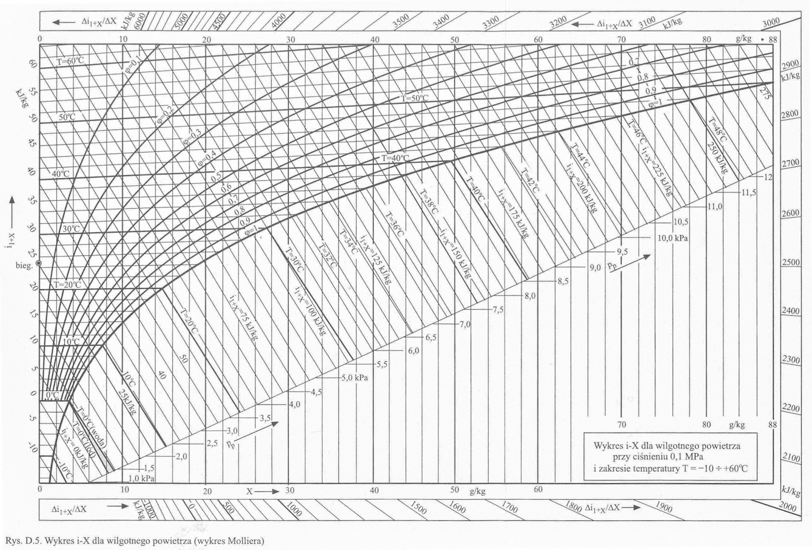

```{r}
#| echo: false
#| warning: false
#| message: false
library(ggplot2)
theme_set(theme_minimal(base_size = 18))
```

## <i class="bi bi-wind"></i> Czym jest klimatyzacja?

Proces uzdatniania powietrza polegający na nadaniu mu odpowiednich parametrów fizykochemicznych w celu zapewnienia komfortu przebywania ludzi lub spełnienia wymagań technologicznych.

**Cztery filary nowoczesnej klimatyzacji:**

*   **Temperatura** – ogrzewanie (zima) i chłodzenie (lato) powietrza.
*   **Wilgotność** – nawilżanie w okresach suchych, osuszanie przy nadmiarze wilgoci.
*   **Czystość** – filtracja z pyłów, alergenów, smogu (filtry wstępne i dokładne).
*   **Prędkość przepływu** – wymuszenie ruchu powietrza w strefie przebywania ludzi tak, aby zapobiec przeciągom, ale zapewnić odpowiednią świeżość.

::: {.callout-note title="Definicja" icon=false class="callout-moodle-def"}
Wentylacja wymienia powietrze zużyte na świeże, natomiast **klimatyzacja** dodatkowo kontroluje parametry termodynamiczne i czystość powietrza niezależnie od warunków zewnętrznych.
:::

## <i class="bi bi-emoji-smile"></i> Parametry komfortu cieplnego

Komfort cieplny to stan zadowolenia człowieka z warunków środowiska termicznego. Zależy on zarówno od parametrów powietrza, jak i czynników osobistych (odzież, aktywność fizyczna).

::: {.callout-note title="Definicja" icon=false class="callout-moodle-def"}
**PMV (Predicted Mean Vote)** – wskaźnik przewidywanej średniej oceny wrażeń cieplnych grupy ludzi w skali od -3 (bardzo zimno) do +3 (bardzo gorąco). Optymalny zakres to od -0.5 do +0.5.

**PPD (Predicted Percentage Dissatisfied)** – wskaźnik określający przewidywany procent osób niezadowolonych z warunków termicznych. Jest bezpośrednio powiązany z PMV (dla PMV = 0, PPD wynosi 5%).
:::

*   **Czynniki środowiskowe:** temperatura powietrza, temperatura promieniowania przegród, wilgotność względna, prędkość ruchu powietrza.
*   **Czynniki indywidualne:** izolacyjność odzieży (wyrażana w *clo*), tempo metabolizmu (wyrażana w *met*).

## <i class="bi bi-building-gear"></i> Centrala Wentylacyjna (AHU)

Centrala wentylacyjno-klimatyzacyjna (ang. *Air Handling Unit* – AHU) to zintegrowane urządzenie służące do przygotowania i dystrybucji powietrza. Każda sekcja centrali odpowiada za określoną przemianę termodynamiczną.

```{mermaid}
%%| fig-align: center
%%| fig-width: 14
%%| fig-height: 2

%%{init: {'theme': 'default', 'flowchart': { 'useMaxWidth': false, 'htmlLabels': true }, 'themeVariables': { 'fontSize': '16px', 'fontFamily': 'sans-serif' }}}%%
flowchart LR
    F["⚙️ <b>Filtry</b><br>Odpylanie"] --> REC["🔄 <b>Rekuperator</b><br>Odzysk ciepła"]
    REC --> CH["❄️ <b>Chłodnica</b><br>Schładzanie"]
    CH --> N["🔥 <b>Nagrzewnica</b><br>Podgrzewanie"]
    N --> NAW["💧 <b>Nawilżacz</b><br>Nawilżanie"]
    NAW --> W["💨 <b>Wentylator</b><br>Nawiew"]
    
    style F fill:#f5f5f5,stroke:#9e9e9e,stroke-width:2px
    style REC fill:#fff3e0,stroke:#f39c12,stroke-width:2px
    style CH fill:#e0f7fa,stroke:#00bcd4,stroke-width:2px
    style N fill:#ffebee,stroke:#e74c3c,stroke-width:2px
    style NAW fill:#e8f5e9,stroke:#4caf50,stroke-width:2px
    style W fill:#e8eaf6,stroke:#3f51b5,stroke-width:2px
    linkStyle default stroke-width:2px,fill:none,stroke:black
```

*   **Filtry:** Zapewniają odpowiednią czystość powietrza nawiewanego.
*   **Rekuperator:** Odzyskuje ciepło z powietrza wywiewanego z budynku.
*   **Chłodnica i Nagrzewnica:** Odpowiadają za regulację temperatury.
*   **Nawilżacz:** Zwiększa wilgotność powietrza w okresach zimowych.
*   **Wentylator:** Pokonuje opory przepływu w sieci kanałów.

## <i class="bi bi-graph-up"></i> Przypomnienie Wykresu h-x (Molliera)

Wykres h-x (często nazywany wykresem Molliera) jest podstawowym narzędziem inżynierskim do projektowania i analizy procesów klimatyzacyjnych.

*   **Oś odciętych (x):** Zawartość wilgoci (stopień zawilżenia) wyrażona w g pary wodnej na kg suchego powietrza [g/kg].
*   **Oś rzędnych (t):** Temperatura powietrza [$^\circ C$].
*   **Linie ukośne (h = const):** Linie stałej entalpii powietrza wilgotnego [kJ/kg].
*   **Krzywe ( $\varphi$ = const):** Wilgotność względna [%]. Granicą wykresu jest linia $\varphi = 100\%$ (linia nasycenia).

Każdy punkt na wykresie jednoznacznie określa stan powietrza wilgotnego. Dowolna przemiana w urządzeniach klimatyzacyjnych może być przedstawiona jako wektor na tym wykresie.

## <i class="bi bi-graph-up"></i> Wykres h-x (Molliera) {.smaller}

{fig-align="center" width="85%"}

## <i class="bi bi-thermometer-sun"></i> Ogrzewanie (Nagrzewnica)

Ogrzewanie powietrza w nagrzewnicy realizowane jest przy stałej zawartości wilgoci. Ponieważ nie dodajemy ani nie odbieramy pary wodnej, proces ten na wykresie h-x przebiega pionowo w górę.

::: {.callout-note title="Definicja" icon=false class="callout-moodle-def"}
**Proces:** $x = const$ (przemiana bez zmiany wilgotności bezwzględnej).
**Efekt:** Wzrost temperatury ($t \uparrow$), wzrost entalpii ($h \uparrow$), ale **spadek wilgotności względnej** ($\varphi \downarrow$).
:::

**Równanie bilansu energii (moc nagrzewnicy):**

$$\dot{Q} = \dot{m}_{s.p.} \cdot (h_2 - h_1) \quad [\text{kW}]$$

Gdzie $\dot{m}_{s.p.}$ to masowe natężenie przepływu suchego powietrza [kg/s].

```{mermaid}
%%| fig-align: center
%%| fig-width: 8
%%| fig-height: 1.5

flowchart LR
    A["Stan 1 (Zimny)<br>t1, x1, h1"] --> H["🔥 Nagrzewnica<br>Q"] --> B["Stan 2 (Ciepły)<br>t2 > t1, x2 = x1, h2 > h1"]
    style A fill:#e3f2fd,stroke:#1565c0,stroke-width:2px
    style H fill:#ffebee,stroke:#e74c3c,stroke-width:2px
    style B fill:#ffebee,stroke:#e74c3c,stroke-width:2px
    linkStyle default stroke-width:2px,fill:none,stroke:black
```

## <i class="bi bi-thermometer-snow"></i> Chłodzenie bez wykraplania

Chłodzenie bez wykraplania (tzw. chłodzenie suche) zachodzi wtedy, gdy temperatura powierzchni chłodnicy ($t_{ch}$) jest wyższa niż temperatura punktu rosy chłodzonego powietrza ($t_{ch} > t_R$).

*   **Proces:** $x = const$ (suchy spadek temperatury).
*   **Kierunek na h-x:** Pionowo w dół.
*   **Efekt:** Temperatura spada ($t \downarrow$), entalpia spada ($h \downarrow$), a wilgotność względna rośnie ($\varphi \uparrow$).
*   **Ograniczenie:** Chłodzenie suche możemy prowadzić tylko do granicy nasycenia ($\varphi = 100\%$). Dalsze obniżanie temperatury wywoła skraplanie pary wodnej.

**Równanie bilansu energii:**

$$\dot{Q}_c = \dot{m}_{s.p.} \cdot (h_1 - h_2) \quad [\text{kW}]$$

Moc chłodnicza chłodnicy suchej służy wyłącznie do obniżenia temperatury powietrza (schładzanie jawne).

## <i class="bi bi-droplet-half"></i> Chłodzenie z osuszaniem

Jeżeli temperatura powierzchni chłodnicy jest niższa od temperatury punktu rosy powietrza ($t_{ch} < t_R$), następuje kondensacja pary wodnej na lamelach chłodnicy.

::: {.callout-note title="Definicja" icon=false class="callout-moodle-def"}
**Proces:** Spadek temperatury ($t \downarrow$) połączony ze spadkiem zawartości wilgoci ($x \downarrow$). Powietrze osiąga stan nasycenia i przemieszcza się wzdłuż linii $\varphi = 100\%$.
:::

**Strumień wykraplanej wody (kondensatu):**

$$\dot{m}_k = \dot{m}_{s.p.} \cdot \frac{x_1 - x_2}{1000} \quad [\text{kg/s}]$$

## <i class="bi bi-droplet-half"></i> Chłodzenie z osuszaniem – bilans energii

**Pełny bilans energii chłodnicy mokrej:**

$$\dot{Q}_c = \dot{m}_{s.p.} \cdot (h_1 - h_2) - \dot{m}_k \cdot h_k \quad [\text{kW}]$$

Gdzie $h_k$ to entalpia skroplin (często pomijana w przybliżonych obliczeniach z uwagi na małą wartość).

```{mermaid}
%%| fig-align: center
%%| fig-width: 18.2
%%| fig-height: 3.1

flowchart LR
    A["Stan 1 (Wilgotny)<br>t1, x1, h1"] --> CH["❄️ Chłodnica mokra"] --> B["Stan 2 (Osuszony)<br>t2 < t1, x2 < x1, h2 < h1"]
    CH --> K["💧 Kondensat<br>mk"]
    style A fill:#ffebee,stroke:#e74c3c,stroke-width:2px
    style CH fill:#e0f7fa,stroke:#00bcd4,stroke-width:2px
    style B fill:#e3f2fd,stroke:#1565c0,stroke-width:2px
    style K fill:#e3f2fd,stroke:#1565c0,stroke-width:2px
    linkStyle default stroke-width:2px,fill:none,stroke:black
```

## <i class="bi bi-cloud-haze2"></i> Nawilżanie Parowe

Nawilżanie parowe polega na bezpośrednim wtrysku pary wodnej (z generatora pary lub sieci) do strumienia powietrza przepływającego przez centralę.

*   **Charakterystyka procesu:** Ponieważ wtryskiwana para ma wysoką temperaturę (zazwyczaj $100^\circ C$), proces ten przebiega niemal izotermicznie ($t \approx const$).
*   **Kierunek na h-x:** W prawo, lekko skośnie w górę (przyrost wilgoci $x \uparrow$ oraz entalpii $h \uparrow$).
*   **Bilans wilgoci:**

$$\dot{m}_p = \dot{m}_{s.p.} \cdot \frac{x_2 - x_1}{1000} \quad [\text{kg/s}]$$

## <i class="bi bi-cloud-haze2"></i> Nawilżanie Parowe – bilans energii

*   **Wzrost entalpii powietrza:**

$$h_2 = h_1 + \frac{x_2 - x_1}{1000} \cdot h_p \quad [\text{kJ/kg}]$$

gdzie $h_p$ to entalpia pary wodnej ($\approx 2680$ kJ/kg).

::: {.callout-tip title="Przykład" icon=false class="callout-moodle-ex"}
Nawilżanie parowe jest bardzo higieniczne i łatwe w regulacji, dlatego stosuje się je powszechnie w klimatyzacji szpitalnej i laboratoryjnej. Wymaga jednak dużej ilości energii elektrycznej do wytworzenia pary.
:::

## <i class="bi bi-droplet"></i> Nawilżanie Wodne

Nawilżanie wodne (adiabatyczne) polega na rozpyleniu drobnych kropelek ciekłej wody w strumieniu powietrza. Woda odparowuje, pobierając ciepło z powietrza.

::: {.callout-note title="Definicja" icon=false class="callout-moodle-def"}
**Proces:** $h \approx const$ (izoentalpowy). Ciepło jawne powietrza zamieniane jest na ciepło utajone parowania wody.
**Efekt:** Spadek temperatury powietrza ($t \downarrow$), przy jednoczesnym wzroście wilgotności ($x \uparrow$).
:::

*   **Zastosowanie:** Tzw. chłodzenie wyparne (ewaporacyjne). Pozwala na znaczne obniżenie temperatury powietrza w lecie przy minimalnym zużyciu energii (tylko zasilanie pompy wody).
*   **Granica procesu:** Teoretyczną granicą chłodzenia adiabatycznego jest temperatura termometru wilgotnego ($t_w$), odpowiadająca punktowi przecięcia izoentalpy z linią $\varphi = 100\%$.

## <i class="bi bi-shuffle"></i> Cel mieszania powietrza

W systemach wentylacji i klimatyzacji rzadko uzdatnia się wyłącznie powietrze zewnętrzne. Najczęściej miesza się świeże powietrze zewnętrzne (Z) z powietrzem obiegowym (S) pobranym z pomieszczenia.

**Główne cele recyrkulacji (mieszania):**

1.  **Oszczędność energii** – powietrze z pomieszczenia ma zazwyczaj temperaturę znacznie bliższą parametrom komfortu niż powietrze zewnętrzne (zarówno zimą, jak i latem). Jego ponowne użycie redukuje moc nagrzewnic i chłodnic.
2.  **Utrzymanie minimalnego strumienia powietrza świeżego** – ze względów higienicznych do pomieszczenia musi trafiać określona ilość świeżego tlenu na osobę. Mieszając je z obiegowym, możemy dostarczyć wymaganą ilość powietrza świeżego, zachowując jednocześnie wysoki wydatek powietrza nawiewanego dla zapewnienia odpowiedniej cyrkulacji.

## <i class="bi bi-diagram-3"></i> Mieszanie na wykresie h-x

:::: {.columns}

::: {.column width="40%"}
Po zmieszaniu powietrza zewnętrznego (Z) o masie $\dot{m}_Z$ z obiegowym (S) o masie $\dot{m}_S$, punkt mieszaniny (M) leży na prostej Z-S.

**Zasada dźwigni:**
$$\frac{\dot{m}_Z}{\dot{m}_S} = \frac{\text{odcinek } SM}{\text{odcinek } ZM}$$

**Parametry mieszaniny (średnia ważona):**
$$x_M = g_Z \cdot x_Z + g_S \cdot x_S \quad [\text{g/kg}]$$
$$h_M = g_Z \cdot h_Z + g_S \cdot h_S \quad [\text{kJ/kg}]$$

gdzie $g_Z$, $g_S$ to udziały masowe.
:::

::: {.column width="60%"}
```{r}
#| label: mixing
#| echo: false
#| fig-width: 9
#| fig-height: 5.5
#| fig-align: center
#| out-width: "100%"

library(ggplot2)

# Funkcje pomocnicze dla wykresu h-X
vis_slope <- 0.2
transform_vis <- function(t, x) t + vis_slope * x

p_sat <- function(t) { 0.61121 * exp((18.678 - t / 234.5) * (t / (257.14 + t))) }
get_x_from_rh <- function(t, rh) {
    pp <- rh * p_sat(t)
    622 * pp / (101.325 - pp)
}

# Punkty stanu - typowa zima
Z <- list(t = -5, rh = 0.8)   # Powietrze zewnętrzne (Zima)
S <- list(t = 22, rh = 0.5)   # Powietrze wywiewane z sali (Sala)
Z$x <- get_x_from_rh(Z$t, Z$rh)
S$x <- get_x_from_rh(S$t, S$rh)

# Mieszanie (Reguła dźwigni): 30% świeżego zewnętrznego (Z), 70% recyrkulowanego (S)
gZ <- 0.3
gS <- 0.7
M <- list(
    x = gZ * Z$x + gS * S$x,
    t = gZ * Z$t + gS * S$t
)

# Transformacja wizualna
Zv <- list(x = Z$x, t = transform_vis(Z$t, Z$x))
Sv <- list(x = S$x, t = transform_vis(S$t, S$x))
Mv <- list(x = M$x, t = transform_vis(M$t, M$x))

# Krzywe stałej wilgotności (RH)
rh_levels <- c(0.2, 0.4, 0.6, 0.8, 1.0)
t_seq <- seq(-10, 35, by = 0.5)
df_rh <- do.call(rbind, lapply(rh_levels, function(rh) {
    x_val <- sapply(t_seq, function(t) get_x_from_rh(t, rh))
    df <- data.frame(t = t_seq, x = x_val, rh = rh)
    df <- df[df$x <= 15 & !is.na(df$x), ]
    df$t_vis <- transform_vis(df$t, df$x)
    df
}))

# Izotermy do tła
t_iso <- seq(-10, 30, by = 10)
df_iso <- data.frame(
    x_start = 0, x_end = 15,
    t_vis_start = sapply(t_iso, function(t) transform_vis(t, 0)),
    t_vis_end = sapply(t_iso, function(t) transform_vis(t, 15)),
    t_label = t_iso
)

ggplot() +
    # Izotermy
    geom_segment(data = df_iso, aes(x = x_start, y = t_vis_start, xend = x_end, yend = t_vis_end), color = "orange", linetype = "dotted", linewidth = 0.8) +
    geom_text(data = df_iso, aes(x = 13.5, y = t_vis_end + 1.2, label = paste0(t_label, "°C")), color = "orange", size = 5) +
    
    # Krzywe RH
    geom_line(data = df_rh, aes(x = x, y = t_vis, group = rh, color = factor(rh)), linewidth = 1) +
    scale_color_viridis_d(option = "C", direction = -1, name = "φ") +
    
    # Odcinek Z - M i M - S
    geom_segment(aes(x = Zv$x, y = Zv$t, xend = Mv$x, yend = Mv$t), color = "blue", linewidth = 1.5, linetype = "longdash") +
    geom_segment(aes(x = Mv$x, y = Mv$t, xend = Sv$x, yend = Sv$t), color = "red", linewidth = 1.5, linetype = "longdash") +
    
    # Reguła dźwigni etykiety
    annotate("text", x = (Zv$x + Mv$x) / 2 - 1.5, y = (Zv$t + Mv$t) / 2 + 2, 
             label = paste0("Odcinek~ZM %~~% g[S] == ", gS*100, "*'%'"), 
             color = "darkblue", size = 5, parse = TRUE) +
    annotate("text", x = (Mv$x + Sv$x) / 2 + 1.5, y = (Mv$t + Sv$t) / 2 - 2, 
             label = paste0("Odcinek~MS %~~% g[Z] == ", gZ*100, "*'%'"), 
             color = "darkred", size = 5, parse = TRUE) +

    # Punkty
    geom_point(aes(x = Zv$x, y = Zv$t), color = "blue", size = 6) +
    geom_point(aes(x = Sv$x, y = Sv$t), color = "red", size = 6) +
    geom_point(aes(x = Mv$x, y = Mv$t), color = "forestgreen", size = 8, shape = 18) +
    
    # Etykiety punktów
    annotate("text", x = Zv$x - 0.5, y = Zv$t + 1, label = "Z", color = "blue", size = 8, fontface = "bold", hjust=1) +
    annotate("text", x = Sv$x + 1, y = Sv$t, label = "S", color = "red", size = 8, fontface = "bold", hjust=0) +
    annotate("text", x = Mv$x - 0.5, y = Mv$t + 2, label = "M", color = "forestgreen", size = 8, fontface = "bold", hjust=1) +
    
    # Osie i motyw
    scale_x_continuous(limits = c(0, 15), breaks = seq(0, 15, 5), expand = expansion(mult = 0.02)) +
    scale_y_continuous(limits = c(-12, 35), breaks = seq(-10, 35, 5), expand = expansion(mult = 0.05)) +
    labs(x = "Stopień zawilżenia X [g/kg]", y = "Temperatura t [°C]", title = "Mieszanie powietrza zewnętrznego (Z) i z sali (S)") +
    theme_minimal(base_size = 18) +
    theme(
        legend.position = "right",
        plot.title = element_text(face = "bold", hjust = 0.5),
        plot.margin = margin(10, 10, 10, 10)
    )
```
:::

::::

## <i class="bi bi-arrow-repeat"></i> Odzysk ciepła (Rekuperacja)

Odzysk ciepła (rekuperacja) to proces przenoszenia energii termicznej z ciepłego strumienia powietrza usuwanego (wywiewanego) do zimnego strumienia powietrza świeżego (nawiewanego), realizowany w wymienniku ciepła bez bezpośredniego kontaktu obu strumieni powietrza.

*   **Zasada działania:** Powietrze wywiewane oddaje ciepło ściankom wymiennika, od których następnie nagrzewa się zimne powietrze zewnętrzne.
*   **Wymienniki krzyżowe i przeciwprądowe:** Przenoszą wyłącznie ciepło jawne (brak wymiany wilgoci).
*   **Regeneratory obrotowe:** Posiadają wirnik pokryty substancją higroskopijną, dzięki czemu odzyskują zarówno ciepło (jawne), jak i wilgoć (ciepło utajone).

::: {.callout-note title="Definicja" icon=false class="callout-moodle-def"}
Odzysk ciepła pozwala na podgrzanie powietrza zewnętrznego w okresie zimowym o kilkanaście, a nawet kilkadziesiąt stopni bez użycia energii zewnętrznej (np. z kotła lub pompy ciepła).
:::

## <i class="bi bi-percent"></i> Efektywność odzysku ciepła

Podstawowym parametrem określającym sprawność centrali rekuperacyjnej jest sprawność temperaturowa odzysku ciepła ($\eta_T$).

**Wzór na sprawność temperaturową (po stronie nawiewu):**

$$\eta_T = \frac{t_{n2} - t_{n1}}{t_{w1} - t_{n1}} \cdot 100\%$$

Gdzie:

*   $t_{n1}$ – temperatura powietrza zewnętrznego przed wymiennikiem [$^\circ C$],
*   $t_{n2}$ – temperatura powietrza nawiewanego po przejściu przez wymiennik [$^\circ C$],
*   $t_{w1}$ – temperatura powietrza wywiewanego z pomieszczenia przed wymiennikiem [$^\circ C$].

## <i class="bi bi-percent"></i> Efektywność odzysku ciepła – przykład

::: {.callout-tip title="Przykład" icon=false class="callout-moodle-ex"}
Jeśli zimą powietrze zewnętrzne ma temperaturę $-5^\circ C$, w pokoju jest $+20^\circ C$, a sprawność rekuperatora wynosi $80\%$, wówczas temperatura powietrza za rekuperatorem wyniesie:

$$t_{n2} = -5 + 0.8 \cdot (20 - (-5)) = \mathbf{15^\circ C}$$

Powietrze zostało podgrzane o $20 \, \text{K}$ za darmo!
:::

## <i class="bi bi-cash-coin"></i> Zyski ciepła i wilgoci

Projektowanie klimatyzacji pomieszczenia wymaga precyzyjnego zbilansowania dopływu energii i wilgoci ze wszystkich źródeł.

*   **Zyski ciepła jawnego ($\dot{Q}_j$):** Powodują bezpośrednią zmianę temperatury powietrza.
    *   *Źródła:* promieniowanie słoneczne przez okna, przenikanie przez ściany, ciepło od oświetlenia, urządzeń elektrycznych (komputery, silniki), ciepło jawne oddawane przez ludzi.
*   **Zyski ciepła utajonego ($\dot{Q}_u$):** Związane z parowaniem wody (wpływają na wzrost wilgoci bez zmiany temperatury suchej).
    *   *Źródła:* wilgoć wydychana przez ludzi, procesy technologiczne, gotowanie, suszenie.
*   **Zyski wilgoci ($\dot{W}$):** Masowy strumień pary wodnej emitowany w pomieszczeniu [kg/s] lub [g/h].

## <i class="bi bi-compass"></i> Współczynnik kierunkowy przemiany

Współczynnik kierunkowy przemiany w pomieszczeniu ($\epsilon$) określa stosunek całkowitego zysku ciepła (entalpii) do zysku wilgoci w pomieszczeniu.

**Wzór na współczynnik $\epsilon$:**

$$\epsilon = \frac{\Delta H}{\Delta x} = \frac{\dot{Q}_j + \dot{Q}_u}{\dot{W}} \quad \left[\frac{\text{kJ}}{\text{kg}}\right]$$

Gdzie:

*   $\dot{Q}_j + \dot{Q}_u$ – całkowite zyski ciepła w pomieszczeniu [kW],
*   $\dot{W}$ – zyski wilgoci w pomieszczeniu [kg/s].

**Znaczenie geometryczne:**
Współczynnik $\epsilon$ wyznacza nachylenie prostej przemiany na wykresie h-x. Powietrze nawiewane do pokoju o stanie (N) będzie zmieniać swój stan w kierunku stanu powietrza w pokoju (P) dokładnie wzdłuż linii o kierunku określonym przez $\epsilon$.

## <i class="bi bi-check2-square"></i> Wyznaczenie punktu nawiewu (N)

Wyznaczenie prawidłowych parametrów powietrza nawiewanego (N) jest kluczowym krokiem projektowym w klimatyzacji.

**Algorytm postępowania:**

1.  **Określenie parametrów projektowych pokoju (P):** np. $t_P = 22^\circ C$, $\varphi_P = 50\%$. Zaznaczamy ten punkt na wykresie h-x.
2.  **Wykreślenie linii $\epsilon$:** Przez punkt P prowadzimy linię równoległą do kierunku współczynnika $\epsilon$ wyznaczonego z bilansu pomieszczenia.
3.  **Założenie różnicy temperatur nawiewu ($\Delta t_{naw}$):** Ze względów komfortu różnica między temperaturą powietrza w pokoju a nawiewanym nie powinna przekraczać $6-10 \, \text{K}$ (dla uniknięcia przeciągów i uczucia chłodu):
    $$t_N = t_P - \Delta t_{naw}$$
4.  **Znalezienie punktu N:** Punkt nawiewu N leży na przecięciu izotermy $t_N$ z wykreśloną wcześniej linią $\epsilon$.

## <i class="bi bi-sun-fill"></i> Typowy pełny obieg letni

W okresie letnim powietrze zewnętrzne (Z) ma zazwyczaj zbyt wysoką temperaturę i wilgotność. Aby sprostać wymaganiom pomieszczenia, przechodzi ono przez skomplikowany cykl uzdatniania.

Przemiany zachodzące po kolei w centrali i pokoju:

::: {.incremental}
1.  **Mieszanie:** Ciepłe powietrze świeże (Z) miesza się z powracającym powietrzem obiegowym (S) z pokoju, dając punkt mieszaniny M.
2.  **Chłodzenie z osuszaniem:** Mieszanina M trafia na chłodnicę mokrą. Zostaje schłodzona do linii nasycenia $\varphi = 100\%$ i osuszona wzdłuż niej do temperatury punktu rosy (punkt C). Otrzymujemy powietrze zimne, ale bardzo wilgotne (nasycone).
3.  **Podgrzanie wtórne (Reheat):** Powietrze z punktu C jest podgrzewane w nagrzewnicy pomocniczej do temperatury punktu nawiewu N. Dzięki temu obniża się jego wilgotność względna do poziomu komfortowego dla człowieka.
4.  **Asymilacja w pokoju:** Powietrze o parametrach N zostaje nawiane do pokoju, gdzie asymiluje zyski ciepła i wilgoci, zmieniając stan wzdłuż prostej $\epsilon$ z powrotem do punktu S.
:::

## <i class="bi bi-pencil-square"></i> Zadanie domowe

::: {.callout-warning title="Zadanie" icon=false class="callout-moodle-warn"}
**Temat:** Bilansowanie nagrzewania i nawilżania zimowego.

Zaprojektuj proces przygotowania powietrza zimą dla centrali wentylacyjnej o wydajności $\dot{V} = 1000 \, \text{m}^3\text{/h}$ (gęstość powietrza $\rho \approx 1.2 \, \text{kg/m}^3$).

**Dane początkowe:**
*   Powietrze zewnętrzne (Z): $t_Z = -5^\circ C$, stopień zawilżenia $x_Z = 2 \, \text{g/kg}$ ($h_1 \approx 0 \, \text{kJ/kg}$).
*   Wymagany stan końcowy w pokoju (P): $t_P = 20^\circ C$, stopień zawilżenia $x_P = 10 \, \text{g/kg}$ ($h_2 \approx 45.5 \, \text{kJ/kg}$).

**Oblicz:**
1.  **Strumień masy wody ($\dot{m}_w$ [kg/h])**, jaki należy doprowadzić w nawilżaczu, aby pokryć zapotrzebowanie na wilgoć.
2.  **Moc nagrzewnicy ($Q_n$ [kW])**, wymaganą do podgrzania powietrza (przyjmij $\dot{m}_{s.p.} = \dot{V} \cdot \rho / 3600$).
:::

## <i class="bi bi-question-circle"></i> Podsumowanie i pytania kontrolne

**Najważniejsze pojęcia z wykładu:**

*   Klimatyzacja precyzyjnie kontroluje temperaturę, wilgotność, czystość i prędkość powietrza.
*   W nagrzewnicach i chłodnicach suchych przemiana przebiega przy $x = const$.
*   Chłodzenie mokre pozwala na jednoczesne obniżenie temperatury i wilgotności powietrza.
*   Nawilżanie parowe to proces izotermiczny ($t \approx const$), a nawilżanie wodne to proces izoentalpowy ($h \approx const$).
*   Mieszanie strumieni projektuje się geometrycznie za pomocą zasady dźwigni na wykresie h-x.

**Pytania kontrolne:**

1.  *Dlaczego zimą, podczas ogrzewania powietrza bez nawilżania, wilgotność względna w pomieszczeniu drastycznie spada?*
2.  *Który rodzaj nawilżania (parowe czy wodne) wymaga większych nakładów energii elektrycznej w samej centrali i dlaczego?*
3.  *Jak zdefiniować współczynnik kierunkowy przemiany $\epsilon$ i do czego służy przy określaniu punktu nawiewu N?*
